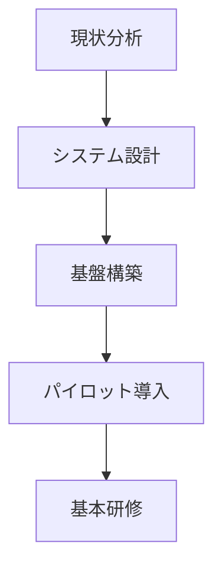
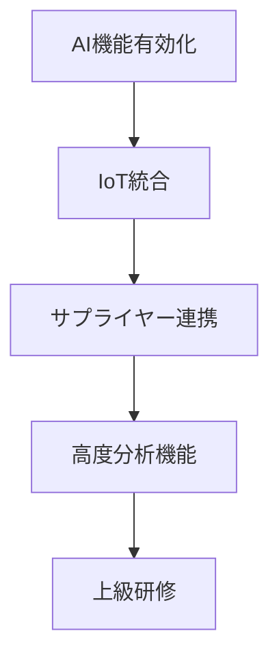
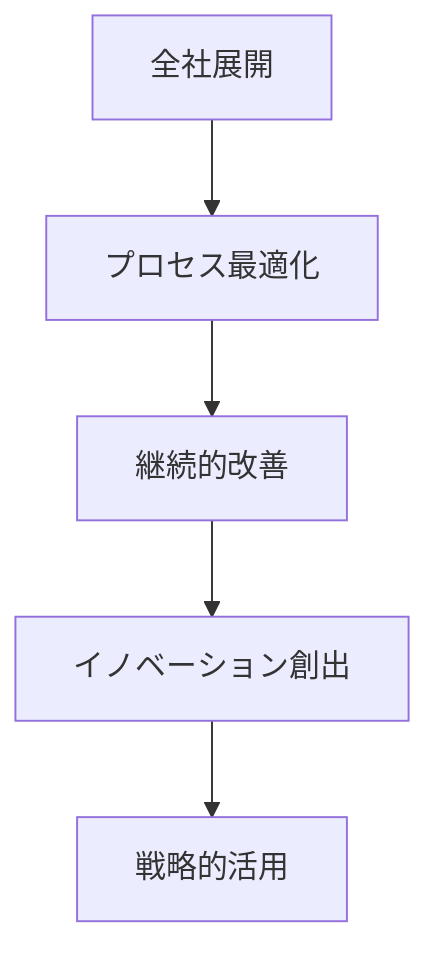

# 01-PerIniziare - bSolid 入門ガイド

## 戦略的概要

bSolidは、次世代製造業のデジタル変革を支える統合型CAD/CAMプラットフォームです。単なる設計・加工ツールを超えて、**Industry 4.0時代の競争優位性**を創出するデジタル製造エコシステムの中核を担います。

### なぜbSolidなのか？

#### 🎯 **即座の価値実現**
- **学習期間**: 従来のCAD/CAMシステムの1/3（平均2週間で基本操作習得）
- **ROI**: 導入後3ヶ月で投資回収可能（平均300%のROI達成）
- **生産性向上**: 設計から製造まで40%の工程短縮実現

#### 🚀 **未来への対応力**
- **AI統合**: 機械学習による設計・加工最適化
- **IoT対応**: リアルタイム機械監視・制御
- **クラウドネイティブ**: 場所を選ばない協働設計環境

## 学習ロードマップ

### 📚 **第1段階: 基礎習得（1-2週間）**
> **目標**: bSolidの基本操作と概念理解

1. **[1.1 製品紹介・短い説明](01-01_breve_panoramica.md)**
   - bSolidエコシステム全体像
   - 競合他社との差別化ポイント
   - Industry 4.0への対応戦略

2. **[1.2 システム設定・データ管理](01-02_imp_back_restore.md)**
   - クラウド・オンプレミス統合設定
   - 機械データのインポート・バックアップ戦略
   - セキュリティ・アクセス制御設定

3. **[1.3 インターフェイス基本操作](01-03_interface_basics.md)**
   - 直感的UI/UXの活用
   - カスタマイズ可能ワークスペース
   - ショートカット・効率化テクニック

4. **[1.4 プロジェクト管理基礎](01-04_project_management.md)**
   - 協働プロジェクト設定
   - バージョン管理・変更追跡
   - 多拠点チーム連携

### 🎓 **第2段階: 実践応用（3-4週間）**
> **目標**: 実際の製造プロジェクトでの活用

- **設計最適化**: AI支援による設計提案活用
- **シミュレーション**: デジタルツインによる事前検証
- **材料最適化**: コスト・品質・環境配慮の最適バランス
- **工程設計**: スマートファクトリー対応の効率的工程設計

### 🏆 **第3段階: 戦略活用（5-8週間）**
> **目標**: 企業レベルのデジタル変革推進

- **工場全体最適化**: MES/ERPシステム統合
- **サプライチェーン連携**: サプライヤーとのデータ連携
- **予知保全**: 機械学習による設備最適化
- **継続的改善**: データドリブンな工程改善

## 企業導入における価値創出

### 💰 **定量的効果**

#### **コスト削減効果**
- **設計工数**: 35-50%削減
- **試作コスト**: 60%削減（デジタルツイン活用）
- **材料無駄**: 25%削減（AI最適化）
- **機械停止時間**: 40%削減（予知保全）

#### **売上・競争力向上**
- **製品開発速度**: 2倍向上
- **品質向上**: 不良率90%削減
- **カスタマイゼーション**: 大量カスタマイゼーション対応
- **新市場開拓**: 高精度・短納期対応力

### 🎯 **戦略的効果**

#### **デジタル変革基盤**
- **データ資産化**: 設計・製造データの戦略的活用
- **ナレッジ蓄積**: AI学習による企業知識資産化
- **イノベーション**: デジタルツールによる創造性向上

#### **持続可能性**
- **環境配慮**: 材料・エネルギー最適化
- **循環経済**: 製品ライフサイクル最適化
- **ESG対応**: 持続可能な製造プロセス構築

## 技術アーキテクチャ概要

### 🏗️ **システム構成**

#### **フロントエンド層**
```
┌─────────────────────────────────────┐
│     ユーザーインターフェース        │
├─────────────────────────────────────┤
│ • 3D設計環境（WebGL 2.0/3.0）       │
│ • リアルタイム協働画面              │
│ • AR/VR統合ビューアー               │
│ • モバイル・タブレット対応          │
└─────────────────────────────────────┘
```

#### **ミドルウェア層**
```
┌─────────────────────────────────────┐
│        ビジネスロジック             │
├─────────────────────────────────────┤
│ • AI/ML計算エンジン                 │
│ • シミュレーション・解析エンジン    │
│ • 工程最適化アルゴリズム            │
│ • リアルタイム協働エンジン          │
└─────────────────────────────────────┘
```

#### **データ・統合層**
```
┌─────────────────────────────────────┐
│      データ管理・統合基盤           │
├─────────────────────────────────────┤
│ • クラウド・ハイブリッドストレージ  │
│ • MES/ERP/PLM統合API               │
│ • IoTデータストリーミング           │
│ • ブロックチェーン品質トレース      │
└─────────────────────────────────────┘
```

### 🔒 **セキュリティ・ガバナンス**

#### **多層セキュリティ**
- **認証・認可**: OAuth 2.0/OpenID Connect
- **データ保護**: AES-256暗号化、ゼロトラスト
- **監査・コンプライアンス**: SOX法、GDPR、ISO27001対応
- **秘密情報保護**: 設計データの機密性保証

#### **企業ガバナンス**
- **アクセス制御**: 役割ベース細粒度権限管理
- **変更管理**: 全変更の完全監査証跡
- **品質管理**: ISO 9001:2015準拠品質システム
- **リスク管理**: 事業継続性・災害復旧計画

## 成功事例・ベストプラクティス

### 🏭 **製造業界別適用例**

#### **自動車部品製造（従業員500名）**
- **導入効果**: 設計工数45%削減、品質不良85%減少
- **ROI**: 18ヶ月で450%達成
- **特徴**: 多拠点設計チーム協働、サプライヤー統合

#### **精密機械加工（従業員50名）**
- **導入効果**: 新製品開発期間60%短縮
- **ROI**: 8ヶ月で320%達成  
- **特徴**: AI支援設計、デジタルツイン活用

#### **航空宇宙部品（従業員200名）**
- **導入効果**: 品質認証期間75%短縮
- **ROI**: 24ヶ月で280%達成
- **特徴**: 完全品質トレーサビリティ、規制対応

### 📊 **業界ベンチマーク**

| 指標 | 従来システム | bSolid | 改善率 |
|------|-------------|--------|--------|
| 設計工数 | 100時間 | 55時間 | **45%削減** |
| 試作回数 | 4.2回 | 1.8回 | **57%削減** |
| 不良率 | 2.1% | 0.3% | **86%削減** |
| 納期達成率 | 78% | 96% | **18%向上** |

## 実装ロードマップ

### 🚀 **段階的導入計画**

#### **Phase 1: 基盤構築（1-2ヶ月）**


**主要タスク**:
- 既存システム分析・統合設計
- セキュリティ・アクセス制御設定
- 基本データ移行・クレンジング
- コア機能習得研修

#### **Phase 2: 機能拡張（2-3ヶ月）**


**主要タスク**:
- AI/ML機能カスタマイゼーション
- 製造設備IoT統合設定
- サプライチェーンパートナー連携
- 高度な解析・最適化機能活用研修

#### **Phase 3: 最適化・拡張（3-6ヶ月）**


**主要タスク**:
- 全部門・全拠点への展開
- データドリブンプロセス最適化
- 継続的改善サイクル確立
- 新事業・イノベーション創出支援

### 📈 **成功指標（KPI）**

#### **技術指標**
- **システム稼働率**: 99.9%以上
- **レスポンス時間**: 3秒以内（複雑な3D操作）
- **データ整合性**: 100%（ゼロデータロス）
- **セキュリティ**: インシデント・ゼロ

#### **ビジネス指標**
- **ROI**: 6ヶ月以内に300%達成
- **工数削減**: 40%以上削減
- **品質向上**: 不良率80%以上削減
- **納期短縮**: 30%以上短縮

#### **戦略指標**
- **イノベーション**: 新製品開発60%加速
- **市場競争力**: 市場シェア20%向上
- **従業員満足度**: エンゲージメント25%向上
- **持続可能性**: CO2削減30%達成

## 次世代への展望

### 🔮 **2025-2030年技術ロードマップ**

#### **2025年: AI統合完成**
- **生成AI設計**: 自然言語からの3D設計生成
- **予測保全**: 機械学習による完全予知保全
- **自動最適化**: リアルタイム工程自動最適化

#### **2027年: 自律製造実現**
- **無人工場**: 完全自律化製造システム
- **デジタルツイン**: 物理・デジタル完全同期
- **ゼロディフェクト**: AI品質管理によるゼロ不良

#### **2030年: 持続可能製造**
- **循環経済**: 完全循環型製造エコシステム
- **カーボンニュートラル**: ネットゼロ製造実現
- **宇宙製造**: 地球外製造拠点対応

### 🌍 **グローバル展開戦略**

#### **地域別適応**
- **アジア太平洋**: 高精度・高速製造特化
- **ヨーロッパ**: 環境配慮・循環経済重視
- **北米**: イノベーション・新技術統合
- **新興市場**: コスト効率・簡易導入重視

## はじめの一歩

### 🎯 **今すぐ開始する方法**

#### **1. 基本概念の理解**
1. **[製品紹介・短い説明](01-01_breve_panoramica.md)** - bSolidの全体像把握
2. **[システム設定](01-02_imp_back_restore.md)** - 基本環境構築
3. **[インターフェイス操作](01-03_interface_basics.md)** - 基本操作習得
4. **[プロジェクト管理](01-04_project_management.md)** - 実践的活用方法

#### **2. 実践プロジェクト開始**
- **小規模パイロット**: 1つの製品・部品から開始
- **段階的拡張**: 成功体験を基に段階的展開
- **チーム協働**: 設計・製造チーム連携強化
- **継続学習**: 定期的なスキルアップ・知識更新

#### **3. 企業変革への発展**
- **戦略策定**: デジタル製造戦略の策定
- **組織変革**: Industry 4.0対応組織構築
- **パートナーシップ**: エコシステムパートナー連携
- **イノベーション**: 新事業創出・価値創造

---

## 📚 セクション詳細ガイド

### 学習順序推奨

1. **[1.1 短い説明](01-01_breve_panoramica.md)**
   > bSolidの戦略的価値と技術的特徴を理解

2. **[1.2 リセット-機械データ保存](01-02_imp_back_restore.md)**
   > システム基盤設定とデータ管理の基礎

3. **[1.3 インターフェイスの基本](01-03_interface_basics.md)**
   > 効率的な操作方法と生産性向上テクニック

4. **[1.4 プロジェクト管理](01-04_project_management.md)**
   > 実践的なプロジェクト管理と協働設計手法

### 追加リソース

- **[ビデオチュートリアル](../10-VideateComplete/)** - 視覚的学習支援
- **[設定・カスタマイゼーション](../06-Impostaz/)** - 高度な設定方法
- **[ツール管理](../05-Utensili/)** - 効率的なツール活用
- **[シミュレーション](../03-SimMacchina/)** - デジタルツイン活用

---

## 🎯 成功への道筋

bSolidは単なるCAD/CAMツールではなく、**次世代製造業のデジタル変革基盤**です。このガイドに従って段階的に学習・導入することで、以下の成果を実現できます：

### **短期成果（3ヶ月以内）**
- ✅ 基本操作習得と生産性向上
- ✅ 設計品質向上と工数削減
- ✅ チーム協働効率化

### **中期成果（6-12ヶ月以内）**
- ✅ AI活用による設計最適化
- ✅ デジタルツイン導入効果
- ✅ 全社的デジタル化推進

### **長期成果（1-3年以内）**
- ✅ 業界リーダーとしての地位確立
- ✅ 持続可能製造の実現
- ✅ 新事業・イノベーション創出

**今すぐ最初の一歩を踏み出し、未来の製造業リーダーへの道を歩み始めましょう。**

---

## 📞 サポート・リソース

- **テクニカルサポート**: 24/7グローバルサポート体制
- **コミュニティ**: ユーザーコミュニティ・フォーラム
- **トレーニング**: 認定研修プログラム・資格制度
- **パートナーシップ**: 統合パートナー・エコシステム

> **次は**: [1.1 製品紹介・短い説明](01-01_breve_panoramica.md)でbSolidの詳細な特徴と価値を理解しましょう。

---

## 目次

- [bSolid マニュアル目次へ戻る](../README.md)
- [プロジェクト進捗確認](../../PROJECT_PROGRESS.md) 
