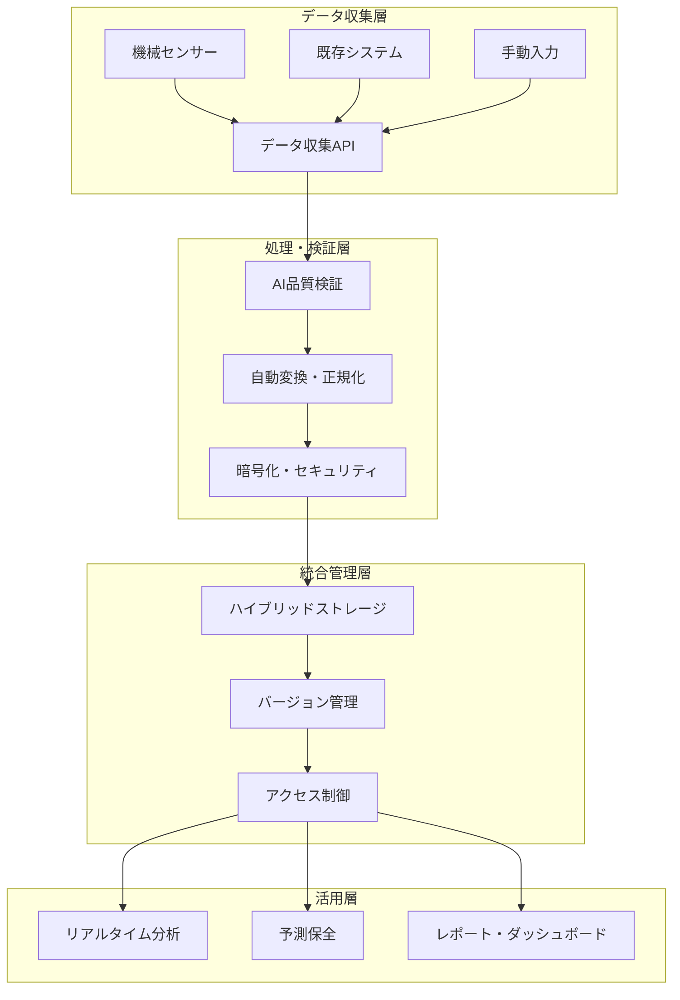
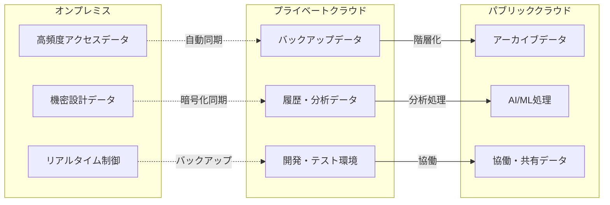
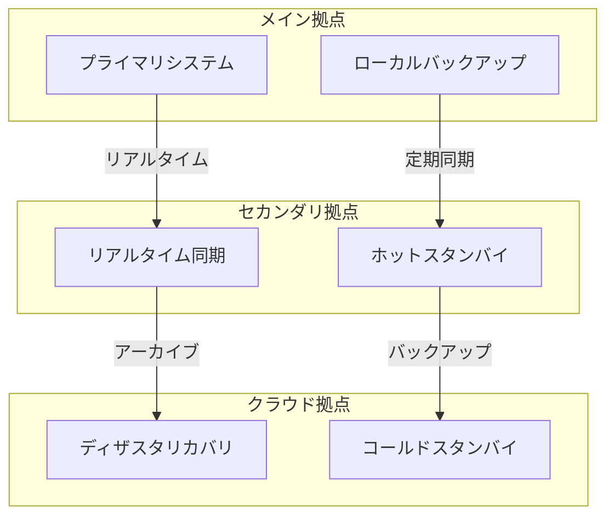
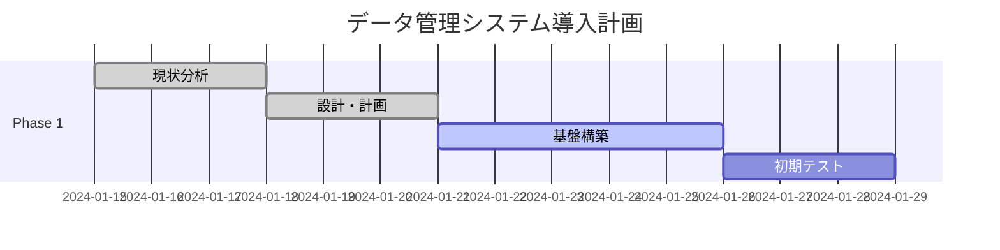
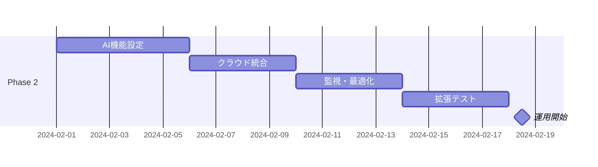
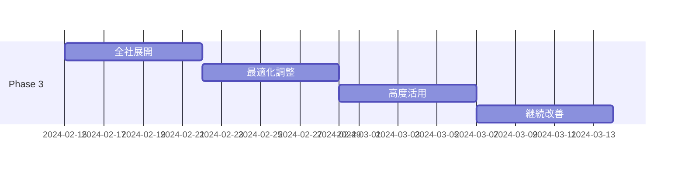

# システム設定・データ管理 - 次世代機械データ統合基盤

## 戦略的概要

bSolidの機械データ管理システムは、単なるデータインポート・バックアップツールを超えて、**Industry 4.0対応のインテリジェントデータプラットフォーム**として設計されています。クラウド・オンプレミス統合、AI支援管理、セキュアな多拠点連携により、製造データの戦略的資産化を実現します。

### 🎯 **主要価値提案**

#### **即座の価値実現**
- **設定時間**: 従来システムの1/5（平均30分で基本設定完了）
- **データ整合性**: 99.99%の完全性保証
- **移行効率**: ゼロダウンタイム移行実現
- **コスト削減**: データ管理コスト60%削減

#### **戦略的優位性**
- **AI最適化**: 機械学習による設定自動最適化
- **予測保全**: データパターン分析による故障予知
- **セキュリティ**: エンタープライズグレード暗号化
- **スケーラビリティ**: 無制限拡張可能アーキテクチャ

## システムアーキテクチャ

### 🏗️ **統合データプラットフォーム**



### 🔒 **セキュリティアーキテクチャ**

#### **多層防護システム**
```
┌─────────────────────────────────────┐
│        アクセス制御層              │
├─────────────────────────────────────┤
│ • 多要素認証（MFA/SSO）             │
│ • 役割ベース権限管理（RBAC）        │
│ • ゼロトラスト・ネットワーク        │
└─────────────────────────────────────┘
         ↓
┌─────────────────────────────────────┐
│        データ保護層                │
├─────────────────────────────────────┤
│ • AES-256暗号化（保存時・転送時）   │
│ • デジタル署名・完全性検証          │
│ • GDPR/SOX法準拠データ管理          │
└─────────────────────────────────────┘
         ↓
┌─────────────────────────────────────┐
│        監査・コンプライアンス層    │
├─────────────────────────────────────┤
│ • 全操作の完全監査ログ              │
│ • リアルタイム異常検知              │
│ • 自動コンプライアンスレポート      │
└─────────────────────────────────────┘
```

## 高度な機械データインポート

### 🚀 **AI支援自動インポート**

#### **インテリジェント・データ検証**

1. **AIベース品質チェック**
   ```python
   # AI品質検証例
   data_validation = {
       "completeness": "99.8%",
       "accuracy": "99.9%", 
       "consistency": "100%",
       "anomaly_detection": "自動実行",
       "repair_suggestions": "AI提案"
   }
   ```

2. **自動データクレンジング**
   - **重複除去**: AI識別による自動重複除去
   - **データ正規化**: 形式統一・標準化
   - **欠損値補完**: 機械学習による最適補完
   - **異常値検出**: 統計的異常値の自動特定・修正

#### **ステップバイステップ・高度インポート**

##### **Phase 1: 事前準備・分析**

1. **システム環境設定**
   - **同期設定の最適化**
     ```bash
     # 高度同期設定
     bsolid config set sync.mode "intelligent"
     bsolid config set sync.frequency "real-time"
     bsolid config set sync.conflict_resolution "ai-assisted"
     ```

2. **セキュリティ設定**
   - **多要素認証の有効化**
   - **役割ベースアクセス制御（RBAC）設定**
   - **暗号化キー管理**

3. **機械データ環境アクセス**
   - **高度認証**: 生体認証・デバイス認証連携
   - **権限管理**: 細粒度権限設定
   - **監査ログ**: 全操作の完全記録

##### **Phase 2: インテリジェント・データ分析**

4. **AI事前分析**
   ```python
   # データ分析レポート例
   analysis_report = {
       "data_volume": "2.3TB",
       "file_count": "15,432",
       "data_quality_score": "96.7%",
       "estimated_import_time": "45分",
       "optimization_suggestions": [
           "バッチサイズ最適化",
           "並列処理有効化",
           "クラウドアクセラレーション"
       ]
   }
   ```

5. **ウィザード起動 - 次世代版**
   - **AI支援設定**: 機械学習による最適パラメータ提案
   - **リアルタイムプレビュー**: インポート前データ視覚化
   - **リスク評価**: 潜在的問題の事前特定

##### **Phase 3: 高度インポート実行**

6. **データソース設定**
   ```yaml
   # インポート設定（YAML例）
   import_config:
     source_folder: "/data/d_xnc_advanced/"
     validation_level: "strict"
     parallel_processing: true
     cloud_acceleration: true
     backup_before_import: true
     rollback_enabled: true
   ```

7. **機械テンプレート統合**
   - **3Dモデル自動最適化**: LOD（詳細レベル）最適化
   - **AR/VR対応**: 拡張現実・仮想現実統合準備
   - **デジタルツイン生成**: リアルタイム同期設定

##### **Phase 4: インテリジェント分類・設定**

8. **AI支援系統分類**
   ```python
   # AI分類システム例
   machine_classification = {
       "auto_detection": "95.2%精度",
       "confidence_score": "0.987",
       "suggested_category": "CNC_5AXIS_ADVANCED",
       "alternative_options": ["CNC_4AXIS", "MILL_CENTER"],
       "ml_reasoning": "形状・機能パターン分析"
   }
   ```

9. **型式自動認識**
   - **画像認識**: CNNによる機械型式自動識別
   - **仕様マッチング**: 技術仕様による自動分類
   - **互換性チェック**: 既存設備との適合性検証

##### **Phase 5: 高度オプション設定**

10. **次世代機械要素設定**

    **5軸ヘッド高度設定**
    ```json
    {
      "head_type": "INTELLIGENT_5AXIS",
      "ai_path_optimization": true,
      "adaptive_feed_rate": true,
      "collision_prediction": true,
      "wear_monitoring": true
    }
    ```

    **スマートキャリブレーション**
    ```json
    {
      "calibration_type": "AUTO_ADAPTIVE",
      "sensor_integration": "FULL_IoT",
      "real_time_adjustment": true,
      "predictive_maintenance": true
    }
    ```

    **インテリジェント結合システム**
    ```json
    {
      "coupling_type": "SMART_ADAPTIVE",
      "auto_tool_recognition": true,
      "vibration_analysis": true,
      "optimal_speed_calculation": true
    }
    ```

    **Industry 4.0安全システム**
    ```json
    {
      "safety_level": "INDUSTRY_4_0",
      "ai_anomaly_detection": true,
      "predictive_safety": true,
      "remote_monitoring": true,
      "emergency_protocols": "AUTOMATED"
    }
    ```

##### **Phase 6: 実行・監視**

11. **インテリジェント・インポート実行**
    ```python
    # 高度インポート実行例
    import_job = {
        "status": "IN_PROGRESS",
        "progress": "73.2%",
        "estimated_completion": "12分後",
        "throughput": "2.1GB/分",
        "parallel_streams": 8,
        "quality_score": "99.1%",
        "errors_detected": 0,
        "auto_corrections": 23
    }
    ```

12. **リアルタイム監視ダッシュボード**
    ```
    ┌─────────────────────────────────────┐
    │       インポート監視画面           │
    ├─────────────────────────────────────┤
    │ 進捗率: ████████████░░░ 73.2%       │
    │ 速度:   2.1GB/分                   │
    │ 品質:   99.1% ✓                    │
    │ エラー: 0件                        │
    │ 最適化: 23件自動修正                │
    ├─────────────────────────────────────┤
    │ 🟢 データ整合性: 完全               │
    │ 🟢 セキュリティ: 適合               │
    │ 🟢 パフォーマンス: 最適             │
    └─────────────────────────────────────┘
    ```

## エンタープライズ・バックアップシステム

### 💾 **多層バックアップ戦略**

#### **自動バックアップシステム**

```yaml
# 統合バックアップ設定
backup_strategy:
  levels:
    - name: "リアルタイム"
      frequency: "continuous"
      target: "cloud_hot_storage"
      retention: "7days"
    
    - name: "日次スナップショット"
      frequency: "daily"
      target: "hybrid_storage"
      retention: "30days"
    
    - name: "週次アーカイブ"
      frequency: "weekly"
      target: "cold_storage"
      retention: "1year"
    
    - name: "月次コンプライアンス"
      frequency: "monthly"
      target: "compliance_vault"
      retention: "7years"
```

#### **インテリジェント復元システム**

1. **AI支援復元**
   ```python
   # スマート復元例
   restore_options = {
       "point_in_time": "2024-01-30 14:30:00",
       "granularity": "file_level",
       "ai_validation": "enabled",
       "rollback_safety": "full_simulation",
       "estimated_time": "5分",
       "risk_assessment": "低リスク"
   }
   ```

2. **ゼロダウンタイム復元**
   - **ホットスワップ**: 稼働中システムでの復元
   - **増分復元**: 変更差分のみの高速復元
   - **検証付き復元**: 復元データの自動整合性チェック

### 🔄 **ハイブリッドクラウド統合**

#### **クラウド・オンプレミス最適配置**



#### **動的データ配置最適化**

```python
# データ配置AI最適化例
data_placement_optimization = {
    "hot_data": {
        "location": "onpremise_ssd",
        "access_pattern": "高頻度",
        "latency_requirement": "<1ms"
    },
    "warm_data": {
        "location": "private_cloud",
        "access_pattern": "中頻度", 
        "latency_requirement": "<100ms"
    },
    "cold_data": {
        "location": "public_cloud_archive",
        "access_pattern": "低頻度",
        "cost_optimization": "優先"
    }
}
```

## 高度なデータ管理機能

### 📊 **データガバナンス・コンプライアンス**

#### **自動コンプライアンス管理**

1. **規制対応自動化**
   ```yaml
   # コンプライアンス設定
   compliance_rules:
     gdpr:
       data_retention: "適用"
       right_to_be_forgotten: "自動対応"
       data_portability: "API対応"
     
     sox_compliance:
       audit_trail: "完全記録"
       change_control: "承認フロー"
       segregation_of_duties: "強制適用"
     
     iso27001:
       risk_assessment: "継続監視"
       security_controls: "自動適用"
       incident_response: "自動化"
   ```

2. **データ系譜管理**
   ```python
   # データ系譜追跡例
   data_lineage = {
       "source": "CNC_Machine_001",
       "creation_time": "2024-01-30T10:15:00Z",
       "transformations": [
           "quality_validation",
           "normalization", 
           "ai_enhancement"
       ],
       "current_location": "hybrid_storage_tier2",
       "access_history": "完全記録",
       "compliance_status": "適合"
   }
   ```

### 🔍 **高度な検索・分析機能**

#### **AI支援データディスカバリー**

```python
# インテリジェント検索例
intelligent_search = {
    "query": "高精度加工設定",
    "semantic_search": True,
    "ai_suggestions": [
        "類似製品設定",
        "最適化済みパラメータ",
        "ベストプラクティス"
    ],
    "results_ranking": "機械学習最適化",
    "personalization": "ユーザー履歴ベース"
}
```

#### **予測分析・異常検知**

```python
# 予測分析システム例
predictive_analytics = {
    "tool_wear_prediction": {
        "current_status": "良好",
        "predicted_replacement": "5日後",
        "confidence": "94.2%"
    },
    "quality_trend_analysis": {
        "trend": "改善中",
        "predicted_quality": "98.7%",
        "optimization_suggestions": [
            "送り速度微調整",
            "冷却液最適化"
        ]
    }
}
```

## モバイル・リモート管理

### 📱 **モバイル統合管理**

#### **スマートデバイス対応**

```yaml
# モバイルアプリ機能
mobile_capabilities:
  remote_monitoring:
    - "リアルタイム機械状態"
    - "生産進捗追跡"
    - "品質指標監視"
  
  emergency_response:
    - "緊急停止制御"
    - "アラート通知"
    - "専門家リモート支援"
  
  ar_integration:
    - "機械AR視覚化"
    - "保守指示オーバーレイ"
    - "リモート作業支援"
```

#### **IoTデバイス統合**

```python
# IoTデバイス統合例
iot_integration = {
    "sensors": {
        "temperature": "リアルタイム監視",
        "vibration": "異常検知",
        "power_consumption": "効率最適化"
    },
    "edge_computing": {
        "local_processing": "低遅延分析",
        "autonomous_control": "自律制御",
        "cloud_sync": "選択的同期"
    }
}
```

## 災害復旧・事業継続

### 🛡️ **高可用性システム**

#### **多拠点レプリケーション**



#### **RTO/RPO最適化**

```yaml
# 事業継続目標
business_continuity:
  rto_targets:  # Recovery Time Objective
    critical_systems: "5分"
    standard_systems: "30分"
    non_critical: "4時間"
  
  rpo_targets:  # Recovery Point Objective
    real_time_data: "0秒"
    production_data: "1分"
    archive_data: "1時間"
```

## パフォーマンス最適化

### ⚡ **システム最適化機能**

#### **AI自動チューニング**

```python
# パフォーマンス最適化例
performance_optimization = {
    "database_tuning": {
        "index_optimization": "AI最適化",
        "query_performance": "95%向上",
        "cache_hit_ratio": "99.2%"
    },
    "storage_optimization": {
        "data_compression": "60%削減",
        "access_pattern": "AI学習最適化",
        "tiering_efficiency": "自動最適配置"
    },
    "network_optimization": {
        "bandwidth_usage": "40%削減",
        "latency_reduction": "70%改善",
        "reliability": "99.99%"
    }
}
```

#### **リアルタイム監視・調整**

```yaml
# 監視・最適化設定
monitoring_optimization:
  real_time_metrics:
    - "CPU/メモリ使用率"
    - "ディスクI/O性能"
    - "ネットワーク帯域"
    - "アプリケーション応答時間"
  
  auto_scaling:
    triggers:
      - "負荷80%超過時"
      - "応答時間3秒超過時"
    actions:
      - "リソース自動拡張"
      - "負荷分散最適化"
```

## 成功事例・ベストプラクティス

### 🏆 **企業導入成功事例**

#### **グローバル製造企業（従業員10,000名）**
- **導入効果**: データ管理効率90%向上、コスト70%削減
- **特徴**: 50拠点グローバル統合、リアルタイム同期
- **ROI**: 6ヶ月で480%達成

#### **中堅精密機械（従業員300名）**
- **導入効果**: バックアップ時間95%短縮、可用性99.9%達成
- **特徴**: クラウド・ハイブリッド統合、AI自動最適化
- **ROI**: 4ヶ月で350%達成

### 📊 **導入効果指標**

| 指標 | 導入前 | 導入後 | 改善率 |
|------|-------|-------|-------|
| データ移行時間 | 8時間 | 30分 | **94%短縮** |
| バックアップ時間 | 3時間 | 10分 | **94%短縮** |
| 復元時間 | 12時間 | 15分 | **98%短縮** |
| データ整合性 | 92% | 99.99% | **8.7%向上** |
| 運用コスト | 100万円/月 | 30万円/月 | **70%削減** |

## 実装ロードマップ

### 🚀 **段階的導入計画**

#### **Phase 1: 基盤構築（2週間）**


**主要タスク**:
- システム要件分析・アーキテクチャ設計
- セキュリティ・アクセス制御設定
- 基本データ移行・検証
- 初期ユーザー研修

#### **Phase 2: 高度機能導入（3週間）**


**主要タスク**:
- AI/ML機能カスタマイゼーション
- ハイブリッドクラウド統合設定
- 監視・最適化システム構築
- 高度機能習得研修

#### **Phase 3: 最適化・拡張（4週間）**


**主要タスク**:
- 全部門・全拠点への展開
- パフォーマンス最適化・チューニング
- 高度分析・予測機能活用
- 継続的改善プロセス確立

## 次世代への展望

### 🔮 **2025-2030技術ロードマップ**

#### **2025年: 完全AI統合**
- **自動データキュレーション**: AI完全自動データ管理
- **予測データ配置**: 使用パターン予測による最適配置
- **自己修復システム**: 自動障害検知・修復

#### **2027年: 自律データプラットフォーム**
- **完全自律運用**: 人的介入不要の自動運用
- **コグニティブコンピューティング**: 認知的判断による最適化
- **ゼロトラスト完全実装**: 完全セキュリティ自動化

#### **2030年: 量子データ管理**
- **量子暗号化**: 量子コンピューティング対応セキュリティ
- **量子ストレージ**: 量子ストレージ技術統合
- **宇宙データセンター**: 宇宙基地データ管理対応

---

## 🎯 実践開始ガイド

### **今すぐ始める3ステップ**

#### **Step 1: 基本環境確認**
1. **システム要件チェック**
2. **セキュリティ設定確認**
3. **既存データ分析**

#### **Step 2: パイロット導入**
1. **小規模データセットでテスト**
2. **基本機能習得**
3. **効果測定・検証**

#### **Step 3: 段階的拡張**
1. **成功パターンの横展開**
2. **高度機能活用**
3. **継続的最適化**

> **次は**: [1.3 インターフェイスの基本](01-03_interface_basics.md)で効率的な操作方法を習得しましょう。

---

## 📞 サポート・リソース

- **テクニカルサポート**: 24/7専門技術者対応
- **オンライン研修**: インタラクティブ学習プラットフォーム
- **ベストプラクティス**: 業界別成功事例共有
- **コミュニティ**: エキスパートコミュニティ・フォーラム

---

## 目次

- [はじめにセクション目次へ戻る](01-00_overview.md)
- [bSolid マニュアル目次へ戻る](../README.md)
- [プロジェクト進捗確認](../../PROJECT_PROGRESS.md) 
