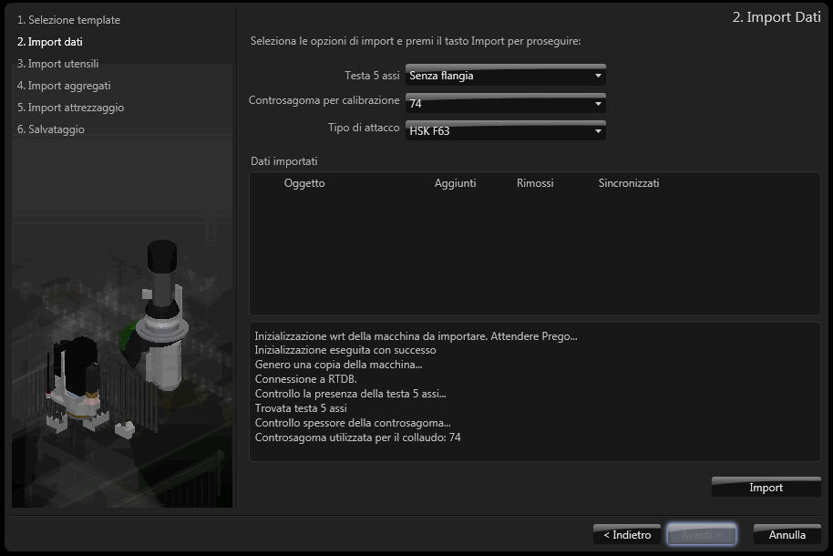

# リセット-機械データ保存

## 機械データをインポートする

1. **機械データのシンクロニセーションを有効にする**環境**一般設定**の

チェックボックス
オプションを有効または無効にするための小さな正方形。クリックすると、内部にチェックマークが表示されるかどうかが切り替わります。
を無効にします。

2. **機械データ**環境にアクセスします。

3.  ボタンを

クリック
(1) 画面上のポインタの下にあるオブジェクト（アイコン、ボタンなど）の上でマウスボタンを押す（そしてすぐに離す）行為を示します。(2)（動詞）選択したコマンドの機能を有効にするため、マウスの左ボタンを押してすぐに離します。
し、パスワードを入力します。

4.  ボタンをクリックして、データ

インポート
オープンドキュメント（ファイル）に、別のプログラムで作成された情報を、現在使用されているものとは別の形式で挿入すること。
ウインドウを起動します。

5. **インポートするd_xncフォルダを選択**データ

フィールド
データまたはコマンドを含む所定のエリア（データフィールドまたはコマンドフィールド）。
には、インポートするデータを含むフォルダの名前を入力します。フォルダを検索するには、

検索ボタン
検索機能を起動するためのボタン。通常、虫眼鏡のアイコンで示されます。
も一緒に使用します。

6. **機械テンプレートを含むフォルダを選択**データフィールドには、インポートする機械の画像を含むフォルダの名前を入力して、機械およびその構成部品の

3D図形
三次元空間の形状図（表面など）。
を作成します。（例えば、E：\MachineTemplates_v1.1.0からデータを取り出すDVDのフォルダなど）フォルダを検索するには、検索ボタンも一緒に使用します。

   

7. **次**ボタンをクリックします。

8. **系統**

ドロップダウンメニュー
ドロップダウンボタンをクリックすると、垂直または水平方向に広がるオプションまたは手段のリスト。
で、機械が所属する系統のタイプを選択します。

9. **型式**ドロップダウン

メニュー
サブメニュー（特定の機能/作業を実施できるようにするオプションのリスト）を生成するコマンド（マウスで選択する）のリスト。
で、機械モデルを選択します。

   

10. **次**ボタンをクリックします。

11. 処理フェーズを待ち、以下のデータフィールドの必要なオプションを選択します。

    

    
5軸ヘッド

    フランジのタイプのリストを持つドロップダウンメニュー
    

    

    
キャリブレーション治具

    形成可能な吸入カップのリストを持つドロップダウンメニュー機械の試験フェーズ中に使用されたものを選択します。
    

    

    
結合タイプ

    ツール結合のタイプのリストを持つドロップダウンメニュー
    

    

    
EC安全システムを持つ機械

    ＥＣガードおよび安全装置を持つ機械をインポートするのに使用されます。
    

**インポートされたデータ**テーブルには、インポートフェーズ中に保存されたすべてのデータのリストとエラーが含まれます。

12. **インポート**ボタンをクリックして、インポート操作を起動します。

13. インポート処理の終了および以下のページが表示されるのを待ちます。

    

インポートされたデータおよびエラーをチェックするには、赤い円の中のボタンをクリックし、**インポートされたデータ**テーブルをスクロールします。

14. **次**ボタンをクリックします。 