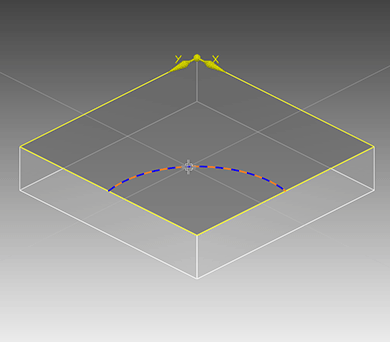
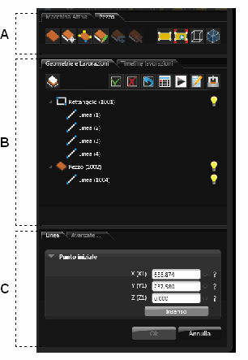

# インターフェイスの基本

説明

bSolidソフトウェアのユーザーインターフェイスは、CAD/CAM環境での作業を効率化するために設計されています。このセクションでは、bSolidのインターフェイス要素とその基本的な機能について説明します。

インターフェイスを理解することで、ソフトウェアをより効果的に使用し、作業の効率を向上させることができます。

関連項目

* [短い説明](./01-01_breve_panoramica.md)
* [リセット-機械データ保存](./01-02_imp_back_restore.md)
* [プロジェクト管理](./01-04_project_management.md)

## インターフェイス要素

bSolidインターフェイスは、以下の主要な要素で構成されています：

### タイトルバー

ウィンドウの最上部に位置し、現在開いているプロジェクトの名前やbSolidのバージョン情報などが表示されます。

### 環境バー

アプリケーションの各種環境（CAD/CAM、機械シミュレーション、bSolidルールなど）にアクセスするためのボタンが含まれています。各バーアイコンをクリックすることで、特定の作業環境に切り替えることができます。

### ステータスバー

ウィンドウの下部に位置し、現在の操作に関する情報やヒント、座標情報などが表示されます。

### ツールバー

コマンドやツールにアクセスするためのボタンが整理されたバーです。bSolidには以下のような様々なツールバーがあります：

- **標準バー** - 基本的なファイル操作や一般的な機能
- **描画バー** - 図形や要素を描画するためのツール
- **CADオプションバー** - CAD機能の設定や特殊操作
- **位置決め・設定バー** - オブジェクトの配置や寸法設定
- **測定バー** - 距離や角度などの測定ツール
- **加工作業バー** - 機械加工操作の設定
- **設定バー** - 全般的な環境設定

### ダイアログウィンドウ

特定の機能やツールの設定を行うためのポップアップウィンドウです。パラメータの入力や選択を行う際に表示されます。

### データ・コマンドフィールド

操作に必要なデータを入力したり、コマンドを選択するための領域です。以下のような要素が含まれます：

- **テキストボックス** - 文字や数値を入力する領域
- **チェックボックス** - オプションの有効/無効を切り替えるボックス
- **ドロップダウンボタン** - 選択肢のリストを表示するボタン
- **オプションボタン** - 複数の選択肢から一つを選ぶためのボタン
- **検索ボタン** - データベース内の情報を検索するためのボタン

## 作業エリア

bSolidの作業エリアは以下の主要な部分に分かれています：

### 描画エリア

作成したオブジェクトや加工作業を視覚的に表示する中央部分です。ここで直接モデルの編集や操作を行います。

### データエリア

インターフェイスの右側に位置し、以下のような要素が含まれています：

1. **コマンドエリア** - 現在選択しているツールやコマンドに関連するオプションを表示します。
2. **形状および加工作業エリア** - プロジェクト内のオブジェクトや加工作業をツリー形式で表示します。
3. **パラメーターエリア** - 選択したオブジェクトや加工作業のパラメーターを設定するためのフィールドを表示します。

## インターフェイスのカスタマイズ

bSolidでは、ユーザーの好みや作業スタイルに合わせてインターフェイスをカスタマイズすることができます：

1. ツールバーの表示/非表示の切り替え
2. ツールバーの位置の変更
3. ショートカットの設定
4. 表示色や背景色の変更

これらの設定は、設定メニューから行うことができます。

## ショートカットと効率的な操作

bSolidでは、効率的に作業を進めるために以下のような機能が提供されています：

- キーボードショートカット（例：Ctrl+Sで保存）
- マウスの右クリックによるコンテキストメニュー
- 頻繁に使用するコマンドのクイックアクセス
- ドラッグ＆ドロップによる操作 