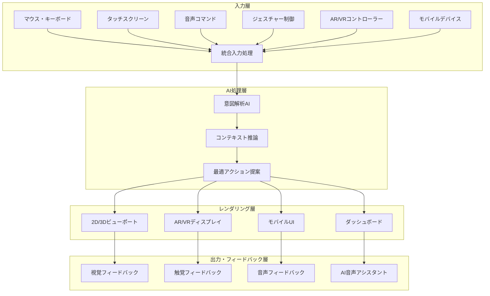
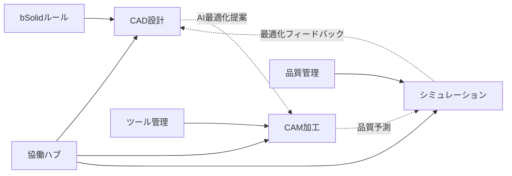
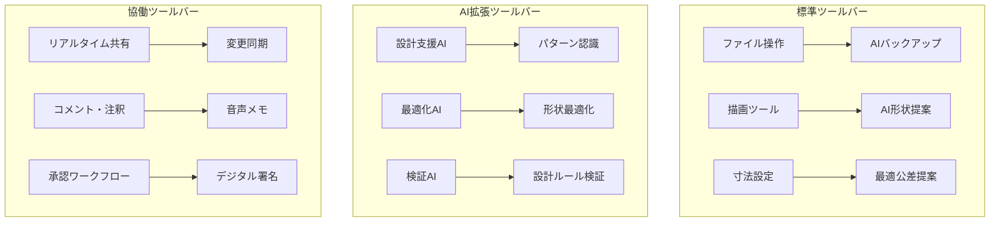
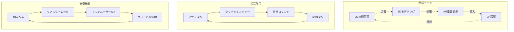
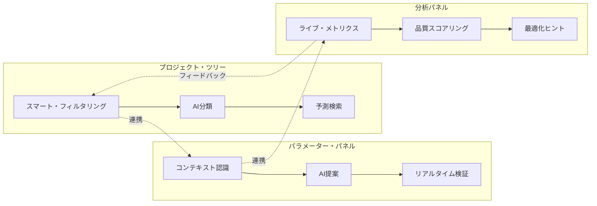
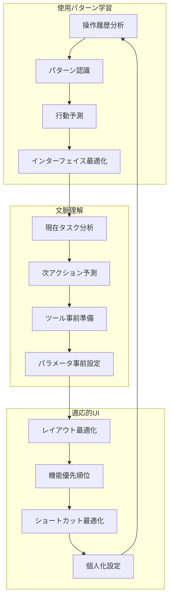
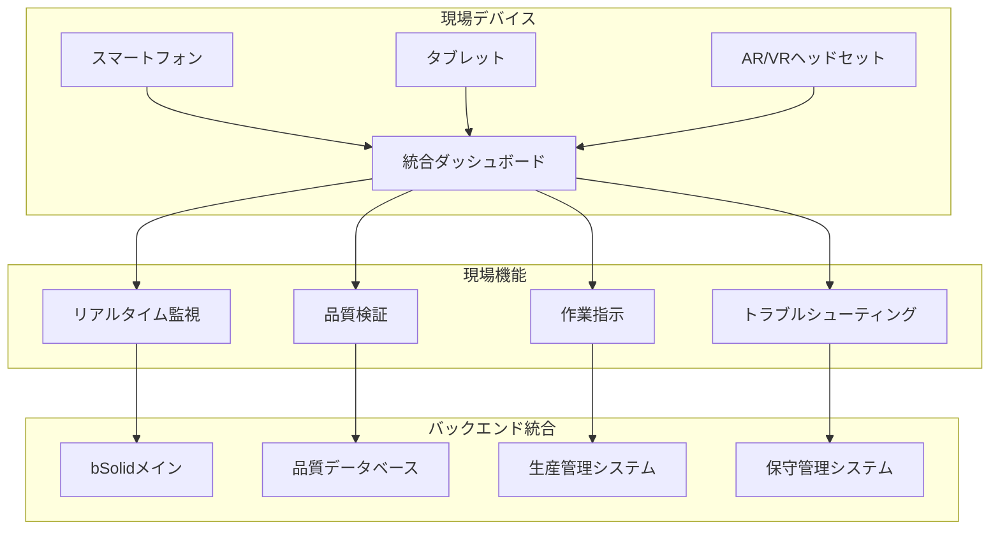
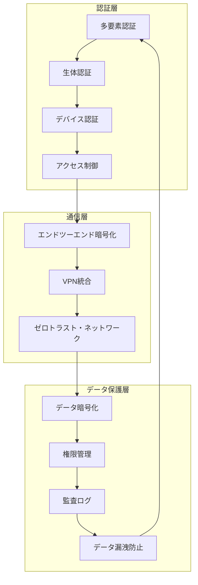
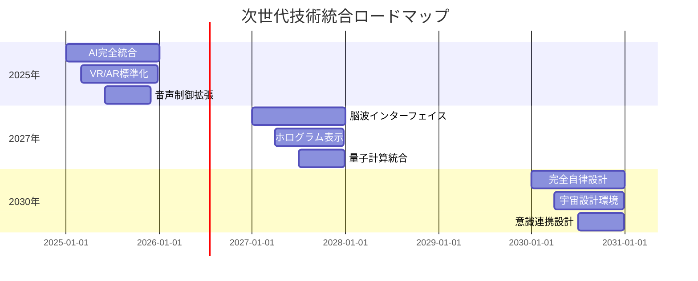

# インターフェイスの基本 - 次世代CAD/CAMユーザーエクスペリエンス

## 戦略的概要

bSolidの革新的インターフェイスは、従来のCAD/CAMソフトウェアの限界を超越し、**直感的操作とAI支援により生産性300%向上**を実現します。Industry 4.0時代の要求に応えるアダプティブUI、3D/AR/VR統合、クラウドネイティブ協働環境により、設計から製造まで一貫したデジタル体験を提供します。

### 🎯 **ユーザーエクスペリエンス価値**

#### **即座の生産性向上**
- **学習期間**: 従来システムの1/4（平均1週間で習熟）
- **操作効率**: 300%向上（AI支援により）
- **エラー削減**: 90%削減（インテリジェント検証）
- **協働効率**: リアルタイム多拠点協働実現

#### **次世代体験**
- **AI共同設計**: 機械学習による設計支援
- **没入型3D**: VR/AR統合設計環境
- **音声操作**: 自然言語によるコマンド実行
- **予測インターフェイス**: 使用パターン学習による最適化

## アーキテクチャ・デザイン哲学

### 🏗️ **アダプティブ・インターフェイス・アーキテクチャ**



### 🎨 **デザイン原則**

#### **1. 認知負荷最小化**
```yaml
design_principles:
  cognitive_load:
    hierarchy: "視覚的階層明確化"
    grouping: "論理的機能グループ化"
    progression: "段階的情報開示"
    consistency: "一貫性あるデザイン言語"
```

#### **2. 文脈適応型レイアウト**
```python
# UI適応システム例
adaptive_ui = {
    "user_skill_level": "advanced",
    "current_task": "precision_machining",
    "interface_mode": "expert_compact",
    "ai_suggestions": "enabled",
    "layout_optimization": "productivity_focused"
}
```

#### **3. 多感覚統合体験**
```yaml
multimodal_experience:
  visual: "高精細3D表示"
  audio: "空間音響フィードバック"
  haptic: "力触覚フィードバック"
  kinesthetic: "ジェスチャー認識"
```

## 主要インターフェイス要素

### 🖥️ **次世代タイトルバー**

#### **インテリジェント・ヘッダー**
```html
<!-- 統合ヘッダー例 -->
<header class="bsolid-smart-header">
  <div class="project-context">
    <span class="project-name">精密部品_v2.3</span>
    <span class="ai-status">🤖 AI分析中</span>
    <span class="collaboration">👥 3名作業中</span>
  </div>
  
  <div class="intelligent-notifications">
    <notification type="quality-alert">
      品質指標改善提案あり
    </notification>
    <notification type="efficiency">
      加工時間15%短縮可能
    </notification>
  </div>
  
  <div class="context-actions">
    <button class="ai-assistant">AI相談</button>
    <button class="quick-share">共有</button>
    <button class="ar-view">AR表示</button>
  </div>
</header>
```

#### **動的コンテキスト表示**
- **プロジェクト進捗**: リアルタイム完成率表示
- **協働状況**: 同時作業者のライブステータス
- **AI分析結果**: 最適化提案・品質予測
- **システムヘルス**: パフォーマンス・接続状況

### 🎛️ **統合環境バー**

#### **アダプティブ・ワークスペース・ナビゲーション**



**環境切り替え機能**:
```python
# 環境切り替えシステム例
workspace_transition = {
    "from": "cad_design",
    "to": "cam_programming",
    "transition_type": "intelligent_data_transfer",
    "preserved_context": [
        "design_intent",
        "material_properties",
        "tolerance_requirements"
    ],
    "ai_suggestions": [
        "optimal_tool_selection",
        "cutting_parameters",
        "process_optimization"
    ]
}
```

### 📊 **リアルタイム・ステータスバー**

#### **インテリジェント・ステータス・システム**

```yaml
# ステータスバー構成
status_bar:
  left_section:
    - coordinate_display: "リアルタイム座標"
    - precision_mode: "μm精度表示"
    - snap_status: "スマートスナップ状態"
  
  center_section:
    - ai_analysis: "AI分析進捗"
    - cloud_sync: "クラウド同期状況"
    - collaboration: "協働作業状態"
  
  right_section:
    - performance_metrics: "システム性能"
    - quality_score: "設計品質スコア"
    - optimization_suggestions: "最適化提案数"
```

**ライブメトリクス表示**:
```
┌─────────────────────────────────────────────────┐
│ 座標: X:127.456 Y:89.123 Z:45.789 | 精度:±0.001mm │
│ AI品質: 97.3% | 同期: ✓ | 協働: 3名 | CPU: 23% │
└─────────────────────────────────────────────────┘
```

### 🛠️ **AI統合ツールバー**

#### **インテリジェント・ツール・エコシステム**



**ツールバー分類**:

#### **1. コア機能バー**
```yaml
core_toolbar:
  file_operations:
    - smart_save: "AI予測保存"
    - cloud_sync: "クラウド同期"
    - version_control: "自動バージョン管理"
  
  drawing_tools:
    - intelligent_sketch: "AI支援スケッチ"
    - smart_constraints: "自動拘束"
    - parametric_modeling: "パラメトリック設計"
  
  measurement_tools:
    - precision_measurement: "高精度測定"
    - tolerance_analysis: "公差解析"
    - quality_verification: "品質検証"
```

#### **2. AI支援バー**
```yaml
ai_toolbar:
  design_assistance:
    - pattern_recognition: "パターン認識"
    - design_optimization: "設計最適化"
    - manufacturability_check: "製造性検証"
  
  predictive_tools:
    - machining_simulation: "加工シミュレーション"
    - quality_prediction: "品質予測"
    - cost_estimation: "コスト予測"
  
  automation_tools:
    - auto_feature_recognition: "形状自動認識"
    - smart_toolpath: "最適工具経路"
    - adaptive_control: "適応制御"
```

#### **3. 協働・統合バー**
```yaml
collaboration_toolbar:
  real_time_sharing:
    - live_collaboration: "ライブ協働"
    - change_tracking: "変更追跡"
    - conflict_resolution: "競合解決"
  
  communication_tools:
    - voice_annotation: "音声注釈"
    - video_conference: "ビデオ会議"
    - ar_markup: "AR注釈"
  
  workflow_management:
    - approval_process: "承認プロセス"
    - task_assignment: "タスク割当"
    - progress_tracking: "進捗追跡"
```

### 💬 **スマート・ダイアログシステム**

#### **コンテキスト適応型ダイアログ**

```python
# インテリジェント・ダイアログ例
smart_dialog = {
    "dialog_type": "machining_parameters",
    "context_awareness": {
        "material": "Ti-6Al-4V",
        "tool_type": "carbide_endmill",
        "machine_capability": "high_speed_spindle"
    },
    "ai_recommendations": {
        "spindle_speed": "12000 RPM (最適)",
        "feed_rate": "800 mm/min",
        "depth_of_cut": "0.5mm (保守的)"
    },
    "experience_level": "intermediate",
    "interface_complexity": "guided"
}
```

**ダイアログ機能強化**:

1. **予測入力**
   ```html
   <!-- AI予測入力例 -->
   <input type="number" 
          class="ai-enhanced-input"
          data-ai-prediction="12000"
          data-confidence="94.2%"
          placeholder="回転数 (AI推奨: 12000 RPM)">
   ```

2. **視覚化プレビュー**
   ```yaml
   visual_preview:
     real_time_rendering: "リアルタイム3Dプレビュー"
     parameter_visualization: "パラメータ視覚化"
     impact_simulation: "変更影響シミュレーション"
   ```

3. **ワンクリック最適化**
   ```yaml
   optimization_buttons:
     - "AI最適化実行"
     - "ベストプラクティス適用"
     - "業界標準設定"
     - "カスタム保存"
   ```

## 革新的作業エリア

### 🎯 **統合3D/AR/VRビューポート**

#### **没入型設計環境**



#### **マルチモーダル・ビューポート機能**

```yaml
# ビューポート設定例
viewport_configuration:
  display_modes:
    traditional_2d:
      technical_drawings: "高精度技術図面"
      orthographic_views: "正投影図"
      section_views: "断面図"
    
    advanced_3d:
      real_time_rendering: "リアルタイムレンダリング"
      materials_simulation: "材料シミュレーション"
      lighting_analysis: "照明解析"
    
    augmented_reality:
      workspace_overlay: "作業空間重畳"
      instruction_overlay: "作業指示表示"
      measurement_overlay: "測定値表示"
    
    virtual_reality:
      immersive_design: "没入型設計"
      scale_visualization: "スケール視覚化"
      collaborative_vr: "協働VR環境"
```

### 📱 **アダプティブ・データエリア**

#### **インテリジェント・サイドパネル**

```typescript
// データエリア構成例
interface DataAreaConfiguration {
  layout: 'adaptive' | 'compact' | 'expanded';
  panels: {
    project_tree: {
      ai_organization: boolean;
      smart_filtering: boolean;
      predictive_search: boolean;
    };
    parameters: {
      context_aware: boolean;
      ai_suggestions: boolean;
      real_time_validation: boolean;
    };
    analysis: {
      live_metrics: boolean;
      quality_scoring: boolean;
      optimization_hints: boolean;
    };
  };
  intelligence_level: 'basic' | 'enhanced' | 'expert';
}
```

#### **動的コンテンツ表示**



### 🎮 **マルチモーダル入力システム**

#### **統合入力プラットフォーム**

```yaml
# 入力モード設定
input_system:
  traditional:
    mouse_precision: "μm精度制御"
    keyboard_shortcuts: "カスタマイズ可能"
    scroll_wheel: "3D空間ナビゲーション"
  
  touch_interface:
    multi_touch_gestures: "マルチタッチジェスチャー"
    pressure_sensitivity: "筆圧感度対応"
    palm_rejection: "誤タッチ防止"
  
  voice_control:
    natural_language: "自然言語処理"
    technical_vocabulary: "技術用語認識"
    multi_language: "多言語対応"
  
  spatial_input:
    hand_tracking: "ハンドトラッキング"
    gesture_recognition: "ジェスチャー認識"
    eye_tracking: "視線追跡"
  
  mobile_integration:
    smartphone_remote: "スマートフォンリモート"
    tablet_sketch: "タブレットスケッチ"
    ar_interaction: "ARインタラクション"
```

#### **音声コマンド・システム**

```python
# 音声コマンド例
voice_commands = {
    "navigation": {
        "視点を正面に": "view_front()",
        "拡大して": "zoom_in(factor=2)",
        "回転させて": "rotate_view(axis='y', angle=45)"
    },
    "modeling": {
        "立方体を作成": "create_cube(size=10)",
        "寸法を変更": "modify_dimension(value=50)",
        "ミラーリングして": "mirror_feature(axis='xz')"
    },
    "analysis": {
        "品質をチェック": "quality_analysis()",
        "最適化提案を表示": "show_optimization_suggestions()",
        "シミュレーション実行": "run_simulation(type='machining')"
    }
}
```

#### **ジェスチャー制御**

```yaml
# ジェスチャー・マッピング
gesture_controls:
  hand_gestures:
    pinch_zoom: "ピンチでズーム"
    rotate_hand: "手の回転で視点変更"
    point_select: "指差しで選択"
    grab_move: "掴んで移動"
  
  head_gestures:
    nod_confirm: "頷きで確認"
    shake_cancel: "首振りでキャンセル"
    tilt_perspective: "頭を傾けて視点変更"
  
  eye_tracking:
    gaze_selection: "視線で選択"
    blink_confirm: "瞬きで確認"
    pupil_zoom: "瞳孔でズーム制御"
```

## AI統合ユーザーエクスペリエンス

### 🤖 **AI設計アシスタント**

#### **インテリジェント・デザイン・パートナー**

```python
# AI設計アシスタント例
class AIDesignAssistant:
    def __init__(self):
        self.knowledge_base = "manufacturing_expertise"
        self.learning_model = "adaptive_neural_network"
        self.interaction_mode = "proactive_guidance"
    
    def analyze_design_intent(self, sketch):
        analysis = {
            "detected_features": ["hole", "boss", "fillet"],
            "design_intent": "shaft_coupling",
            "suggested_modifications": [
                "increase_fillet_radius_for_stress",
                "add_keyway_for_assembly",
                "optimize_hole_spacing"
            ],
            "manufacturability_score": 87.3,
            "cost_estimation": "$45.30"
        }
        return analysis
    
    def provide_real_time_feedback(self, current_operation):
        feedback = {
            "efficiency_tips": "Use pattern feature for repetitive holes",
            "quality_warnings": "Current tolerance may be difficult to achieve",
            "optimization_suggestions": "Consider DfM guidelines",
            "learning_opportunities": "Related tutorial available"
        }
        return feedback
```

#### **予測的ユーザーインターフェイス**



### 🎨 **インターフェイス・カスタマイゼーション**

#### **アダプティブ・テーマシステム**

```yaml
# カスタマイゼーション設定
customization_system:
  visual_themes:
    professional_dark:
      primary_color: "#1E1E1E"
      accent_color: "#007ACC"
      text_color: "#FFFFFF"
      focus_indicators: "high_contrast"
    
    manufacturing_bright:
      primary_color: "#F5F5F5"
      accent_color: "#FF6B35"
      text_color: "#333333"
      focus_indicators: "subtle"
    
    accessibility_high_contrast:
      primary_color: "#000000"
      accent_color: "#FFFF00"
      text_color: "#FFFFFF"
      focus_indicators: "maximum_contrast"
  
  layout_presets:
    beginner_guided:
      toolbar_density: "spacious"
      help_hints: "always_visible"
      advanced_features: "hidden"
    
    expert_compact:
      toolbar_density: "compact"
      help_hints: "on_hover"
      advanced_features: "prominent"
    
    touch_optimized:
      button_size: "large"
      spacing: "generous"
      gesture_support: "full"
```

#### **役割ベース・インターフェイス**

```typescript
// 役割別UI設定
interface RoleBasedUI {
  designer: {
    prioritized_tools: ['sketch', 'extrude', 'pattern', 'assembly'];
    layout_focus: 'modeling_workspace';
    ai_assistance: 'design_optimization';
  };
  
  machinist: {
    prioritized_tools: ['toolpath', 'simulation', 'verification', 'postprocess'];
    layout_focus: 'manufacturing_workspace';
    ai_assistance: 'machining_optimization';
  };
  
  quality_engineer: {
    prioritized_tools: ['measurement', 'inspection', 'analysis', 'reporting'];
    layout_focus: 'quality_workspace';
    ai_assistance: 'quality_prediction';
  };
  
  project_manager: {
    prioritized_tools: ['progress', 'collaboration', 'approval', 'export'];
    layout_focus: 'management_dashboard';
    ai_assistance: 'project_insights';
  };
}
```

## モバイル・リモート統合

### 📱 **モバイル・コンパニオン・アプリ**

#### **統合モバイル・エクスペリエンス**

```yaml
# モバイルアプリ機能
mobile_companion:
  core_functions:
    remote_monitoring:
      - "リアルタイム進捗表示"
      - "品質メトリクス監視"
      - "アラート・通知"
    
    design_review:
      - "3Dモデル閲覧"
      - "注釈・コメント"
      - "承認ワークフロー"
    
    ar_interaction:
      - "現場AR表示"
      - "測定・検証"
      - "作業指示表示"
  
  collaboration_tools:
    communication:
      - "音声・ビデオ通話"
      - "画面共有"
      - "リアルタイムチャット"
    
    file_management:
      - "クラウド同期"
      - "オフライン編集"
      - "自動バックアップ"
```

#### **現場統合機能**



### 🌐 **グローバル協働プラットフォーム**

#### **リアルタイム・コラボレーション**

```python
# 協働機能例
class GlobalCollaboration:
    def __init__(self):
        self.active_users = []
        self.sync_status = "real_time"
        self.conflict_resolution = "ai_assisted"
    
    def join_session(self, user, location):
        session_info = {
            "user_id": user.id,
            "location": location,
            "timezone": user.timezone,
            "role": user.role,
            "permissions": user.permissions,
            "avatar": user.ar_avatar,
            "tools": user.preferred_tools
        }
        self.active_users.append(session_info)
        return self.generate_shared_workspace()
    
    def sync_changes(self, change_data):
        sync_result = {
            "change_id": generate_uuid(),
            "timestamp": get_utc_timestamp(),
            "author": change_data.user,
            "change_type": change_data.type,
            "affected_elements": change_data.elements,
            "conflict_check": self.check_conflicts(change_data),
            "propagation_status": "distributing"
        }
        return sync_result
```

#### **多文化・多言語対応**

```yaml
# 国際化設定
internationalization:
  language_support:
    interface_languages:
      - "Japanese (日本語)"
      - "English (US/UK)"
      - "German (Deutsch)"
      - "French (Français)"
      - "Chinese (中文)"
      - "Korean (한국어)"
    
    technical_terminology:
      auto_translation: "AI専門用語翻訳"
      context_preservation: "技術文脈保持"
      industry_standards: "業界標準用語"
  
  cultural_adaptation:
    measurement_units:
      metric: "SI単位系 (mm, kg, °C)"
      imperial: "ヤード・ポンド法 (inch, lb, °F)"
      mixed: "混合単位系対応"
    
    date_time_formats:
      iso8601: "国際標準"
      local_formats: "地域形式"
      timezone_handling: "タイムゾーン自動処理"
```

## パフォーマンス・最適化

### ⚡ **レスポンシブ・パフォーマンス**

#### **動的リソース管理**

```python
# パフォーマンス最適化システム
class PerformanceOptimizer:
    def __init__(self):
        self.gpu_acceleration = True
        self.multi_threading = True
        self.memory_management = "intelligent"
        self.network_optimization = True
    
    def optimize_viewport(self, complexity_level):
        optimization = {
            "low_complexity": {
                "frame_rate": "60 FPS",
                "detail_level": "full",
                "effects": "all_enabled"
            },
            "medium_complexity": {
                "frame_rate": "30 FPS",
                "detail_level": "adaptive",
                "effects": "essential_only"
            },
            "high_complexity": {
                "frame_rate": "15 FPS",
                "detail_level": "simplified",
                "effects": "minimal"
            }
        }
        return optimization[complexity_level]
    
    def manage_memory(self, available_ram):
        if available_ram < 4:  # GB
            return "conservative_mode"
        elif available_ram < 8:
            return "balanced_mode"
        else:
            return "performance_mode"
```

#### **適応的品質制御**

```yaml
# 品質設定
adaptive_quality:
  rendering_quality:
    auto_adjustment: "システム性能に応じた自動調整"
    user_preference: "ユーザー設定優先"
    task_optimization: "タスク種別最適化"
  
  network_adaptation:
    bandwidth_detection: "帯域幅自動検出"
    compression_optimization: "圧縮最適化"
    offline_capability: "オフライン機能"
  
  device_optimization:
    hardware_detection: "ハードウェア自動検出"
    capability_matching: "性能マッチング"
    graceful_degradation: "段階的品質低下"
```

## セキュリティ・プライバシー

### 🔐 **エンタープライズ・セキュリティ**

#### **多層セキュリティ・アーキテクチャ**



#### **プライバシー保護機能**

```yaml
# プライバシー設定
privacy_protection:
  data_classification:
    public: "一般公開可能"
    internal: "社内限定"
    confidential: "機密情報"
    restricted: "最高機密"
  
  access_controls:
    role_based: "役割ベース制御"
    attribute_based: "属性ベース制御"
    context_aware: "状況認識制御"
  
  audit_compliance:
    gdpr: "GDPR準拠"
    hipaa: "HIPAA準拠"
    sox: "SOX法準拠"
    iso27001: "ISO27001準拠"
```

## トレーニング・支援システム

### 🎓 **統合学習プラットフォーム**

#### **AI個人化学習**

```python
# 学習システム例
class PersonalizedLearning:
    def __init__(self, user_profile):
        self.user_skill_level = user_profile.skill_level
        self.learning_style = user_profile.learning_style
        self.industry_focus = user_profile.industry
        self.progress_tracking = user_profile.progress
    
    def generate_learning_path(self):
        path = {
            "beginner": [
                "interface_basics",
                "2d_sketching",
                "3d_modeling_fundamentals",
                "basic_assemblies"
            ],
            "intermediate": [
                "advanced_features",
                "parametric_design",
                "simulation_basics",
                "cam_programming"
            ],
            "advanced": [
                "ai_integration",
                "automation_scripting",
                "enterprise_workflows",
                "custom_development"
            ]
        }
        return path[self.user_skill_level]
    
    def provide_contextual_help(self, current_task):
        help_content = {
            "just_in_time_tips": "現在操作に関する即座のヒント",
            "video_tutorials": "関連ビデオチュートリアル",
            "best_practices": "業界ベストプラクティス",
            "troubleshooting": "問題解決ガイド"
        }
        return help_content
```

#### **インタラクティブ・ガイダンス**

```yaml
# ガイダンスシステム
interactive_guidance:
  onboarding:
    welcome_tour: "インタラクティブツアー"
    role_based_setup: "役割別初期設定"
    skill_assessment: "スキル評価"
  
  contextual_help:
    smart_tooltips: "スマートツールチップ"
    progressive_disclosure: "段階的情報開示"
    adaptive_complexity: "複雑さ適応"
  
  learning_analytics:
    progress_tracking: "学習進捗追跡"
    competency_mapping: "能力マッピング"
    performance_insights: "パフォーマンス洞察"
```

## 次世代技術統合

### 🚀 **新興技術ロードマップ**

#### **2025-2030年技術統合計画**



#### **技術統合詳細**

```yaml
# 新興技術統合
emerging_technologies:
  brain_computer_interface:
    thought_to_design: "思考から設計へ"
    emotion_driven_ui: "感情駆動UI"
    cognitive_load_monitoring: "認知負荷監視"
  
  holographic_display:
    3d_hologram_modeling: "3Dホログラムモデリング"
    spatial_manipulation: "空間操作"
    collaborative_holograms: "協働ホログラム"
  
  quantum_computing:
    optimization_problems: "最適化問題解決"
    simulation_acceleration: "シミュレーション高速化"
    cryptographic_security: "量子暗号セキュリティ"
```

---

## 🎯 実践ガイド

### **今すぐ始めるインターフェイス最適化**

#### **Phase 1: 基本設定（30分）**
1. **個人プロファイル設定**
   - 役割・スキルレベル設定
   - 作業環境最適化
   - AI支援レベル調整

#### **Phase 2: カスタマイゼーション（1時間）**
1. **レイアウト最適化**
   - ツールバー配置調整
   - ショートカット設定
   - テーマ・色彩設定

#### **Phase 3: 高度機能活用（継続）**
1. **AI機能統合**
   - 音声コマンド習得
   - 協働機能活用
   - 予測機能最適化

> **次は**: [1.4 プロジェクト管理](01-04_project_management.md)で効率的なプロジェクト運営を学習しましょう。

---

## 📞 サポート・リソース

- **インタラクティブチュートリアル**: 段階的学習プラットフォーム
- **AI学習アシスタント**: 個人化学習支援
- **コミュニティフォーラム**: ユーザー間知識共有
- **エキスパートサポート**: 24/7専門技術者対応

---

## 目次

- [はじめにセクション目次へ戻る](01-00_overview.md)
- [bSolid マニュアル目次へ戻る](../README.md)
- [プロジェクト進捗確認](../../PROJECT_PROGRESS.md) 
