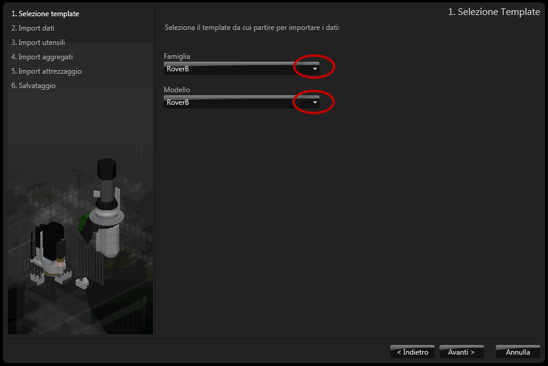
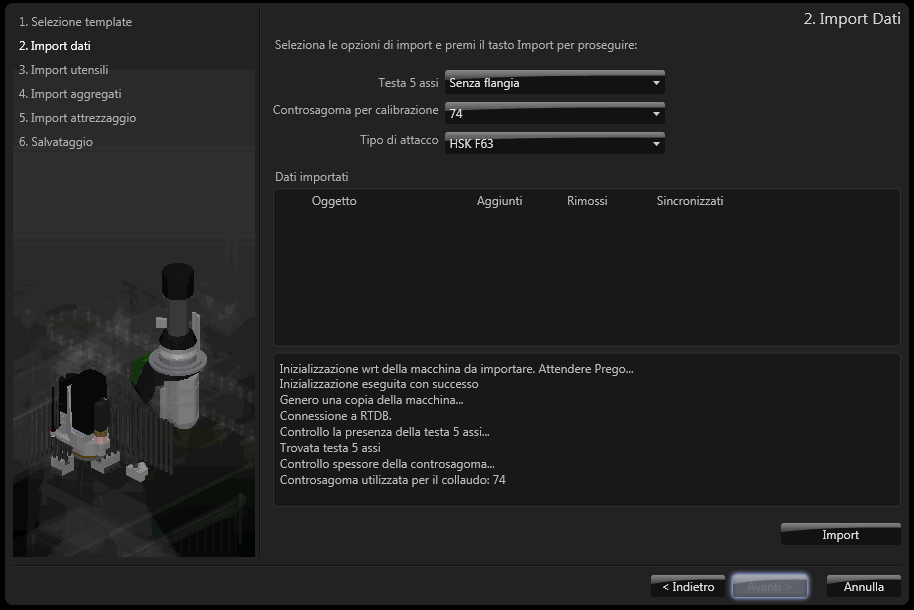

# プロジェクト管理

説明

bSolidでは、作成したモデルやプログラムはプロジェクトとして管理されます。プロジェクト管理機能を使用することで、作業の整理、保存、共有が効率的に行えます。

このセクションでは、bSolidでのプロジェクトの作成、保存、開き方など、基本的なプロジェクト管理機能について説明します。

関連項目

* [短い説明](./01-01_breve_panoramica.md)
* [リセット-機械データ保存](./01-02_imp_back_restore.md)
* [インターフェイスの基本](./01-03_interface_basics.md)

## プロジェクトの基本概念

bSolidのプロジェクトには、以下の要素が含まれています：

- **モデル情報** - 3Dモデルや2D図面のジオメトリデータ
- **加工情報** - 加工作業、ツール、パラメータなどの情報
- **機械構成** - プロジェクトに関連する機械の設定情報
- **マテリアル定義** - 使用する素材とその特性に関する情報
- **メタデータ** - プロジェクト名、作成日、バージョンなどの情報

## プロジェクトの作成と保存

### 新規プロジェクトの作成

新規プロジェクトを作成するには、以下の手順に従います：

1. 標準ツールバーから「新規」ボタンをクリックするか、メニューから「ファイル」→「新規」を選択します。
2. プロジェクトタイプを選択します（標準、パラメトリック、ネスティングなど）。
3. 必要な初期設定を行います（使用する機械や単位など）。
4. 「OK」をクリックして新しいプロジェクトを作成します。

### プロジェクトの保存

作成したプロジェクトを保存するには：

1. 標準ツールバーから「保存」ボタンをクリックするか、メニューから「ファイル」→「保存」または「名前を付けて保存」を選択します。
2. プロジェクト名を入力し、保存先を選択します。
3. 必要に応じて追加情報（説明、タグなど）を入力します。
4. 「保存」をクリックしてプロジェクトを保存します。

プロジェクトはbSolidの標準形式（.bSolid）で保存されます。このファイルにはプロジェクトのすべての情報が含まれています。

### 自動保存機能

bSolidには自動保存機能があり、定期的に作業内容を一時ファイルに保存します。自動保存の間隔は設定メニューから変更できます。

## プロジェクトを開く・インポート

### 既存プロジェクトを開く

既存のbSolidプロジェクトを開くには：

1. 標準ツールバーから「開く」ボタンをクリックするか、メニューから「ファイル」→「開く」を選択します。
2. 開きたいプロジェクトファイル（.bSolid）を選択します。
3. 「開く」をクリックします。

### 外部ファイルのインポート

bSolidでは、他のCADシステムから作成されたファイルをインポートすることもできます：

1. メニューから「ファイル」→「インポート」を選択します。
2. インポートするファイルの形式を選択します（DXF、STL、STEP、IGESなど）。
3. インポートするファイルを選択します。
4. インポート設定を行い、「インポート」をクリックします。

## プロジェクトの管理と整理

### プロジェクトのバックアップ

重要なプロジェクトは定期的にバックアップすることをお勧めします：

1. メニューから「ファイル」→「バックアップ」→「バックアップを作成」を選択します。
2. バックアップの保存先を指定します。
3. 「バックアップ」をクリックします。

### プロジェクトの整理

複数のプロジェクトを効率的に管理するためのヒント：

- 一貫した命名規則を使用する
- プロジェクトにタグや説明を追加する
- プロジェクトを適切なフォルダに整理する
- 完了したプロジェクトをアーカイブする

## プロジェクトの共有とエクスポート

### プロジェクトの共有

他のbSolidユーザーとプロジェクトを共有するには：

1. プロジェクトファイル（.bSolid）をそのまま共有します。
2. 必要に応じて関連するライブラリファイルも含めます。
3. ネットワーク共有フォルダやクラウドストレージを利用して効率的に共有します。

### プロジェクトのエクスポート

他のシステムで使用するためにプロジェクトをエクスポートするには：

1. メニューから「ファイル」→「エクスポート」を選択します。
2. エクスポート形式を選択します（DXF、STL、STEP、NC、XMLなど）。
3. エクスポート設定を行い、「エクスポート」をクリックします。 