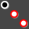

# 変換操作

**ファイル名**: `02-05-01_transform.md`  
**カテゴリ**: 編集ツール - 変換操作

## 概要

変換操作は、既存のオブジェクトに対して移動、回転、拡大・縮小、ミラー（反転）、配列コピーなどの幾何学的変換を適用するツール群です。元HTMLファイルからの高精度変換により、詳細な手順と機能を提供します。

## 基本変換ツール

### 移動 

オブジェクトを指定した方向と距離に移動させます。

**操作手順**:
1. 移動するオブジェクトをツリーリストまたは描画エリアで選択
2. 変換バーの  ボタンをクリック
3. 移動の基準点（起点）をクリック
4. 移動先の点（終点）をクリック

**パラメーター**:
- **相対座標**: 現在位置からの相対的な移動量を指定
- **絶対座標**: 絶対座標系での移動先位置を指定
- **数値入力**: 正確な移動距離をX、Y、Z軸で数値指定

### 回転 

オブジェクトを指定した中心点と角度で回転させます。

**操作手順**:
1. 回転するオブジェクトを選択
2. 変換バーの  ボタンをクリック
3. 回転の中心点をクリック
4. 基準角度の点をクリック
5. 回転後の角度を示す点をクリック

**パラメーター**:
- **回転中心**: 回転の中心となる点の座標
- **回転角度**: 角度の数値入力（度単位）
- **回転軸**: 3D空間での回転軸の指定（X、Y、Z軸）

### 拡大・縮小 

オブジェクトのサイズを拡大または縮小します。

**操作手順**:
1. 拡大・縮小するオブジェクトを選択
2. 変換バーの  ボタンをクリック
3. スケーリングの中心点をクリック
4. 基準距離の点をクリック
5. 新しいサイズを示す点をクリック

**パラメーター**:
- **スケール中心**: 拡大・縮小の中心となる点
- **スケール係数**: 拡大・縮小倍率の数値入力
- **均等スケール**: 全方向に同じ倍率で拡大・縮小
- **非均等スケール**: X、Y、Z軸ごとに異なる倍率を指定

### ミラー（反転） 

オブジェクトの鏡像を作成します。

**操作手順**:
1. 反転するオブジェクトを選択
2. 変換バーの  ボタンをクリック
3. 反転軸の開始点をクリック
4. 反転軸の終了点をクリック

**パラメーター**:
- **反転軸**: 反転の基準となる軸の定義
- **オリジナル保持**: 元のオブジェクトを保持するかどうか
- **平面反転**: 3D空間での平面を基準とした反転

## 高度な変換ツール

### 配列コピー 

オブジェクトを規則的なパターンで複数コピーします。

#### 直線配列

**操作手順**:
1. 配列コピーするオブジェクトを選択
2. 変換バーの  ボタンをクリック
3. **直線配列**タイプを選択
4. 配列の方向と間隔を指定
5. 要素数を設定

**パラメーター**:
- **配列方向**: X、Y、Z軸方向の指定
- **要素間隔**: 各コピー間の距離
- **要素数**: 作成するコピーの総数
- **配列範囲**: 配列全体の総距離

#### 円形配列

**操作手順**:
1. 配列コピーするオブジェクトを選択
2. **円形配列**タイプを選択
3. 配列の中心点を指定
4. 角度間隔または要素数を設定

**パラメーター**:
- **配列中心**: 円形配列の中心点
- **角度間隔**: 各要素間の角度
- **要素数**: 円周上に配置する要素数
- **総角度**: 配列が占める全角度範囲

### 複合変換 

複数の変換操作を組み合わせて実行します。

**利用可能な組み合わせ**:
- **移動 + 回転**: オブジェクトを移動してから回転
- **移動 + スケール**: オブジェクトを移動してからサイズ変更
- **回転 + ミラー**: オブジェクトを回転してから反転
- **配列 + 変換**: 配列コピーの各要素に個別の変換を適用

## 変換操作の共通パラメーター

### 基本設定

**オリジナル保持**: 
- ✅ チェック時: 元のオブジェクトを保持し、変換されたコピーを作成
- ❌ チェック解除時: 元のオブジェクトに直接変換を適用

**プレビュー表示**:
- 変換結果を赤色でプレビュー表示
- 実行前に結果を確認可能
- Escキーでキャンセル可能

### 座標系設定

**相対座標**:
- 現在の位置を基準とした相対的な指定
- 増分値による変換

**絶対座標**:
- 絶対座標系での直接指定
- 最終位置の明確な制御

### 精度設定

**数値入力**:
- パラメーターエリアでの正確な数値入力
- 小数点以下の精密な制御
- 単位の自動変換（mm、inch等）

**スナップ機能**:
- 既存のオブジェクト点へのスナップ
- グリッド点へのスナップ
- 角度制約（15°、30°、45°等）

## 作業効率向上のヒント

### 変換順序の最適化

1. **スケール → 回転 → 移動**: 一般的な推奨順序
2. **配列前の準備**: 配列前に単一要素を完璧に配置
3. **プレビュー活用**: 大きな変換前は必ずプレビューで確認

### 繰り返し作業の効率化

**マクロ記録**: 複雑な変換手順をマクロとして保存
**テンプレート利用**: 定型的な配列パターンをテンプレート化
**パラメーター保存**: よく使用する設定値の保存と再利用

### 精度管理

**基準点設定**: 変換の基準となる点を慎重に選択
**段階的変換**: 複雑な変換は段階的に実行
**確認・修正**: 各段階で結果を確認し、必要に応じて修正

## エラー対処法

### よくある問題と解決策

**問題**: 変換後にオブジェクトが予期しない位置に移動
**解決策**: 
- 座標系設定（相対・絶対）を確認
- 基準点の選択を見直し
- スナップ設定を確認

**問題**: 配列コピーが正しく作成されない
**解決策**:
- 要素数と間隔の設定を確認
- 配列方向の軸設定を確認
- オリジナル保持設定を確認

**問題**: 回転がうまくいかない
**解決策**:
- 回転中心点の位置を確認
- 回転軸の設定を確認（2D/3D）
- 角度の単位設定を確認

## 関連機能

### 基本編集操作
- [基本編集操作](./02-05-01_basic_edit.md) - 切り取り、コピー、貼り付け、削除

### インターフェース
- [ビューバー](../10-Interface/02-10-01_view_bar.md) - 表示制御とナビゲーション
- [ステータスバー](../10-Interface/02-10-03_status_bar.md) - スナップとレイヤー制御

### 図形作成
- [2D図形](../04-Geo2D/README.md) - 2次元図形の作成
- [3D図形](../06-Geo3D/README.md) - 3次元モデルの作成

---

**注意**: この文書は元HTMLファイル `BarraStand.htm` および関連する変換操作ファイルを基に作成されています。 
