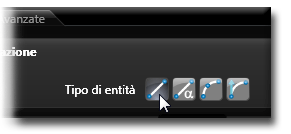
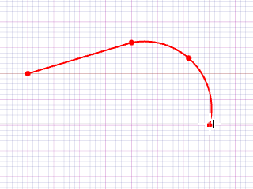

# 変換 

説明

既存のオブジェクトに対して移動、回転、コピー、スケーリングなどの変換操作を行います。

変換操作を実行するには、まず対象となるオブジェクトを選択し、次に必要な変換ツールを選択します。

データエリア
データ入力用の特定のエリアを定義する一般的な用語です。
で変換パラメータを設定することも可能です。

関連項目

* [コントロール- キー - 指示](../_HTM_PARTI/H1-barreS-C.md#コントロール-キー-指示)
* [ビューの管理](../../../_USO-bSuiteComuni/Gestione-viste.md)
* [オブジェクトの表示方法](../../../_USO-bSuiteComuni/visualiz-oggetti.md)
* [平面図形または3D図形を作成する](../02-Nozioni/Dis-figure.md#平面図形または3D図形を作成する)

**描画の概念：**
* [構成平面](../02-Nozioni/PianoCostr.md)
* [オブジェクトを操作する](../02-Nozioni/oggetti.md#オブジェクトを操作する)

## 変換操作の種類

### 移動 

選択したオブジェクトを指定した方向と距離に移動します。

#### 移動の手順：

1. 移動するオブジェクトを選択します。
2. 

編集バー
編集ツールを一覧表示するバー。
のボタンを

クリック
（1）画面上のポインタの下にあるオブジェクト（アイコン、ボタンなど）の上でマウスボタンを押す（そしてすぐに離す）行為を示します。（2）（動詞）選択したコマンドの機能を有効にするため、マウスの左ボタンを押してすぐに離します。
します。
3. 移動の基準点をクリックします。
4. 移動先の点をクリックします。

   

### 回転 

選択したオブジェクトを指定した中心点と角度で回転させます。

#### 回転の手順：

1. 回転するオブジェクトを選択します。
2. 編集バーのボタンをクリックします。
3. 回転の中心点をクリックします。
4. 基準角度の点をクリックし、その後回転角度を指定する点をクリックします。

   

### コピー 

選択したオブジェクトのコピーを作成します。移動や回転と組み合わせることも可能です。

#### コピーの手順：

1. コピーするオブジェクトを選択します。
2. 編集バーのボタンをクリックします。
3. コピー元の基準点をクリックします。
4. コピー先の点をクリックします。

   

### 配列コピー 

選択したオブジェクトを規則的なパターンで複数コピーします。直線配列と円形配列があります。

#### 配列コピーの手順：

1. 配列コピーするオブジェクトを選択します。
2. 編集バーのボタンをクリックします。
3. 配列タイプ（直線または円形）とパラメータ（要素数、間隔など）を設定します。
4. **適用**ボタンをクリックします。

   

### スケーリング 

選択したオブジェクトのサイズを拡大または縮小します。

#### スケーリングの手順：

1. スケーリングするオブジェクトを選択します。
2. 編集バーのボタンをクリックします。
3. スケーリングの中心点をクリックします。
4. 基準長さの点をクリックし、その後新しい長さを指定する点をクリックします。

   

### ミラー 

選択したオブジェクトの鏡像を作成します。

#### ミラーの手順：

1. ミラーリングするオブジェクトを選択します。
2. 編集バーのボタンをクリックします。
3. ミラーの対称軸を定義する2点をクリックします。

   

## 変換操作の共通パラメータ

### オリジナルを保持
チェックすると、元のオブジェクトを保持したまま変換が適用されます（コピーとして動作）。

### 複数コピー
指定した回数だけコピーを作成します。

### 相対座標
相対的な位置指定を使用します。

### 絶対座標
絶対的な位置指定を使用します。 