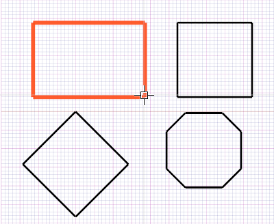

# 変形 

説明

既存のオブジェクトの形状を変更するためのツールです。面取り、フィレット（角丸め）、トリム（切り取り）、延長などの操作を行います。

変形操作を実行するには、対象となるオブジェクトを選択し、必要な変形ツールを適用します。

関連項目

* [コントロール- キー - 指示](../_HTM_PARTI/H1-barreS-C.md#コントロール-キー-指示)
* [ビューの管理](../../../_USO-bSuiteComuni/Gestione-viste.md)
* [オブジェクトの表示方法](../../../_USO-bSuiteComuni/visualiz-oggetti.md)
* [平面図形または3D図形を作成する](../02-Nozioni/Dis-figure.md#平面図形または3D図形を作成する)

**描画の概念：**
* [構成平面](../02-Nozioni/PianoCostr.md)
* [オブジェクトを操作する](../02-Nozioni/oggetti.md#オブジェクトを操作する)

## 変形操作の種類

### 面取り 

角を斜めに切り落とす操作です。2つの線または曲線の交点に適用します。

#### 面取りの手順：

1. 

編集バー
編集ツールを一覧表示するバー。
のボタンを

クリック
（1）画面上のポインタの下にあるオブジェクト（アイコン、ボタンなど）の上でマウスボタンを押す（そしてすぐに離す）行為を示します。（2）（動詞）選択したコマンドの機能を有効にするため、マウスの左ボタンを押してすぐに離します。
します。
2. 面取りする1つ目の線をクリックします。
3. 面取りする2つ目の線をクリックします。
4. 

データエリア
データ入力用の特定のエリアを定義する一般的な用語です。
で面取りの距離を指定します。

   

### フィレット 

角を滑らかな曲線で接続する操作です。2つの線または曲線の交点に適用します。

#### フィレットの手順：

1. 編集バーのボタンをクリックします。
2. フィレットする1つ目の線をクリックします。
3. フィレットする2つ目の線をクリックします。
4. データエリアでフィレットの半径を指定します。

   

### トリム 

線や曲線を別のオブジェクトとの交点で切り取る操作です。

#### トリムの手順：

1. 編集バーのボタンをクリックします。
2. トリムの境界となるオブジェクト（ライン、円など）を選択します。
3. トリムするオブジェクトの切り取る部分をクリックします。

   

### 延長 

線や曲線を指定したオブジェクトまで延長する操作です。

#### 延長の手順：

1. 編集バーのボタンをクリックします。
2. 延長の境界となるオブジェクト（ライン、円など）を選択します。
3. 延長するオブジェクトをクリックします。

   

### 分割 

線や曲線を指定した点で分割する操作です。

#### 分割の手順：

1. 編集バーのボタンをクリックします。
2. 分割するオブジェクトを選択します。
3. 分割点をクリックします。

   

### 結合 

複数の線や曲線を1つのオブジェクトに結合する操作です。

#### 結合の手順：

1. 編集バーのボタンをクリックします。
2. 結合する複数のオブジェクトを選択します。
3. **適用**ボタンをクリックします。

   

## 変形操作のパラメータ

### 面取りの距離
面取りを作成するための元の線からの距離を指定します。

### フィレットの半径
フィレットの円弧の半径を指定します。

### 延長距離
オブジェクトを指定した距離だけ延長します。

### 分割数
オブジェクトを等分割する場合の分割数を指定します。 

# 変形操作

**ファイル名**: `02-05-02_modify.md`  
**カテゴリ**: 編集ツール - 変形操作

## 概要

変形操作は、既存の図形の形状を局所的に修正するためのツール群です。線分の切断・延長、角の丸め・面取り、図形の分割・結合など、設計の詳細調整に不可欠な機能を提供します。

## 基本変形ツール

### トリム 

線分や曲線の不要な部分を切り取ります。

**操作手順**:
1. 変形バーの  ボタンをクリック
2. 切断境界となるオブジェクト（線分、円弧等）を選択
3. 削除したい部分の線分をクリック

**適用対象**:
- 線分（ライン）
- 円弧（アーク）
- ポリライン
- スプライン曲線

**パラメーター**:
- **境界選択**: 切断の境界となるオブジェクトを指定
- **複数選択**: 複数の境界を同時に使用
- **延長モード**: 境界まで延長してから切断

### 延長 

線分や曲線を境界まで延長します。

**操作手順**:
1. 変形バーの  ボタンをクリック
2. 延長の境界となるオブジェクトを選択
3. 延長したい線分の端点近くをクリック

**延長タイプ**:
- **線形延長**: 直線を直線的に延長
- **円弧延長**: 円弧を円弧として延長
- **自然延長**: 曲線の接線方向に延長

### フィレット（角丸め） 

2つの線分の交点に円弧を挿入して角を丸めます。

**操作手順**:
1. 変形バーの  ボタンをクリック
2. フィレット半径をパラメーターエリアで設定
3. 最初の線分をクリック
4. 2番目の線分をクリック

**パラメーター**:
- **フィレット半径**: 円弧の半径（mm単位）
- **トリム**: 元の線分をトリムするかどうか
- **複数フィレット**: 連続する複数の角にフィレットを適用

**活用例**:
- 機械部品の応力集中を避ける
- 美観的な仕上げ
- 加工時の工具負荷軽減

### 面取り 

2つの線分の交点に直線を挿入して角を面取りします。

**操作手順**:
1. 変形バーの  ボタンをクリック
2. 面取り距離をパラメーターエリアで設定
3. 最初の線分をクリック
4. 2番目の線分をクリック

**パラメーター設定**:
- **距離1**: 第1の線分からの面取り距離
- **距離2**: 第2の線分からの面取り距離
- **角度**: 面取り角度（45°、30°等）
- **対称**: 両側に同じ距離で面取り

## 高度な変形ツール

### 分割 

線分や曲線を指定点で分割します。

**分割方法**:

#### 点による分割
1. 分割したいオブジェクトを選択
2. 分割点をクリック
3. オブジェクトが2つの独立した要素に分離

#### 距離による分割
1. 分割したいオブジェクトを選択
2. 基準点から距離を指定
3. 指定距離の位置で分割

#### 等分割
1. 分割したいオブジェクトを選択
2. 分割数を指定
3. 等間隔で複数分割

**パラメーター**:
- **分割タイプ**: 点/距離/等分割
- **分割数**: 等分割時の分割数
- **基準点**: 距離測定の基準となる点

### 結合 

複数の線分や曲線を1つのオブジェクトに結合します。

**結合条件**:
- 端点が接続されている
- 同一平面上にある
- 同じタイプの要素（線分同士、円弧同士等）

**操作手順**:
1. 結合したい複数のオブジェクトを選択
2. 変形バーの  ボタンをクリック
3. 結合結果を確認

**結合タイプ**:
- **ポリライン結合**: 複数の線分をポリラインに結合
- **曲線結合**: 複数の曲線セグメントを1つの曲線に結合
- **強制結合**: わずかなギャップを許容して結合

### オフセット 

既存の線分や曲線から一定距離離れた並行線を作成します。

**操作手順**:
1. オフセットしたいオブジェクトを選択
2. オフセット距離をパラメーターエリアで設定
3. オフセット方向を指定（内側/外側）

**パラメーター**:
- **オフセット距離**: 並行線までの距離
- **オフセット方向**: 内側/外側の指定
- **角処理**: 角部分の処理方法（尖る/丸める/切る）
- **削除元**: 元のオブジェクトを削除するかどうか

## 特殊変形ツール

### スケッチフィレット 

矩形や多角形の角を一括でフィレット処理します。

**適用方法**:
1. 図形作成時にフィレットオプションを選択
2. フィレット半径を設定
3. 全ての角が自動的に丸められた図形が作成

**利用可能図形**:
- 矩形
- 多角形
- 複合図形

### ブレーク 

線分の一部分を除去します。

**操作手順**:
1. ブレークしたいオブジェクトを選択
2. 第1ブレーク点をクリック
3. 第2ブレーク点をクリック
4. 指定範囲が除去される

**ブレークタイプ**:
- **2点ブレーク**: 2点間を除去
- **1点ブレーク**: 指定点でオブジェクトを分離
- **ギャップブレーク**: 指定間隔を開ける

### 逆順 

線分や曲線の方向を逆転させます。

**用途**:
- 加工順序の調整
- 曲線の始点・終点変更
- ツールパスの最適化

## 操作パラメーターの詳細設定

### 精度設定

**スナップ許容値**: 
- 自動スナップの感度調整
- 接続判定の厳密さ制御

**角度制約**:
- 特定角度での拘束（0°、45°、90°等）
- 角度スナップの間隔設定

### 表示設定

**プレビュー機能**:
- 変形結果の事前確認
- 赤色での仮表示
- リアルタイム更新

**ハイライト表示**:
- 選択オブジェクトの強調表示
- 作業対象の明確化

## 作業効率向上のテクニック

### 連続操作

**フィレット連続適用**:
1. フィレット半径を設定
2. 連続して角をクリック
3. 同じ半径で複数箇所を一括処理

**トリム連続適用**:
1. 境界オブジェクトを選択
2. 連続して不要線分をクリック
3. 効率的な清掃作業

### 選択の最適化

**適切な選択順序**:
- 境界 → 対象オブジェクト
- 参照点 → 作業対象
- 基準要素 → 変形要素

### パラメーター管理

**設定値の保存**:
- よく使用する半径・距離の登録
- プロジェクト標準値の設定
- 設定テンプレートの活用

## エラー対処法

### よくある問題と解決策

**問題**: フィレットが作成できない
**解決策**:
- 線分が交差しているか確認
- フィレット半径が適切か確認
- 線分の延長による交点作成を検討

**問題**: トリムが機能しない
**解決策**:
- 境界オブジェクトが適切に選択されているか確認
- 切断対象の線分が境界と交差しているか確認
- 延長モードの使用を検討

**問題**: 結合できない
**解決策**:
- オブジェクトの端点が接続されているか確認
- 許容ギャップ内での接続状況を確認
- 必要に応じて事前に移動・調整

## 品質管理とチェック

### 変形後の確認項目

**幾何学的整合性**:
- 意図した形状になっているか
- 寸法精度が保たれているか
- 不適切な交差が生じていないか

**設計意図の維持**:
- 機能的要件が満たされているか
- 美観的要求が達成されているか
- 製造性が考慮されているか

## 関連機能

### 基本編集操作
- [基本編集操作](./02-05-01_basic_edit.md) - 切り取り、コピー、貼り付け、削除
- [変換操作](./02-05-01_transform.md) - 移動、回転、拡大・縮小

### 図形作成
- [2D図形](../04-Geo2D/README.md) - 2次元図形の作成
- [3D図形](../06-Geo3D/README.md) - 3次元モデルの作成

### インターフェース
- [ステータスバー](../10-Interface/02-10-03_status_bar.md) - スナップ機能とレイヤー制御

---

**注意**: この文書は元HTMLファイル `oggetti.htm`、`BarraStand.htm` および一般的なCAD変形操作の知識を基に作成されています。 
