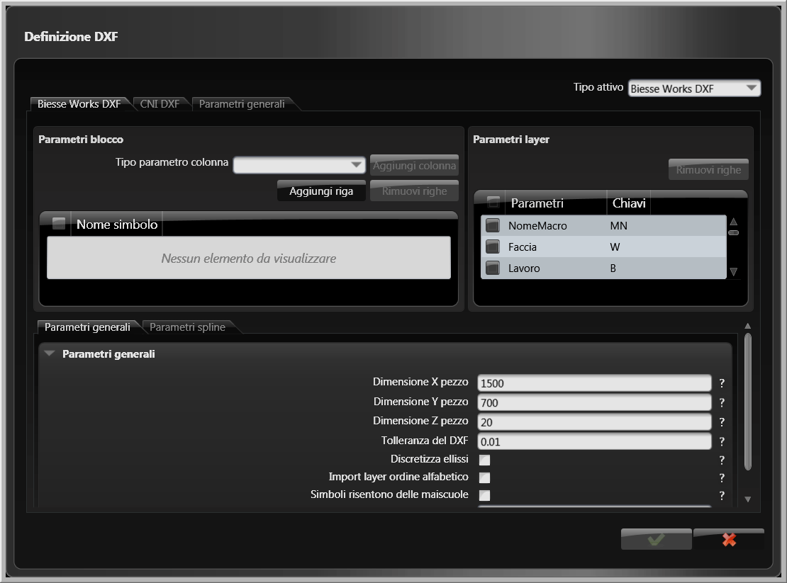
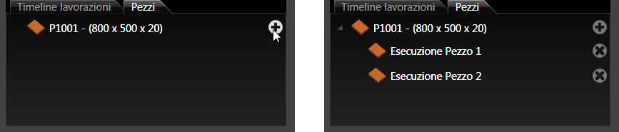
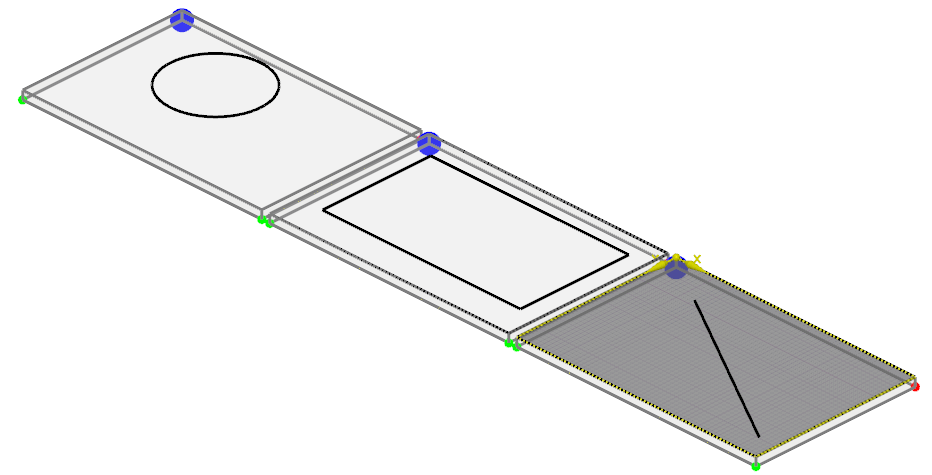
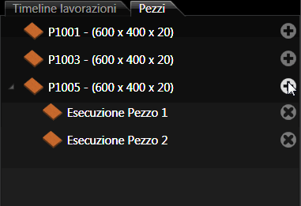
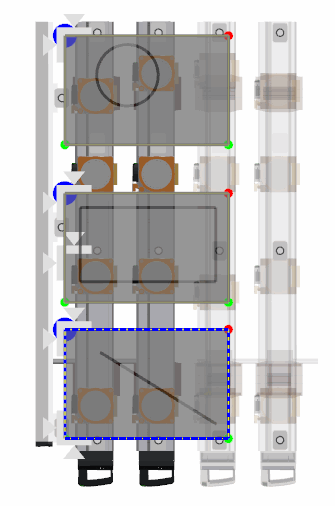

# 寸法と注釈 

説明

図面に寸法線や注釈を追加するためのツールです。長さ、角度、半径、直径などの寸法を表示したり、テキスト注釈やシンボルを追加したりできます。

寸法の作成には、図面上の点や線などのオブジェクトを選択し、適切な寸法ツールを適用します。

関連項目

* [コントロール- キー - 指示](../_HTM_PARTI/H1-barreS-C.md#コントロール-キー-指示)
* [ビューの管理](../../../_USO-bSuiteComuni/Gestione-viste.md)
* [オブジェクトの表示方法](../../../_USO-bSuiteComuni/visualiz-oggetti.md)
* [平面図形または3D図形を作成する](../02-Nozioni/Dis-figure.md#平面図形または3D図形を作成する)

**描画の概念：**
* [構成平面](../02-Nozioni/PianoCostr.md)
* [オブジェクトを操作する](../02-Nozioni/oggetti.md#オブジェクトを操作する)

## 寸法ツールの種類

### 線形寸法 

2点間の水平、垂直、または傾斜した直線距離を表示します。

#### 線形寸法の作成手順：

1. 

注釈バー
注釈ツールを一覧表示するバー。
のボタンを

クリック
（1）画面上のポインタの下にあるオブジェクト（アイコン、ボタンなど）の上でマウスボタンを押す（そしてすぐに離す）行為を示します。（2）（動詞）選択したコマンドの機能を有効にするため、マウスの左ボタンを押してすぐに離します。
します。
2. 寸法を測定する最初の点をクリックします。
3. 寸法を測定する2番目の点をクリックします。
4. 寸法線の位置をクリックして指定します。

   

### 角度寸法 

2本の線が成す角度を表示します。

#### 角度寸法の作成手順：

1. 注釈バーのボタンをクリックします。
2. 角度を測定する1本目の線をクリックします。
3. 角度を測定する2本目の線をクリックします。
4. 寸法弧の位置をクリックして指定します。

   

### 半径寸法 

円または円弧の半径を表示します。

#### 半径寸法の作成手順：

1. 注釈バーのボタンをクリックします。
2. 半径を測定する円または円弧をクリックします。
3. 寸法線の位置をクリックして指定します。

   

### 直径寸法 

円または円弧の直径を表示します。

#### 直径寸法の作成手順：

1. 注釈バーのボタンをクリックします。
2. 直径を測定する円または円弧をクリックします。
3. 寸法線の位置をクリックして指定します。

   

### テキスト注釈 

図面にテキストを追加します。

#### テキスト注釈の作成手順：

1. 注釈バーのボタンをクリックします。
2. テキストを配置する位置をクリックします。
3. 

データエリア
データ入力用の特定のエリアを定義する一般的な用語です。
にテキスト内容を入力します。
4. **適用**ボタンをクリックします。

   

### 引出線 

テキストと線を使用して、図面の特定の部分を指し示します。

#### 引出線の作成手順：

1. 注釈バーのボタンをクリックします。
2. 矢印の先端が指し示す位置をクリックします。
3. 引出線の折れ曲がり点をクリックします（必要に応じて複数点を指定可能）。
4. テキストの配置位置をクリックします。
5. データエリアにテキスト内容を入力します。
6. **適用**ボタンをクリックします。

   

## 寸法と注釈のスタイル設定

### テキストスタイル
テキストのフォント、サイズ、色などを設定します。

### 寸法線スタイル
線のタイプ、太さ、色などを設定します。

### 矢印スタイル
矢印の形状、サイズなどを設定します。

### 単位
寸法の表示単位を設定します（mm、cm、インチなど）。

### 精度
寸法値の小数点以下の桁数を設定します。

### 接頭辞と接尾辞
寸法値の前後に付ける文字を設定します（例：Φ10mm）。 