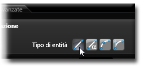
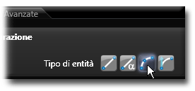
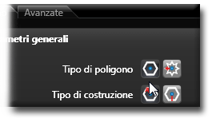

# 基本立体 

説明

基本立体は、3Dモデル作成のための基本的な形状です。立方体、直方体、球、円柱、円錐などが含まれます。

これらの基本形状は、ボタンをクリックして必要なパラメータを入力するだけで簡単に作成でき、その後より複雑なモデル作成の基礎として使用できます。

関連項目

* [コントロール- キー - 指示](../_HTM_PARTI/H1-barreS-C.md#コントロール-キー-指示)
* [ビューの管理](../../../_USO-bSuiteComuni/Gestione-viste.md)
* [オブジェクトの表示方法](../../../_USO-bSuiteComuni/visualiz-oggetti.md)
* [平面図形または3D図形を作成する](../02-Nozioni/Dis-figure.md#平面図形または3D図形を作成する)

**描画の概念：**
* [構成平面](../02-Nozioni/PianoCostr.md)
* [3Dモデリングの基本](../03-Nozioni3D/Modeling-base.md)

## 基本立体の種類

### 直方体 

6つの長方形の面で構成される立体です。長さ、幅、高さのパラメータで定義します。

#### 直方体の作成手順：

1. 

3D作成バー
3Dモデリングツールを一覧表示するバー。
のボタンを

クリック
（1）画面上のポインタの下にあるオブジェクト（アイコン、ボタンなど）の上でマウスボタンを押す（そしてすぐに離す）行為を示します。（2）（動詞）選択したコマンドの機能を有効にするため、マウスの左ボタンを押してすぐに離します。
します。
2. 直方体の1つ目の角となる点をクリックします。
3. 直方体の対角となる点をクリックするか、

データエリア
データ入力用の特定のエリアを定義する一般的な用語です。
で長さ、幅、高さを指定します。
4. 高さの方向と大きさを指定します。

   

### 球 

中心点と半径で定義される完全に丸い立体です。

#### 球の作成手順：

1. 3D作成バーのボタンをクリックします。
2. 球の中心点をクリックします。
3. 球の半径を指定する点をクリックするか、データエリアで半径値を入力します。

   

### 円柱 

底面が円で、側面が垂直な立体です。半径と高さのパラメータで定義します。

#### 円柱の作成手順：

1. 3D作成バーのボタンをクリックします。
2. 円柱の底面の中心点をクリックします。
3. 円柱の半径を指定する点をクリックするか、データエリアで半径値を入力します。
4. 円柱の高さと方向を指定します。

   

### 円錐 

底面が円で、頂点に向かって先細りになる立体です。底面の半径と高さのパラメータで定義します。

#### 円錐の作成手順：

1. 3D作成バーのボタンをクリックします。
2. 円錐の底面の中心点をクリックします。
3. 円錐の底面の半径を指定する点をクリックするか、データエリアで半径値を入力します。
4. 円錐の高さと方向を指定します。

   

### トーラス 

ドーナツ状の立体で、大円と小円の半径で定義されます。

#### トーラスの作成手順：

1. 3D作成バーのボタンをクリックします。
2. トーラスの中心点をクリックします。
3. 大円の半径を指定する点をクリックします。
4. 小円の半径を指定するか、データエリアで値を入力します。

   

### 多角柱 

底面が多角形の立体です。辺の数、半径、高さのパラメータで定義します。

#### 多角柱の作成手順：

1. 3D作成バーのボタンをクリックします。
2. 多角柱の底面の中心点をクリックします。
3. データエリアで辺の数を指定します。
4. 多角柱の外接円半径を指定する点をクリックします。
5. 多角柱の高さと方向を指定します。

   

## 基本立体のパラメータ

### 位置
オブジェクトを配置する3D空間上の座標位置。

### サイズ
オブジェクトの寸法（長さ、幅、高さ、半径など）。

### 回転
オブジェクトの向きを定義する回転角度。

### 分割数
曲面の滑らかさを決定する分割の数（球、円柱などの曲面を持つオブジェクトに適用）。

### 中空
チェックすると中空の立体を作成します。内側の厚みを指定する必要があります。 