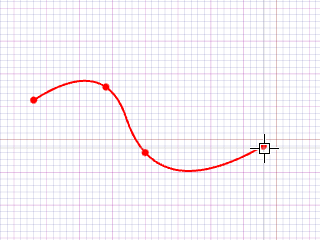
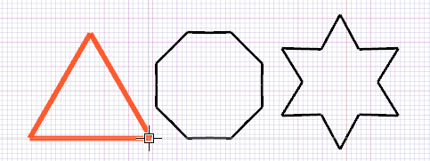

# bSolid マニュアル - 基本立体

## 説明

基本的な3D立体図形を作成するツールです。直方体、円柱、球などの幾何学的基本要素から複雑な3Dオブジェクトを構成することができます。

## 関連項目

- [より高度な形状用のタブ](../../04-Geo2D/README.md) - より高度な形状作成オプション
- [コントロール- キー - 指示](../_HTM_PARTI/H1-barreS-C.md#コントロール-キー-指示)
- [ビューの管理](../../../_USO-bSuiteComuni/Gestione-viste.md)
- [オブジェクトの表示方法](../../../_USO-bSuiteComuni/visualiz-oggetti.md)
- [平面図形または3D図形を作成する](../02-Nozioni/Dis-figure.md#平面図形または3D図形を作成する)

### 描画の概念

- [構成平面](../02-Nozioni/PianoCostr.md#構成平面)
- [平面図形または3D図形を作成する](../02-Nozioni/Dis-figure.md#平面図形または3D図形を作成する)
- [オブジェクトを操作する](../02-Nozioni/oggetti.md#オブジェクトを操作する)
- [カーソルの動きの制限および妨害](../02-Nozioni/puntatore.md#カーソルの動きの制限および妨害)

## 教育ビデオへのリンク

- [3次元のフィギュアの作成](../09-VIDEO.md)

## セクション一覧

- [基本立体の種類](#基本立体の種類)
- [共通パラメーター](#共通パラメーター)
- [プロパティ](../../04-Geo2D/README.md#プロパティ)
- [繰り返し](../../04-Geo2D/README.md#繰り返し)
- [CAMデータ](../../04-Geo2D/README.md#CAMデータ)

## 基本立体の種類

### 直方体（ボックス）
最も基本的な3D立体で、長さ、幅、高さで定義されます。木工における角材や板材の基本形状として使用されます。

#### 直方体の作成手順：

1. 

3D作成バー
3Dモデリングツールを一覧表示するバー。
のボタンを

クリック
（1）画面上のポインタの下にあるオブジェクト（アイコン、ボタンなど）の上でマウスボタンを押す（そしてすぐに離す）行為を示します。（2）（動詞）選択したコマンドの機能を有効にするため、マウスの左ボタンを押してすぐに離します。
します。
2. 直方体の1つ目の角となる点をクリックします。
3. 直方体の対角となる点をクリックするか、

データエリア
データ入力用の特定のエリアを定義する一般的な用語です。
で長さ、幅、高さを指定します。
4. 高さの方向と大きさを指定します。

   

### 円柱（シリンダー）
円形の断面を持つ立体で、半径と高さで定義されます。支柱、パイプ、丸材などの木工要素として使用されます。

#### 円柱の作成手順：

1. 3D作成バーのボタンをクリックします。
2. 円柱の底面の中心点をクリックします。
3. 円柱の半径を指定する点をクリックするか、データエリアで半径値を入力します。
4. 円柱の高さと方向を指定します。

   

### 球体（スフィア）
中心点からの距離が一定の完全な球形で、半径で定義されます。装飾的な要素や接合部の設計に使用されます。

#### 球の作成手順：

1. 3D作成バーのボタンをクリックします。
2. 球の中心点をクリックします。
3. 球の半径を指定する点をクリックするか、データエリアで半径値を入力します。

   

### 円錐（コーン）
底面が円形で頂点に向かって細くなる立体で、底面半径と高さで定義されます。家具の脚部や装飾要素として使用されます。

#### 円錐の作成手順：

1. 3D作成バーのボタンをクリックします。
2. 円錐の底面の中心点をクリックします。
3. 円錐の底面の半径を指定する点をクリックするか、データエリアで半径値を入力します。
4. 円錐の高さと方向を指定します。

   

### トーラス 

ドーナツ状の立体で、大円と小円の半径で定義されます。

#### トーラスの作成手順：

1. 3D作成バーのボタンをクリックします。
2. トーラスの中心点をクリックします。
3. 大円の半径を指定する点をクリックします。
4. 小円の半径を指定するか、データエリアで値を入力します。

   

### 多角柱 

底面が多角形の立体です。辺の数、半径、高さのパラメータで定義します。

#### 多角柱の作成手順：

1. 3D作成バーのボタンをクリックします。
2. 多角柱の底面の中心点をクリックします。
3. データエリアで辺の数を指定します。
4. 多角柱の外接円半径を指定する点をクリックします。
5. 多角柱の高さと方向を指定します。

   

## 共通パラメーター

### 寸法設定
各基本立体には、形状に応じた寸法パラメーターが設定できます：
- **長さ（L）**: 直方体のX軸方向の寸法
- **幅（W）**: 直方体のY軸方向の寸法  
- **高さ（H）**: 立体のZ軸方向の寸法
- **半径（R）**: 円形断面の半径

### 位置設定
立体の配置位置を設定します：
- **X座標**: X軸方向の位置
- **Y座標**: Y軸方向の位置
- **Z座標**: Z軸方向の位置

### 精度
**パラメーター:** PR

作成した3Dの図の精密さを定義するインデックス。1000より小さい値にするとオブジェクトがより精密になる。

## 使用例

基本立体は以下のような木工プロジェクトで活用されます：

- **家具設計**: 棚板、天板、支柱などの基本構造
- **建具制作**: 枠材、パネル材などの構成要素
- **装飾要素**: 装飾用の幾何学形状の作成
- **接合部設計**: ダボ穴、ほぞ穴などの基本形状

## 関連項目

- [形状用のタブ](../../04-Geo2D/README.md) - より高度な形状作成オプション
- [3次元のフィギュアの作成](../README.md) - 3Dモデリングの概要
- [押し出し](./02-06-02_extrusion.md) - 2D形状からの立体作成
- [回転](./02-06-03_revolution.md) - 回転による立体作成
- [ブール演算](./02-06-06_boolean.md) - 立体間の演算

## 上位セクションに戻る

- [3D図形](./README.md)
- [CAD/CAM](../README.md)
- [bSolid マニュアル目次へ戻る](../../README.md) 
