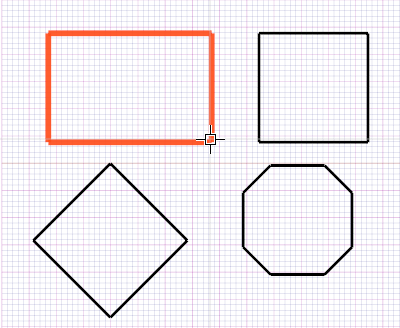
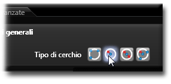
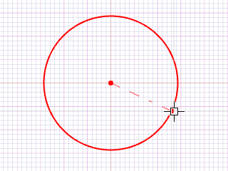
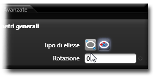

# 押し出し 

説明

押し出し（エクストルージョン）は、2次元の図形に高さを与えて3次元の立体を作成する操作です。閉じた2D図形（円、長方形、多角形など）から立体を作成する最も基本的な方法です。

押し出し操作には、直線押し出しとテーパー（傾斜）押し出しがあります。

関連項目

* [コントロール- キー - 指示](../_HTM_PARTI/H1-barreS-C.md#コントロール-キー-指示)
* [ビューの管理](../../../_USO-bSuiteComuni/Gestione-viste.md)
* [オブジェクトの表示方法](../../../_USO-bSuiteComuni/visualiz-oggetti.md)
* [平面図形または3D図形を作成する](../02-Nozioni/Dis-figure.md#平面図形または3D図形を作成する)

**描画の概念：**
* [構成平面](../02-Nozioni/PianoCostr.md)
* [3Dモデリングの基本](../03-Nozioni3D/Modeling-base.md)
* [2Dジオメトリ](../04-Geo2D/02-04-00_overview.md)

## 押し出しの種類

### 直線押し出し 

2D図形を指定した方向と高さで押し出して立体を作成します。

#### 直線押し出しの手順：

1. 

3D作成バー
3Dモデリングツールを一覧表示するバー。
のボタンを

クリック
（1）画面上のポインタの下にあるオブジェクト（アイコン、ボタンなど）の上でマウスボタンを押す（そしてすぐに離す）行為を示します。（2）（動詞）選択したコマンドの機能を有効にするため、マウスの左ボタンを押してすぐに離します。
します。
2. 押し出す2D図形を選択します。
3. 押し出しの方向と高さを指定します。これは

データエリア
データ入力用の特定のエリアを定義する一般的な用語です。
で数値を入力するか、マウスで視覚的に指定できます。
4. **適用**ボタンをクリックします。

   

### テーパー押し出し 

2D図形を押し出す際に、側面に傾斜（テーパー）を付けて立体を作成します。

#### テーパー押し出しの手順：

1. 3D作成バーのボタンをクリックします。
2. 押し出す2D図形を選択します。
3. 押し出しの方向と高さを指定します。
4. データエリアでテーパー角度を指定します。
5. **適用**ボタンをクリックします。

   

### 両方向押し出し 

2D図形を選択した平面から両方向に押し出して立体を作成します。

#### 両方向押し出しの手順：

1. 3D作成バーのボタンをクリックします。
2. 押し出す2D図形を選択します。
3. データエリアで正方向と負方向の押し出し距離を指定します。
4. **適用**ボタンをクリックします。

   

### パスに沿った押し出し 

2D図形を指定したパス（曲線）に沿って押し出して立体を作成します。

#### パスに沿った押し出しの手順：

1. 3D作成バーのボタンをクリックします。
2. 押し出す2D図形（プロファイル）を選択します。
3. 押し出しのパスとなる曲線を選択します。
4. データエリアでオプションを設定します。
5. **適用**ボタンをクリックします。

   

## 押し出しのパラメータ

### 高さ
押し出す距離を指定します。

### 方向
押し出しの向きを指定します（通常は平面に垂直）。

### テーパー角度
テーパー押し出しの場合、側面の傾斜角度を指定します。正の値で外側に広がり、負の値で内側に狭まります。

### キャップ
押し出しの端面（上下の面）を作成するかどうかを指定します。

### ツイスト
押し出し方向に沿って回転させる角度を指定します。

### スケール
押し出しの終端部分のサイズ比率を指定します。1.0より大きい値で拡大、小さい値で縮小します。 