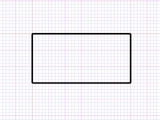
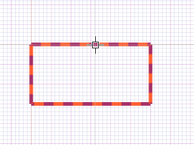

# 回転体 

説明

回転体（リボルブ）は、2次元の図形を指定した軸を中心に回転させて3次元の立体を作成する操作です。グラス、ボール、花瓶など、軸対称の形状を作成するのに適しています。

回転体の作成には、回転の中心となる軸と回転角度が必要です。通常は360度の完全回転を行いますが、部分的な回転も可能です。

関連項目

* [コントロール- キー - 指示](../_HTM_PARTI/H1-barreS-C.md#コントロール-キー-指示)
* [ビューの管理](../../../_USO-bSuiteComuni/Gestione-viste.md)
* [オブジェクトの表示方法](../../../_USO-bSuiteComuni/visualiz-oggetti.md)
* [平面図形または3D図形を作成する](../02-Nozioni/Dis-figure.md#平面図形または3D図形を作成する)

**描画の概念：**
* [構成平面](../02-Nozioni/PianoCostr.md)
* [3Dモデリングの基本](../03-Nozioni3D/Modeling-base.md)
* [2Dジオメトリ](../04-Geo2D/02-04-00_overview.md)

## 回転体の種類

### 完全回転体 

2D図形を360度回転させて閉じた立体を作成します。

#### 完全回転体の作成手順：

1. 

3D作成バー
3Dモデリングツールを一覧表示するバー。
のボタンを

クリック
（1）画面上のポインタの下にあるオブジェクト（アイコン、ボタンなど）の上でマウスボタンを押す（そしてすぐに離す）行為を示します。（2）（動詞）選択したコマンドの機能を有効にするため、マウスの左ボタンを押してすぐに離します。
します。
2. 回転させる2D図形（プロファイル）を選択します。
3. 回転軸の始点をクリックします。
4. 回転軸の終点をクリックします。
5. 

データエリア
データ入力用の特定のエリアを定義する一般的な用語です。
で回転角度として360度を確認します。
6. **適用**ボタンをクリックします。

   

### 部分回転体 

2D図形を指定した角度（360度未満）だけ回転させて立体を作成します。

#### 部分回転体の作成手順：

1. 3D作成バーのボタンをクリックします。
2. 回転させる2D図形（プロファイル）を選択します。
3. 回転軸の始点をクリックします。
4. 回転軸の終点をクリックします。
5. データエリアで回転角度を指定します（例：180度）。
6. **適用**ボタンをクリックします。

   

### 双方向回転体 

2D図形を回転軸の両側に指定した角度で回転させて立体を作成します。

#### 双方向回転体の作成手順：

1. 3D作成バーのボタンをクリックします。
2. 回転させる2D図形（プロファイル）を選択します。
3. 回転軸の始点をクリックします。
4. 回転軸の終点をクリックします。
5. データエリアで正方向と負方向の回転角度を指定します。
6. **適用**ボタンをクリックします。

   

## 回転体のパラメータ

### 回転軸
回転の中心となる軸を定義します。2点を指定するか、既存の線を選択します。

### 回転角度
図形を回転させる角度を指定します（度数）。360度で完全な回転体になります。

### 開始角度
回転を開始する角度を指定します。通常は0度ですが、部分回転体の場合に開始位置を変更できます。

### 薄肉
チェックすると内部が空洞の薄肉回転体を作成します。壁の厚さを指定する必要があります。

### 分割数
回転方向の分割数を指定します。値が大きいほど曲面が滑らかになりますが、データ量が増加します。 