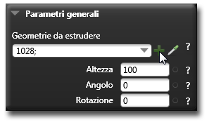

# スイープ 

説明

スイープは、2次元の図形（プロファイル）を3次元のパス（経路）に沿って移動させることで立体を作成する操作です。曲がったパイプ、手すり、複雑な形状の部品などを作成する際に非常に便利です。

スイープ操作では、プロファイルとパスの関係を制御するために、様々なオプションが用意されています。

関連項目

* [コントロール- キー - 指示](../_HTM_PARTI/H1-barreS-C.md#コントロール-キー-指示)
* [ビューの管理](../../../_USO-bSuiteComuni/Gestione-viste.md)
* [オブジェクトの表示方法](../../../_USO-bSuiteComuni/visualiz-oggetti.md)
* [平面図形または3D図形を作成する](../02-Nozioni/Dis-figure.md#平面図形または3D図形を作成する)

**描画の概念：**
* [構成平面](../02-Nozioni/PianoCostr.md)
* [3Dモデリングの基本](../03-Nozioni3D/Modeling-base.md)
* [2Dジオメトリ](../04-Geo2D/02-04-00_overview.md)

## スイープの種類

### 基本スイープ 

単一のプロファイルを単一のパスに沿って移動させて立体を作成します。

#### 基本スイープの作成手順：

1. 

3D作成バー
3Dモデリングツールを一覧表示するバー。
のボタンを

クリック
（1）画面上のポインタの下にあるオブジェクト（アイコン、ボタンなど）の上でマウスボタンを押す（そしてすぐに離す）行為を示します。（2）（動詞）選択したコマンドの機能を有効にするため、マウスの左ボタンを押してすぐに離します。
します。
2. スイープするプロファイル（断面形状となる2D図形）を選択します。
3. スイープのパス（経路となる線や曲線）を選択します。
4. 

データエリア
データ入力用の特定のエリアを定義する一般的な用語です。
でスイープのオプションを設定します。
5. **適用**ボタンをクリックします。

   

### 回転スイープ 

プロファイルをパスに沿って移動させる際に、指定した角度で回転させながら立体を作成します。

#### 回転スイープの作成手順：

1. 3D作成バーのボタンをクリックします。
2. スイープするプロファイル（断面形状）を選択します。
3. スイープのパス（経路）を選択します。
4. データエリアで回転角度を指定します。
5. **適用**ボタンをクリックします。

   

### スケールスイープ 

プロファイルをパスに沿って移動させる際に、サイズを変化させながら立体を作成します。

#### スケールスイープの作成手順：

1. 3D作成バーのボタンをクリックします。
2. スイープするプロファイル（断面形状）を選択します。
3. スイープのパス（経路）を選択します。
4. データエリアで開始スケールと終了スケールを指定します。
5. **適用**ボタンをクリックします。

   

### ガイド付きスイープ 

メインパスとガイドカーブに沿ってプロファイルを移動させて立体を作成します。ガイドカーブによって、プロファイルの向きや変形が制御されます。

#### ガイド付きスイープの作成手順：

1. 3D作成バーのボタンをクリックします。
2. スイープするプロファイル（断面形状）を選択します。
3. メインパスを選択します。
4. ガイドカーブを選択します（複数可）。
5. データエリアでオプションを設定します。
6. **適用**ボタンをクリックします。

   

## スイープのパラメータ

### オリエンテーション
プロファイルのパスに対する向きを制御します。「フリクション」、「固定」、「パスに垂直」などのオプションがあります。

### 回転
パスに沿ってプロファイルを回転させる角度を指定します。

### スケール
パスに沿ってプロファイルのサイズを変化させる比率を指定します。

### ねじれ
パスに沿ってプロファイルをひねる角度を指定します。

### 分割数
スイープ操作の精度を決定する分割の数を指定します。値が大きいほど滑らかになりますが、データ量が増加します。 