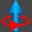
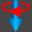

# bSolid マニュアル - 4つのセクションからの面

## 説明

4つの異なる平面または1つの平面上で作成された4つのオープンアウトラインを結合することによって面を作成します。

4つのアウトラインは共通する頂点を使って開いた面のスケルトンを表すこと。

**A.** 4つの異なる平面上で描画された形状から得た面。  
**B.** 1つの平面上で描画された形状から得た面。

## 関連項目

- [より高度な形状用のタブ](../../04-Geo2D/README.md) - より高度な形状作成オプション
- [コントロール- キー - 指示](../_HTM_PARTI/H1-barreS-C.md#コントロール-キー-指示)
- [ビューの管理](../../../_USO-bSuiteComuni/Gestione-viste.md)
- [オブジェクトの表示方法](../../../_USO-bSuiteComuni/visualiz-oggetti.md)
- [平面図形または3D図形を作成する](../02-Nozioni/Dis-figure.md#平面図形または3D図形を作成する)

### 描画の概念

- [構成平面](../02-Nozioni/PianoCostr.md#構成平面)
- [平面図形または3D図形を作成する](../02-Nozioni/Dis-figure.md#平面図形または3D図形を作成する)
- [オブジェクトを操作する](../02-Nozioni/oggetti.md#オブジェクトを操作する)
- [カーソルの動きの制限および妨害](../02-Nozioni/puntatore.md#カーソルの動きの制限および妨害)

## 教育ビデオへのリンク

- [3次元のフィギュアの作成](../09-VIDEO.md)

## セクション一覧

- [セクションを選択する](#セクションを選択する)
- [モード](#モード)
- [プロパティ](../../04-Geo2D/README.md#プロパティ)
- [繰り返し](../../04-Geo2D/README.md#繰り返し)
- [CAMデータ](../../04-Geo2D/README.md#CAMデータ)

## セクションを選択する

1. [第1セクション](#第1セクション)
2. [第2セクション](#第2セクション)
3. [第3セクション](#第3セクション)
4. [第4セクション](#第4セクション)

### 第1セクション
**パラメーター:** SEC1

開いた面の最初の辺の作成に役立つオープンアウトラインを選択するために使用されます。

- 参照1、図2を参照。

### 第2セクション
**パラメーター:** SEC2

開いた面の2番目の辺の作成に役立つオープンアウトラインを選択するために使用されます。

- 参照2、図2を参照。

### 第3セクション
**パラメーター:** SEC3

開いた面の3番目の辺の作成に役立つオープンアウトラインを選択するために使用されます。

- 参照3、図2を参照。

### 第4セクション
**パラメーター:** SEC4

開いた面の4番目の辺の作成に役立つオープンアウトラインを選択するために使用されます。

- 参照4、図2を参照。

## モード

### 精度
**パラメーター:** PR

作成した3Dの図の精密さを定義するインデックス。1000より小さい値にするとオブジェクトがより精密になる。

### セクション1の回転
**パラメーター:** R1

構成平面に対する面の最初の辺の回転。回転は、曲線のセグメントのみに適用されます。

####  回転なし

無効にされた回転。

####  引出し

構成平面に対する曲線のセグメントの回転。この場合、凹面が作成されます。

####  引込み

構成平面に対する曲線のセグメントの回転。この場合、凸面が作成されます。

### セクション2の回転
**パラメーター:** R2

構成平面に対する面の2番目の辺の回転。回転は、曲線のセグメントのみに適用されます。

####  回転なし

無効にされた回転。

####  引出し

構成平面に対する曲線のセグメントの回転。この場合、凹面が作成されます。

####  引込み

構成平面に対する曲線のセグメントの回転。この場合、凸面が作成されます。

### セクション3の回転
**パラメーター:** R3

構成平面に対する面の3番目の辺の回転。回転は、曲線のセグメントのみに適用されます。

####  回転なし

無効にされた回転。

####  引出し

構成平面に対する曲線のセグメントの回転。この場合、凹面が作成されます。

####  引込み

構成平面に対する曲線のセグメントの回転。この場合、凸面が作成されます。

### セクション4の回転
**パラメーター:** R4

構成平面に対する面の4番目の辺の回転。回転は、曲線のセグメントのみに適用されます。

####  回転なし

無効にされた回転。

####  引出し

構成平面に対する曲線のセグメントの回転。この場合、凹面が作成されます。

####  引込み

構成平面に対する曲線のセグメントの回転。この場合、凸面が作成されます。

## 関連項目

- [形状用のタブ](../../04-Geo2D/README.md) - より高度な形状作成オプション
- [3次元のフィギュアの作成](../README.md) - 3Dモデリングの概要
- [基本立体](./02-06-01_solid_primitives.md) - 基本的な3D形状の作成
- [押し出し](./02-06-02_extrusion.md) - 垂直方向の押し出し
- [回転](./02-06-03_revolution.md) - 回転による立体作成
- [セクションからの面](./02-06-05_loft.md) - セクションからの面の作成

## 上位セクションに戻る

- [3D図形](./README.md)
- [CAD/CAM](../README.md)
- [bSolid マニュアル目次へ戻る](../../README.md) 
