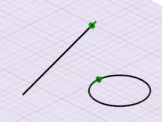
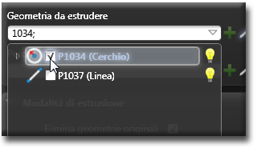
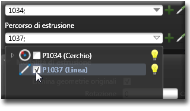
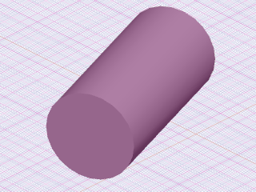

# ロフト 

説明

ロフトは、複数の2次元図形（断面）の間を補間することで3次元の立体を作成する操作です。異なる形状の断面間をなめらかに遷移させることができるため、複雑な形状のモデリングに適しています。

ロフト操作では、複数の断面を順番に選択し、それらを繋ぐ方法を制御するパラメータを設定します。

関連項目

* [コントロール- キー - 指示](../_HTM_PARTI/H1-barreS-C.md#コントロール-キー-指示)
* [ビューの管理](../../../_USO-bSuiteComuni/Gestione-viste.md)
* [オブジェクトの表示方法](../../../_USO-bSuiteComuni/visualiz-oggetti.md)
* [平面図形または3D図形を作成する](../02-Nozioni/Dis-figure.md#平面図形または3D図形を作成する)

**描画の概念：**
* [構成平面](../02-Nozioni/PianoCostr.md)
* [3Dモデリングの基本](../03-Nozioni3D/Modeling-base.md)
* [2Dジオメトリ](../04-Geo2D/02-04-00_overview.md)

## ロフトの種類

### 標準ロフト 

複数の断面間を直接補間して立体を作成します。

#### 標準ロフトの作成手順：

1. 

3D作成バー
3Dモデリングツールを一覧表示するバー。
のボタンを

クリック
（1）画面上のポインタの下にあるオブジェクト（アイコン、ボタンなど）の上でマウスボタンを押す（そしてすぐに離す）行為を示します。（2）（動詞）選択したコマンドの機能を有効にするため、マウスの左ボタンを押してすぐに離します。
します。
2. ロフトの最初の断面（2D図形）を選択します。
3. 2番目の断面を選択します。
4. 必要に応じて追加の断面を選択します。
5. すべての断面を選択したら、

データエリア
データ入力用の特定のエリアを定義する一般的な用語です。
でロフトのオプションを設定します。
6. **適用**ボタンをクリックします。

   

### ガイド付きロフト 

複数の断面をガイドカーブに沿って補間して立体を作成します。ガイドカーブによって断面間の接続方法が制御されます。

#### ガイド付きロフトの作成手順：

1. 3D作成バーのボタンをクリックします。
2. ロフトの各断面（2D図形）を順番に選択します。
3. すべての断面を選択したら、ガイドカーブを選択します。
4. データエリアでロフトのオプションを設定します。
5. **適用**ボタンをクリックします。

   

### 閉じたロフト 

最初と最後の断面を接続して閉じた立体を作成します。例えば、リング状のオブジェクトを作成する場合に使用します。

#### 閉じたロフトの作成手順：

1. 3D作成バーのボタンをクリックします。
2. ロフトの各断面（2D図形）を順番に選択します。
3. データエリアで「閉じたロフト」オプションを有効にします。
4. その他のロフトオプションを設定します。
5. **適用**ボタンをクリックします。

   

### 曲面ロフト 

複数の断面から中身のない曲面のみを作成します。ソリッドではなくサーフェスモデルが必要な場合に使用します。

#### 曲面ロフトの作成手順：

1. 3D作成バーのボタンをクリックします。
2. ロフトの各断面（2D図形）を順番に選択します。
3. データエリアで「サーフェス作成」オプションを有効にします。
4. その他のロフトオプションを設定します。
5. **適用**ボタンをクリックします。

   

## ロフトのパラメータ

### 断面の整列方法
断面同士をどのように整列させるかを制御します。「自動」、「中心点」、「端点」などのオプションがあります。

### プロファイルの向き
断面の方向を制御します。必要に応じて一部の断面を反転させることができます。

### 滑らかさ
断面間の遷移の滑らかさを制御します。値が大きいほど曲面が滑らかになりますが、元の断面形状から離れる可能性があります。

### 断面の比率
各断面のスケーリング比率を調整します。断面ごとに異なるスケール値を適用できます。

### 捻り角度
断面間の回転角度を制御します。断面を回転させながら補間することができます。 