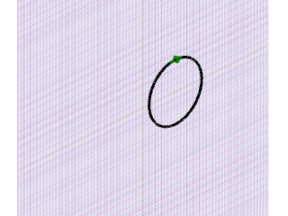
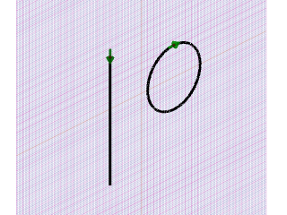
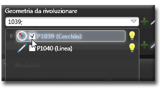
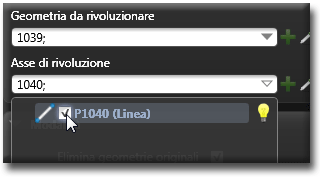

# ブール演算 

説明

ブール演算は、2つまたはそれ以上の3Dオブジェクト間で実行される集合演算です。和集合（結合）、差集合（減算）、交差（共通部分）などの操作を通じて、複雑な形状を効率的に作成できます。

ブール演算は、単純な基本形状から複雑なモデルを構築するための強力なツールであり、穴あけ、切り取り、部品の結合などの操作に使用されます。

関連項目

* [コントロール- キー - 指示](../_HTM_PARTI/H1-barreS-C.md#コントロール-キー-指示)
* [ビューの管理](../../../_USO-bSuiteComuni/Gestione-viste.md)
* [オブジェクトの表示方法](../../../_USO-bSuiteComuni/visualiz-oggetti.md)
* [平面図形または3D図形を作成する](../02-Nozioni/Dis-figure.md#平面図形または3D図形を作成する)

**描画の概念：**
* [構成平面](../02-Nozioni/PianoCostr.md)
* [3Dモデリングの基本](../03-Nozioni3D/Modeling-base.md)
* [基本立体](./02-06-01_solid_primitives.md)

## ブール演算の種類

### 和集合（結合） 

2つ以上のオブジェクトを結合して、1つのオブジェクトを作成します。結果として、全てのオブジェクトを含む領域が作成されます。

#### 和集合の手順：

1. 

ブール演算バー
ブール演算ツールを一覧表示するバー。
のボタンを

クリック
（1）画面上のポインタの下にあるオブジェクト（アイコン、ボタンなど）の上でマウスボタンを押す（そしてすぐに離す）行為を示します。（2）（動詞）選択したコマンドの機能を有効にするため、マウスの左ボタンを押してすぐに離します。
します。
2. 最初のオブジェクト（ターゲット）を選択します。
3. 2番目のオブジェクト（ツール）を選択します。
4. 必要に応じて追加のオブジェクトを選択します。
5. **適用**ボタンをクリックします。

   

### 差集合（減算） 

第1のオブジェクト（ターゲット）から第2のオブジェクト（ツール）を減算します。結果として、第1のオブジェクトから第2のオブジェクトの領域を取り除いた形状が作成されます。

#### 差集合の手順：

1. ブール演算バーのボタンをクリックします。
2. 第1のオブジェクト（ターゲット）を選択します。
3. 第2のオブジェクト（ツール）を選択します。
4. 必要に応じて追加のツールオブジェクトを選択します。
5. **適用**ボタンをクリックします。

   

### 交差 

複数のオブジェクトの共通部分（重なり合う領域）のみを残します。結果として、全てのオブジェクトが重なる部分だけの形状が作成されます。

#### 交差の手順：

1. ブール演算バーのボタンをクリックします。
2. 最初のオブジェクトを選択します。
3. 2番目のオブジェクトを選択します。
4. 必要に応じて追加のオブジェクトを選択します。
5. **適用**ボタンをクリックします。

   

### 分割 

第1のオブジェクト（ターゲット）を第2のオブジェクト（ツール）で切断し、複数の部分に分割します。結果として、元のオブジェクトがツールオブジェクトの境界で分割されます。

#### 分割の手順：

1. ブール演算バーのボタンをクリックします。
2. 分割するオブジェクト（ターゲット）を選択します。
3. 分割に使用するオブジェクト（ツール）を選択します。
4. 

データエリア
データ入力用の特定のエリアを定義する一般的な用語です。
で分割オプションを設定します。
5. **適用**ボタンをクリックします。

   

## ブール演算のオプション

### オリジナルを保持
チェックすると、演算に使用した元のオブジェクトが保持されます。チェックしない場合、元のオブジェクトは削除され、結果オブジェクトのみが残ります。

### 結果のマージ
複数のオブジェクトに対してブール演算を行う場合、すべての結果を1つのオブジェクトにマージするか、個別のオブジェクトとして保持するかを選択できます。

### 精度
ブール演算の計算精度を指定します。高精度の場合は計算時間が長くなりますが、結果の品質が向上します。

### 自動修復
演算結果に問題がある場合（小さなギャップや重なりなど）、自動的に修復を試みます。 