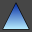
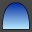
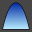

# bSolid マニュアル - 光る面

## 説明

形状ツール（テキストを含む）で構成された、閉じた同一平面上の形状図形から始まる芸術的な面（浅浮き彫り）を作成します。

**A.** 閉じた形状  
**B.** 作成した面

## 関連項目

- [より高度な形状用のタブ](../../04-Geo2D/README.md) - より高度な形状作成オプション
- [コントロール- キー - 指示](../_HTM_PARTI/H1-barreS-C.md#コントロール-キー-指示)
- [ビューの管理](../../../_USO-bSuiteComuni/Gestione-viste.md)
- [オブジェクトの表示方法](../../../_USO-bSuiteComuni/visualiz-oggetti.md)
- [平面図形または3D図形を作成する](../02-Nozioni/Dis-figure.md#平面図形または3D図形を作成する)

### 描画の概念

- [構成平面](../02-Nozioni/PianoCostr.md#構成平面)
- [平面図形または3D図形を作成する](../02-Nozioni/Dis-figure.md#平面図形または3D図形を作成する)
- [オブジェクトを操作する](../02-Nozioni/oggetti.md#オブジェクトを操作する)
- [カーソルの動きの制限および妨害](../02-Nozioni/puntatore.md#カーソルの動きの制限および妨害)

## 教育ビデオへのリンク

- [3次元のフィギュアの作成](../09-VIDEO.md)

## セクション一覧

- [形状を選択する](#形状を選択する)
- [モード](#モード)
- [プロパティ](../../04-Geo2D/README.md#プロパティ)
- [繰り返し](../../04-Geo2D/README.md#繰り返し)
- [CAMデータ](../../04-Geo2D/README.md#CAMデータ)

## 形状を選択する

### 形状
**パラメーター:** PTG

ユーザーは閉じた同一平面状の形状を選択することができます。他のものの内部の形状（図1を参照）は孤立したものと見なされるので、区別されます。

## モード

### オリジナルの形状を削除する
**パラメーター:** ED

開始する形状の削除を有効（ボックスがチェックされている）または無効にします。

ボックスが無効にされている場合、面が作成され、元の形状が維持されます。

### 精度
**パラメーター:** PR

作成した3Dの図の精密さを定義するインデックス。1000より小さい値にするとオブジェクトがより精密になる。

### プロファイル
**パラメーター:** MOD

作成された面の形を選択するのに使用されます。

####  線形の

尖った面（ピラミッド形）。

####  円弧

円弧のアウトラインによる丸い面。

####  楕円の弧

楕円のアウトラインによる丸い面。

### 繰り返し
**パラメーター:** NMOD

繰り返しの数（例、図5を参照）。

### 最小Z
**パラメーター:** ZMIN

面の開始のZ位置。

### 最大Z
**パラメーター:** ZMAX

面の高さを成立させるZの位置。「自動最大の高さ」ボックスがチェックされている場合、この値は考慮されない。

### 自動最大の高さ
**パラメーター:** AUTO

開始形状の寸法に基づいて面の高さの自動挿入を有効（ボックスをチェック）または無効にします。ボックスがチェックされている場合、「最大Z」データフィールドの値は無効にされている。

## 関連項目

- [形状用のタブ](../../04-Geo2D/README.md) - より高度な形状作成オプション
- [3次元のフィギュアの作成](../README.md) - 3Dモデリングの概要
- [基本立体](./02-06-01_solid_primitives.md) - 基本的な3D形状の作成
- [押し出し](./02-06-02_extrusion.md) - 2D形状からの押し出し

## 上位セクションに戻る

- [3D図形](./README.md)
- [CAD/CAM](../README.md)
- [bSolid マニュアル目次へ戻る](../../README.md) 
