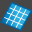

# bSolid マニュアル - 固定化する

## 説明

閉じた形状図形から平らな面を作成します。

## 関連項目

- [より高度な形状用のタブ](../../04-Geo2D/README.md) - より高度な形状作成オプション
- [コントロール- キー - 指示](../_HTM_PARTI/H1-barreS-C.md#コントロール-キー-指示)
- [ビューの管理](../../../_USO-bSuiteComuni/Gestione-viste.md)
- [オブジェクトの表示方法](../../../_USO-bSuiteComuni/visualiz-oggetti.md)
- [平面図形または3D図形を作成する](../02-Nozioni/Dis-figure.md#平面図形または3D図形を作成する)

### 描画の概念

- [構成平面](../02-Nozioni/PianoCostr.md#構成平面)
- [平面図形または3D図形を作成する](../02-Nozioni/Dis-figure.md#平面図形または3D図形を作成する)
- [オブジェクトを操作する](../02-Nozioni/oggetti.md#オブジェクトを操作する)
- [カーソルの動きの制限および妨害](../02-Nozioni/puntatore.md#カーソルの動きの制限および妨害)

## セクション一覧

- [一般的パラメーター](#一般的パラメーター)
- [プロパティ](../../04-Geo2D/README.md#プロパティ)
- [繰り返し](../../04-Geo2D/README.md#繰り返し)
- [CAMデータ](../../04-Geo2D/README.md#CAMデータ)

## 一般的パラメーター

### 固定化する形状
**パラメーター:** PTS

平らな面を作成するための閉じた形状図形を選択するために使用されます。図形は同じ平面上にあること。

### 精度
**パラメーター:** PR

作成した3Dの図の精密さを定義するインデックス。1000より小さい値にするとオブジェクトがより精密になる。

## 関連項目

- [形状用のタブ](../../04-Geo2D/README.md) - より高度な形状作成オプション
- [3次元のフィギュアの作成](../README.md) - 3Dモデリングの概要
- [基本立体](./02-06-01_solid_primitives.md) - 基本的な3D形状の作成
- [押し出し](./02-06-02_extrusion.md) - 2D形状からの押し出し
- [光る面](./02-06-07_glow_surface.md) - 芸術的な面の作成

## 上位セクションに戻る

- [3D図形](./README.md)
- [CAD/CAM](../README.md)
- [bSolid マニュアル目次へ戻る](../../README.md) 
