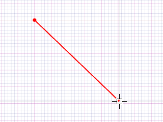

# パラメータ 

説明

パラメータは、モデルの寸法や特性を制御する数値です。これらを使用することで、設計の意図を明確に表現し、後で変更が容易な柔軟なモデルを作成できます。

パラメータを使用すると、モデルのサイズや形状を数値を変更するだけで簡単に調整できるため、設計の反復や製品バリエーションの作成が効率的になります。

関連項目

* [コントロール- キー - 指示](../_HTM_PARTI/H1-barreS-C.md#コントロール-キー-指示)
* [ビューの管理](../../../_USO-bSuiteComuni/Gestione-viste.md)
* [オブジェクトの表示方法](../../../_USO-bSuiteComuni/visualiz-oggetti.md)

**パラメトリック設計の概念：**
* [変数](./02-07-02_variables.md)
* [拘束条件](./02-07-03_constraints.md)
* [方程式](./02-07-04_equations.md)

## パラメータの種類

### グローバルパラメータ 

モデル全体で使用できるパラメータです。これらは中央の場所で定義され、モデル内の複数の場所から参照できます。

#### グローバルパラメータの作成手順：

1. 

パラメータバー
パラメータ関連ツールを一覧表示するバー。
のボタンを

クリック
（1）画面上のポインタの下にあるオブジェクト（アイコン、ボタンなど）の上でマウスボタンを押す（そしてすぐに離す）行為を示します。（2）（動詞）選択したコマンドの機能を有効にするため、マウスの左ボタンを押してすぐに離します。
します。
2. パラメータ管理ダイアログで「新規」ボタンをクリックします。
3. パラメータ名を入力します。
4. 値のタイプ（数値、テキスト、真偽値など）を選択します。
5. パラメータの初期値を設定します。
6. 必要に応じて単位や範囲などの追加プロパティを設定します。
7. 「OK」をクリックして確定します。

   

### ローカルパラメータ 

特定のフィーチャーやコンポーネントに関連付けられたパラメータです。これらはそのフィーチャー内でのみ使用できます。

#### ローカルパラメータの作成手順：

1. パラメータを追加するフィーチャーを選択します。
2. 

プロパティパネル
選択したオブジェクトのプロパティを表示および編集するためのパネル。
を開きます。
3. 「パラメータ」タブを選択します。
4. 「新規パラメータ」ボタンをクリックします。
5. パラメータ名、タイプ、値を設定します。
6. 「OK」をクリックして確定します。

   

### 寸法パラメータ 

モデル内の寸法値をパラメータとして使用します。これにより、既存の寸法を変数として参照できます。

#### 寸法パラメータの作成手順：

1. パラメータ化したい寸法を選択します。
2. 寸法を右クリックし、コンテキストメニューから「パラメータ化」を選択します。
3. パラメータ名を入力します。
4. 必要に応じて初期値を調整します。
5. 「OK」をクリックして確定します。

   

### リンクパラメータ 

外部ファイルまたはデータベースからインポートされるパラメータです。設計を外部データと連携させる場合に使用します。

#### リンクパラメータの作成手順：

1. パラメータバーのボタンをクリックします。
2. 「リンクパラメータ」ダイアログで「新規」をクリックします。
3. リンク名を入力します。
4. データソース（Excel、CSV、データベースなど）を選択します。
5. ファイルを参照するか、接続文字列を入力します。
6. インポートするパラメータを選択します。
7. 「OK」をクリックして確定します。

   

## パラメータの管理

### パラメータテーブル
すべてのパラメータを一覧表示し、値の確認や変更ができる表形式のインターフェイスです。

#### パラメータテーブルの使用手順：

1. パラメータバーの「パラメータテーブル」ボタンをクリックします。
2. テーブルでパラメータの一覧を確認します。
3. 値を変更するには、対応するセルをダブルクリックして新しい値を入力します。
4. フィルタや検索機能を使用して必要なパラメータを見つけることができます。
5. 変更を適用するには「適用」または「OK」をクリックします。

   

## パラメータのプロパティ

### 名前
パラメータを識別するための一意の名前です。

### 値
パラメータの現在の値です。

### タイプ
パラメータのデータ型（整数、実数、テキスト、真偽値など）です。

### 単位
値に関連付けられる測定単位です（長さの場合はmm、cmなど）。

### 範囲
パラメータが取ることができる有効な値の範囲です。最小値と最大値を設定できます。

### 説明
パラメータの目的や使用方法を説明するテキストです。

### 読み取り専用
チェックすると、パラメータの値が変更できなくなります（参照のみ可能）。 