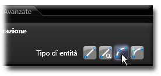

# 変数 

説明

変数は、設計内で異なる値を持つことができる名前付きの要素です。パラメータと似ていますが、変数はより動的であり、数式や条件によって値が変更される場合が多いです。

変数を使用することで、設計を柔軟に変更したり、異なる条件に基づいて異なる振る舞いをするようにモデルを構成したりできます。

関連項目

* [コントロール- キー - 指示](../_HTM_PARTI/H1-barreS-C.md#コントロール-キー-指示)
* [ビューの管理](../../../_USO-bSuiteComuni/Gestione-viste.md)
* [オブジェクトの表示方法](../../../_USO-bSuiteComuni/visualiz-oggetti.md)

**パラメトリック設計の概念：**
* [パラメータ](./02-07-01_parameters.md)
* [拘束条件](./02-07-03_constraints.md)
* [方程式](./02-07-04_equations.md)

## 変数の種類

### 数値変数 

数値を格納する変数です。整数または実数値を保持できます。

#### 数値変数の作成手順：

1. 

変数バー
変数関連ツールを一覧表示するバー。
のボタンを

クリック
（1）画面上のポインタの下にあるオブジェクト（アイコン、ボタンなど）の上でマウスボタンを押す（そしてすぐに離す）行為を示します。（2）（動詞）選択したコマンドの機能を有効にするため、マウスの左ボタンを押してすぐに離します。
します。
2. 変数管理ダイアログで「新規」ボタンをクリックします。
3. 変数名を入力します。
4. 「タイプ」ドロップダウンから「数値」を選択します。
5. 初期値を設定します。
6. 必要に応じて単位を選択します。
7. 「OK」をクリックして確定します。

   

### テキスト変数 

文字列や文字データを格納する変数です。名前や説明などの非数値情報に使用されます。

#### テキスト変数の作成手順：

1. 変数バーのボタンをクリックします。
2. 変数管理ダイアログで「新規」ボタンをクリックします。
3. 変数名を入力します。
4. 「タイプ」ドロップダウンから「テキスト」を選択します。
5. 初期値を設定します。
6. 「OK」をクリックして確定します。

   

### 真偽変数 

真（true）または偽（false）の2つの状態のみを持つ変数です。フィーチャーの表示・非表示の切り替えなどに使用されます。

#### 真偽変数の作成手順：

1. 変数バーのボタンをクリックします。
2. 変数管理ダイアログで「新規」ボタンをクリックします。
3. 変数名を入力します。
4. 「タイプ」ドロップダウンから「真偽値」を選択します。
5. チェックボックスで初期値（オン＝真、オフ＝偽）を設定します。
6. 「OK」をクリックして確定します。

   

### 配列変数 

複数の値を順序付けて格納できる変数です。同じタイプの値の集合を管理する場合に便利です。

#### 配列変数の作成手順：

1. 変数バーのボタンをクリックします。
2. 変数管理ダイアログで「新規」ボタンをクリックします。
3. 変数名を入力します。
4. 「タイプ」ドロップダウンから「配列」を選択します。
5. 要素のデータ型（数値、テキスト、真偽値）を選択します。
6. 「追加」ボタンをクリックして配列要素を追加します。
7. 各要素の値を入力します。
8. 「OK」をクリックして確定します。

   

## 変数の使用方法

### 数式での使用
変数は数式内で使用して、動的な値を計算できます。

#### 数式での変数使用例：

1. 

数式エディタ
数式を作成・編集するためのツール。
を開きます。
2. 数式に変数名を入力します（例：「width * 2」）。
3. 式を確定すると、変数の現在の値に基づいて結果が計算されます。
4. 変数の値が変更されると、数式の結果も自動的に更新されます。

   

### 条件文での使用
変数を条件文で使用して、特定の条件に基づいて異なる動作を実行できます。

#### 条件文での変数使用例：

1. 条件式を定義するダイアログを開きます。
2. IF/THEN/ELSE構文を使用して条件を入力します（例：「IF diameter > 10 THEN true ELSE false」）。
3. 変数名を条件式に含めます。
4. 条件式を確定すると、変数の現在の値に基づいて条件が評価されます。
5. 変数値が変更されると、条件の結果も自動的に再評価されます。

   

## 変数とパラメータの違い

### 用途の違い
パラメータは主に寸法や基本的な特性の制御に使用されます。変数はより複雑な関係や計算に使用されます。

### 更新方法の違い
パラメータは通常、手動で直接変更されますが、変数は式や条件によって自動的に値が変更されることが多いです。

### スコープの違い
パラメータはしばしば特定のフィーチャーやコンポーネントに関連付けられますが、変数はより広い範囲で使用され、複数のパラメータに影響を与えることができます。

### 関連付けの違い
パラメータは通常、特定の物理的な特性（長さ、角度など）に直接関連付けられますが、変数は抽象的な概念や制御メカニズムとして使用されることがあります。 