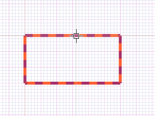
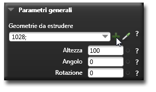
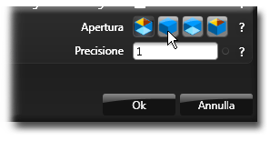
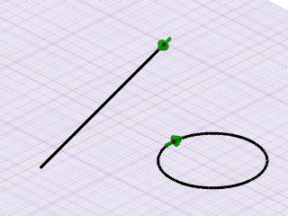

# 拘束条件 

説明

拘束条件は、モデル内の要素間の関係を定義するルールです。これらを使用することで、スケッチやモデルの形状を自動的に維持し、設計意図に沿った変更のみを許可できます。

拘束条件を適切に設定することで、モデルの寸法を変更しても形状の整合性が保たれ、予測可能な方法でモデルが更新されます。

関連項目

* [コントロール- キー - 指示](../_HTM_PARTI/H1-barreS-C.md#コントロール-キー-指示)
* [ビューの管理](../../../_USO-bSuiteComuni/Gestione-viste.md)
* [オブジェクトの表示方法](../../../_USO-bSuiteComuni/visualiz-oggetti.md)

**パラメトリック設計の概念：**
* [パラメータ](./02-07-01_parameters.md)
* [変数](./02-07-02_variables.md)
* [方程式](./02-07-04_equations.md)

## 拘束条件の種類

### 幾何学的拘束条件 

図形要素の位置や関係を定義する拘束条件です。形状の特徴を維持するために使用されます。

#### 幾何学的拘束条件の作成手順：

1. 

拘束条件バー
拘束条件関連ツールを一覧表示するバー。
のボタンを

クリック
（1）画面上のポインタの下にあるオブジェクト（アイコン、ボタンなど）の上でマウスボタンを押す（そしてすぐに離す）行為を示します。（2）（動詞）選択したコマンドの機能を有効にするため、マウスの左ボタンを押してすぐに離します。
します。
2. 適用したい幾何学的拘束のタイプを選択します。
3. 拘束を適用する要素を選択します。
4. 必要に応じて追加のパラメータを設定します。
5. 「適用」をクリックして確定します。

   

### 寸法拘束条件 

要素のサイズや位置を数値で制御する拘束条件です。特定の距離、角度、半径などを維持するために使用されます。

#### 寸法拘束条件の作成手順：

1. 拘束条件バーのボタンをクリックします。
2. 寸法を設定したい要素を選択します。
3. 寸法値を入力します。
4. 必要に応じて寸法の表示位置を調整します。
5. 「適用」をクリックして確定します。

   

## 幾何学的拘束条件の種類

### 平行 

選択した線分が平行になるように拘束します。

#### 平行拘束の適用手順：

1. 幾何学的拘束条件メニューから「平行」を選択します。
2. 平行にしたい2つの線分を選択します。
3. 「適用」をクリックして確定します。

   

### 垂直 

選択した線分が互いに90度の角度を保つように拘束します。

#### 垂直拘束の適用手順：

1. 幾何学的拘束条件メニューから「垂直」を選択します。
2. 垂直にしたい2つの線分を選択します。
3. 「適用」をクリックして確定します。

   

### 水平 

選択した線分が水平になるように拘束します。

#### 水平拘束の適用手順：

1. 幾何学的拘束条件メニューから「水平」を選択します。
2. 水平にしたい線分を選択します。
3. 「適用」をクリックして確定します。

   

### 垂直配置 

選択した線分が垂直になるように拘束します。

#### 垂直配置拘束の適用手順：

1. 幾何学的拘束条件メニューから「垂直配置」を選択します。
2. 垂直にしたい線分を選択します。
3. 「適用」をクリックして確定します。

   

### 一致 

選択したポイントが同じ位置に配置されるように拘束します。

#### 一致拘束の適用手順：

1. 幾何学的拘束条件メニューから「一致」を選択します。
2. 一致させたい2つのポイントを選択します。
3. 「適用」をクリックして確定します。

   

### 同心円 

選択した円や円弧が同じ中心を共有するように拘束します。

#### 同心円拘束の適用手順：

1. 幾何学的拘束条件メニューから「同心円」を選択します。
2. 同心円にしたい2つの円または円弧を選択します。
3. 「適用」をクリックして確定します。

   

### 等距離 

選択した要素間の距離が等しくなるように拘束します。

#### 等距離拘束の適用手順：

1. 幾何学的拘束条件メニューから「等距離」を選択します。
2. 等距離にしたい要素を選択します。
3. 「適用」をクリックして確定します。

   

### 固定 

選択した要素が現在の位置に固定されるように拘束します。

#### 固定拘束の適用手順：

1. 幾何学的拘束条件メニューから「固定」を選択します。
2. 固定したい要素またはポイントを選択します。
3. 「適用」をクリックして確定します。

   

## 拘束条件の管理

### 拘束条件の表示/非表示
モデル内の拘束条件の表示と非表示を切り替えます。

#### 拘束条件の表示/非表示の切り替え手順：

1. 「表示」メニューから「拘束条件」を選択します。
2. 表示したい拘束条件のタイプにチェックを入れます。
3. 「OK」をクリックして適用します。

### 拘束条件の編集
既存の拘束条件のプロパティを変更します。

#### 拘束条件の編集手順：

1. 編集したい拘束条件を選択します。
2. 右クリックしてコンテキストメニューから「編集」を選択します。
3. 必要な変更を行います。
4. 「適用」をクリックして確定します。

### 拘束条件の削除
不要になった拘束条件を削除します。

#### 拘束条件の削除手順：

1. 削除したい拘束条件を選択します。
2. 右クリックしてコンテキストメニューから「削除」を選択します。
3. 確認メッセージが表示されたら「はい」をクリックします。 