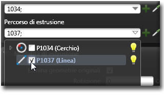

# 方程式 

説明

方程式は、モデル内のパラメータや変数間の関係を数学的に定義するものです。これを使用することで、値が自動的に計算され、モデルの振る舞いを制御できます。

方程式を活用することで、設計意図をより明確に表現し、複雑な関係性を持つモデルでも一貫性を保つことができます。

関連項目

* [コントロール- キー - 指示](../_HTM_PARTI/H1-barreS-C.md#コントロール-キー-指示)
* [ビューの管理](../../../_USO-bSuiteComuni/Gestione-viste.md)
* [オブジェクトの表示方法](../../../_USO-bSuiteComuni/visualiz-oggetti.md)

**パラメトリック設計の概念：**
* [パラメータ](./02-07-01_parameters.md)
* [変数](./02-07-02_variables.md)
* [拘束条件](./02-07-03_constraints.md)

## 方程式の作成

### 基本的な方程式 

単純な数式を使用してパラメータ間の関係を定義します。

#### 基本的な方程式の作成手順：

1. 

方程式バー
方程式関連ツールを一覧表示するバー。
のボタンを

クリック
（1）画面上のポインタの下にあるオブジェクト（アイコン、ボタンなど）の上でマウスボタンを押す（そしてすぐに離す）行為を示します。（2）（動詞）選択したコマンドの機能を有効にするため、マウスの左ボタンを押してすぐに離します。
します。
2. 「新規方程式」ダイアログで左辺の変数または出力パラメータを選択します。
3. 演算子と右辺の値を入力します（例：「width = length / 2」）。
4. 「OK」をクリックして確定します。

   

### 条件式 

条件に基づいて異なる値を返す方程式です。IF-THEN-ELSE構文を使用します。

#### 条件式の作成手順：

1. 方程式バーのボタンをクリックします。
2. 「新規条件式」ダイアログで出力パラメータまたは変数を選択します。
3. 条件式を構築します（例：「IF diameter > 10 THEN thickness = 2 ELSE thickness = 1」）。
4. 「OK」をクリックして確定します。

   

### 関数式 

数学関数を使用してより複雑な計算を行う方程式です。

#### 関数式の作成手順：

1. 方程式バーのボタンをクリックします。
2. 「新規関数式」ダイアログで出力パラメータまたは変数を選択します。
3. 使用する関数と引数を設定します（例：「radius = SQRT(width^2 + height^2) / 2」）。
4. 「OK」をクリックして確定します。

   

## 方程式で使用できる演算子と関数

### 算術演算子
- 加算（+）：`a + b`
- 減算（-）：`a - b`
- 乗算（*）：`a * b`
- 除算（/）：`a / b`
- べき乗（^）：`a ^ b`

### 比較演算子
- 等しい（=）：`a = b`
- 等しくない（!=）：`a != b`
- より大きい（>）：`a > b`
- より小さい（<）：`a < b`
- 以上（>=）：`a >= b`
- 以下（<=）：`a <= b`

### 論理演算子
- AND（&&）：`a && b`
- OR（||）：`a || b`
- NOT（!）：`!a`

### 数学関数
- 平方根：`SQRT(x)`
- 絶対値：`ABS(x)`
- 正弦：`SIN(x)`
- 余弦：`COS(x)`
- 正接：`TAN(x)`
- 対数：`LOG(x)`
- 自然対数：`LN(x)`
- 最小値：`MIN(x, y)`
- 最大値：`MAX(x, y)`
- 四捨五入：`ROUND(x)`

## 方程式の管理

### 方程式エディタ
すべての方程式を一覧表示し、編集や管理ができるインターフェイスです。

#### 方程式エディタの使用手順：

1. 方程式バーの「方程式エディタ」ボタンをクリックします。
2. エディタで方程式の一覧を確認します。
3. 編集したい方程式を選択し、「編集」ボタンをクリックします。
4. 変更を行い、「適用」をクリックして確定します。
5. 「閉じる」をクリックしてエディタを終了します。

   

### 方程式の検証
方程式の整合性をチェックし、問題がないことを確認します。

#### 方程式の検証手順：

1. 方程式エディタで「検証」ボタンをクリックします。
2. エラーや警告が表示された場合は、指示に従って修正します。
3. すべての問題が解決されたら「閉じる」をクリックします。

   

### 方程式の優先順位
複数の方程式がある場合の計算順序を設定します。

#### 方程式の優先順位設定手順：

1. 方程式エディタで「優先順位」ボタンをクリックします。
2. 方程式をドラッグアンドドロップして順序を変更します。
3. 「適用」をクリックして確定します。
4. 「閉じる」をクリックしてダイアログを終了します。

    