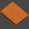

# 教育ビデオ

このセクションでは、bSolidの重要な機能を視覚的に学習するための教育ビデオを提供します。

## 3次元のフィギュアの作成

###  パスへの押出し

平面に作図された形状から得られる表面

<video controls muted loop>
  <source src="../../Help/ja/5804sb0002/Resources/Multimedia/M4V-GEO/2-estrusPercorso.m4v" type="video/mp4">
  お使いのブラウザは動画タグをサポートしていません。
</source>
</video>

ピースの平面に作図された形状から得られる表面

<video controls muted loop>
  <source src="../../Help/ja/5804sb0002/Resources/Multimedia/M4V-GEO/2-estrusPercorso-fac.m4v" type="video/mp4">
  お使いのブラウザは動画タグをサポートしていません。
</source>
</video>

###  回転

平面に作図された形状から得られる表面

<video controls muted loop>
  <source src="../../Help/ja/5804sb0002/Resources/Multimedia/M4V-GEO/3-rivoluzione.m4v" type="video/mp4">
  お使いのブラウザは動画タグをサポートしていません。
</source>
</video>

###  4セクションからの表面

平面に作図された形状から得られる表面

<video controls muted loop>
  <source src="../../Help/ja/5804sb0002/Resources/Multimedia/M4V-GEO/5-sup-4sez-piano.m4v" type="video/mp4">
  お使いのブラウザは動画タグをサポートしていません。
</source>
</video>

ピースの4フェースに作図された形状から得られる表面

<video controls muted loop>
  <source src="../../Help/ja/5804sb0002/Resources/Multimedia/M4V-GEO/5-sup4sez.m4v" type="video/mp4">
  お使いのブラウザは動画タグをサポートしていません。
</source>
</video>

###  2つのセクションのある表面

平面に作図された形状から得られる表面

<video controls muted loop>
  <source src="../../Help/ja/5804sb0002/Resources/Multimedia/M4V-GEO/6-sup-sez-piano.m4v" type="video/mp4">
  お使いのブラウザは動画タグをサポートしていません。
</source>
</video>

ピースの2フェイスに作図された形状から得られる表面

<video controls muted loop>
  <source src="../../Help/ja/5804sb0002/Resources/Multimedia/M4V-GEO/6-sup-sez-pezzo.m4v" type="video/mp4">
  お使いのブラウザは動画タグをサポートしていません。
</source>
</video>

###  2つのセクションと1つのクローズドパスから得られる表面

ピースの上面に作図された形状から得られる表面

<video controls muted loop>
  <source src="../../Help/ja/5804sb0002/Resources/Multimedia/M4V-GEO/8-sup2sez_1per-chiuso.m4v" type="video/mp4">
  お使いのブラウザは動画タグをサポートしていません。
</source>
</video>

###  2つのセクションと1つの常にクローズドパスから得られる表面

ピースの上面に作図された形状から得られる表面

<video controls muted loop>
  <source src="../../Help/ja/5804sb0002/Resources/Multimedia/M4V-GEO/9-sup2sez_1per-chiusoCost.m4v" type="video/mp4">
  お使いのブラウザは動画タグをサポートしていません。
</source>
</video>

###  グロー表面

ピースの上面に作図された形状から得られる表面

<video controls muted loop>
  <source src="../../Help/ja/5804sb0002/Resources/Multimedia/M4V-GEO/glow.m4v" type="video/mp4">
  お使いのブラウザは動画タグをサポートしていません。
</source>
</video>

## プログラミング

###  ピースの作成

長方形の粗いピースを使用して、形状から仕上げたピース

<video controls muted loop>
  <source src="../../Help/ja/5804sb0002/Resources/Multimedia/M4V-Lav-Stand/L-pezzo_Da_Geo.m4v" type="video/mp4">
  お使いのブラウザは動画タグをサポートしていません。
</source>
</video>

形状から仕上げた、かつ粗いピース

<video controls muted loop>
  <source src="../../Help/ja/5804sb0002/Resources/Multimedia/M4V-Lav-Stand/L-pezzo_Da_Geo02.m4v" type="video/mp4">
  お使いのブラウザは動画タグをサポートしていません。
</source>
</video>

###  カスタマイズされたフェイスの作成

ピースのゼロ面に生じた形状から得られるフェイス

<video controls muted loop>
  <source src="../../Help/ja/5804sb0002/Resources/Multimedia/M4V-Lav-Stand/L-faccia_Custom.m4v" type="video/mp4">
  お使いのブラウザは動画タグをサポートしていません。
</source>
</video>

###  ポケッティング加工

ゼロフェイスの上に構築された形状上の内部ポケット加工

<video controls muted loop>
  <source src="../../Help/ja/5804sb0002/Resources/Multimedia/M4V-Lav-Stand/L-svuotamentogeo.m4v" type="video/mp4">
  お使いのブラウザは動画タグをサポートしていません。
</source>
</video>

ゼロフェイスの上に構築された形状上の外部ポケット加工

<video controls muted loop>
  <source src="../../Help/ja/5804sb0002/Resources/Multimedia/M4V-Lav-Stand/L-svuotamentogeo02.m4v" type="video/mp4">
  お使いのブラウザは動画タグをサポートしていません。
</source>
</video>

### 切削加工 - ボア - カット

ピースのゼロフェイスに適用された様々な加工作業

<video controls muted loop>
  <source src="../../Help/ja/5804sb0002/Resources/Multimedia/M4V-Lav-Stand/L-fres-for-tag.m4v" type="video/mp4">
  お使いのブラウザは動画タグをサポートしていません。
</source>
</video>

カスタマイズされたフェイスに繰り返されたボアリング

<video controls muted loop>
  <source src="../../Help/ja/5804sb0002/Resources/Multimedia/M4V-Lav-Stand/L-prog-lavsufacciacust.m4v" type="video/mp4">
  お使いのブラウザは動画タグをサポートしていません。
</source>
</video>

### 3および5軸を使用数加工作業

5－軸と3－軸の仕上げを使用して同じ表面に適用される、加工作業の例

**5軸仕上げ（分析的表面）**

<video controls muted loop>
  <source src="../../Help/ja/5804sb0002/Resources/Multimedia/M4V-Lav-Stand/L-5-assi-analitica.m4v" type="video/mp4">
  お使いのブラウザは動画タグをサポートしていません。
</source>
</video>

**3軸仕上げ**

<video controls muted loop>
  <source src="../../Help/ja/5804sb0002/Resources/Multimedia/M4V-Lav-Stand/L-3-assi.m4v" type="video/mp4">
  お使いのブラウザは動画タグをサポートしていません。
</source>
</video>

5-軸仕上げの例（削り面）

<video controls muted loop>
  <source src="../../Help/ja/5804sb0002/Resources/Multimedia/M4V-Lav-Stand/L-5-assi-swarfing.m4v" type="video/mp4">
  お使いのブラウザは動画タグをサポートしていません。
</source>
</video>

5-軸仕上げの例（カスタマイズされたフェイスに構築された分析的表面）

<video controls muted loop>
  <source src="../../Help/ja/5804sb0002/Resources/Multimedia/M4V-Lav-Stand/L-5-assi-sufacciacust.m4v" type="video/mp4">
  お使いのブラウザは動画タグをサポートしていません。
</source>
</video>

###  シーケンス

ポケット加工/プロファイリングシーケンスを作成および適用する方法の例示

<video controls muted loop>
  <source src="../../Help/ja/5804sb0002/Resources/Multimedia/M4V-Lav-Stand/L-sequenza-creaz-applicaz.m4v" type="video/mp4">
  お使いのブラウザは動画タグをサポートしていません。
</source>
</video>

表面に適用される粗い成形/仕上げシーケンスの例示

<video controls muted loop>
  <source src="../../Help/ja/5804sb0002/Resources/Multimedia/M4V-Lav-Stand/L-applicaz-sequenza.m4v" type="video/mp4">
  お使いのブラウザは動画タグをサポートしていません。
</source>
</video>

 