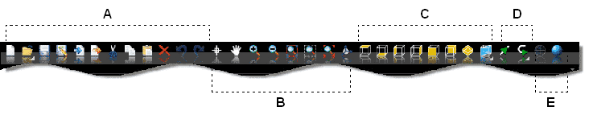

# ビューバー（標準バー）

**ファイル名**: `02-10-01_view_bar.md`  
**カテゴリ**: インターフェース - ビューバー

## 概要

ビューバー（標準バー）は、アプリケーションの最前面に位置するバーで、メインツールをリスト化しています。このバーは以下の5つの主要セクションで構成されています：

- **一般的ツール**（A）
- **管理ツールを表示する**（B）
- **直交ビューツール**（C）
- **方向ツール**（D）
- **表示ツール**（E）

## 管理ツールを表示する

### 基本操作ツール

| アイコン | 機能 |
|---------|------|
|  | **オブジェクト選択**: オブジェクトを選択するための十字カーソルをアクティブにします |
|  | **ビュー回転**: ビューを回転させるようにカーソルをアクティブにします |
|  | **パン（移動）**: ビューを移動するパンコマンドをアクティブにします |

### ズーム操作ツール

| アイコン | 機能 |
|---------|------|
|  | **拡大**: オブジェクトを近くに寄せるため、描画エリアの表示サイズを大きくします（拡大カーソル） |
|  | **縮小**: オブジェクトをさらに移動させるため、描画エリアの表示サイズを減らします（縮小カーソル） |
|  | **全体表示**: すべての作成済みオブジェクトを描画エリアの寸法に適合させます |
|  | **選択オブジェクトに合わせる**: 選択したオブジェクト（青い輪郭のもの）だけを描画エリアサイズとします ※このコマンドはオブジェクトが選択されている時のみアクティブ化されます |

## 直交ビューツール

3Dオブジェクトを様々な角度から表示するための標準的なビューです。

| アイコン | 機能 |
|---------|------|
|  | **上面ビュー**: 上からのビューを表示します |
|  | **下面ビュー**: 下からのビューを表示します |
|  | **左面ビュー**: 左ビューを表示します |
|  | **右面ビュー**: 右ビューを表示します |
|  | **前面ビュー**: 前方ビューを表示します |
|  | **後面ビュー**: 後方ビューを表示します |
|  | **等角図ビュー**: 等角図を表示します ※三次元オブジェクトを表示するための軸測投影タイプ。基準軸（x、y、z）がまとめて120°の角度を形成し、オブジェクトのバランスの取れたビューを提供 |

## 方向ツール

ツールパスの移動方向を制御するためのツールです。

| アイコン | 機能 |
|---------|------|
|  | **方向表示**: 描画エリアに、2つの方向を指す矢を表示または非表示にする（ツール前進およびアウトライン作成） |
|  | **左方向設定**: 選択され開いているすべてのアウトライン上で、右から左へ、ツールの移動方向を設定します |
|  | **右方向設定**: 選択され開いているすべてのアウトライン上で、左から右へ、ツールの移動方向を設定します |
|  | **時計回り**: 選択したすべてのアウトライン上で、時計回りに、ツールの移動方向を設定します |
|  | **反時計回り**: 選択されたすべてのアウトライン上で、反時計回りに、ツールの移動方向を設定します |
|  | **方向反転**: ツール前進方向を逆転させる。選択されたアウトラインで、矢が右を指しているものは、その矢の向きは左になります |

## 表示ツール

3D図形の視覚化モードを制御するツールです。

| アイコン | 機能 |
|---------|------|
|  | **ワイヤーフレーム**: 3D図形のワイヤーフレーム可視化を有効にします |
|  | **フォトリアリスティック**: 3D図形の写実的可視化を有効にします |
|  | **メッシュ**: 3D図形のメッシュ可視化を有効にします |

## 操作方法

### ビュー回転の操作方法

#### コマンドを使用した方法
1.  ボタンをクリックします
2. マウスの**左**キーを押します
3. カーソルを画像に置き、移動させます

#### マウスを使用した方法
1. キーボードの**Ctrl**キーと、マウスの**中央**キー（スクロールホイール）を押します
2. 両方を押したまま、カーソルを移動させます

### ビューのドラッグ（パン）操作方法

#### コマンドを使用した方法
1.  ボタンをクリックします
2. マウスの任意のキーを押し、押したまま表示を切り替え、オブジェクトを必要な方向にドラッグします

#### マウスを使用した方法
1. マウスの**中央**キー（スクロールホイール）を押し、手の形のカーソルを表示させます
2. 中央キー（スクロールホイール）を押したまま、マウスを移動させて表示をシフトし、オブジェクトを必要な方向にドラッグします

### ズーム操作方法

#### マウスホイールを使用
表示を拡大または縮小するには、マウスの**中央**キー（スクロールホイール）を前または後ろに回します。

#### ズームコマンドを使用
特定のズームコマンドを選択し、マウスの**左**キーをクリックします。

#### 描画エリアの一部の最大化
1.  ボタンをクリックします
2. マウスの**左**キーを押してから、カーソルを画像の上に置いてドラッグして選択エリアを作成します

## 関連項目

- [ドキュメントを管理する](../02-UTILIZZO/Gestione_document.md)
- [オブジェクトを選択する](../02-Nozioni/oggetti.md#オブジェクト選択)
- [カーソルの動きの制限および妨害](../02-Nozioni/puntatore.md)

---

**注意**: この文書は元HTMLファイル `BarraStand.htm` および `Gestione-viste.htm` を基に作成されています。 
