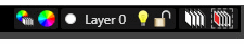

# ステータスバー

**ファイル名**: `02-10-03_status_bar.md`  
**カテゴリ**: インターフェース - ステータスバー

## 概要

ステータスバーは、CAD/CAM環境での作業効率を向上させるための重要なツール群を提供します。主に以下の3つの機能カテゴリで構成されています：

1. **スナップツール** - 形状エレメントの精密な接続
2. **レイヤーツール** - レベル管理とオブジェクト表示制御  
3. **加工作業ツール** - ツールパスと加工表示の管理

## スナップツール

様々な形状エレメントを接続する「磁石」コマンド群です。途中の点や外側の先端などを検索し、正確な位置決めを支援します。

### 基本スナップツール

| アイコン | 機能 | 説明 |
|---------|------|------|
|  | **終点でスナップ** | カーソルをオブジェクトセグメント（ライン、円弧、ポリライン、FreeFormsとして作成された）の終点にリンクさせます |
|  | **中間点でスナップ** | カーソルを（ライン、円弧またはポリラインとして作成された）オブジェクトのセグメントの中間点にリンクさせます ※FreeFormsとして作成されたオブジェクトでは機能しません |
|  | **交差部でのスナップ** | カーソルを（ライン、円弧またはポリラインとして作成された）オブジェクトのセグメントの交差点にリンクさせます ※FreeFormsとして作成されたオブジェクトでは機能しません |

### 高度なスナップツール

| アイコン | 機能 | 説明 |
|---------|------|------|
|  | **垂直スナップ** | カーソルを既存のセグメントに対して垂直な位置にリンクさせます |
|  | **接線スナップ** | カーソルを円や円弧の接線位置にリンクさせます |
|  | **重心スナップ** | カーソルを閉じた形状図の中心にリンクさせます |
|  | **中心スナップ** | カーソルを円または円弧の中心にリンクさせます |

### 専門スナップツール

| アイコン | 機能 | 説明 |
|---------|------|------|
|  | **象眼スナップ** | カーソルを、象眼軸が通る円形図（円弧、円または楕円）の終点にリンクさせます ※点の位置は構築面セットによって、xyプレーンを考慮して決定（0°、90°、180°、270°） |
|  | **アクティブな描画面との交差部スナップ** | カーソルをアクティブな構築面にリンクさせます |
|  | **自動スナップ** | どのスナップツールを常にアクティブにするか定義するウィンドウを表示します |

### スナップ動作制御

**操作方法**：
- ボタンがハイライトされると、関連スナップツールがアクティブになります
- 選択したスナップツールの使用をアクティブにするには、「Osnap」コマンドをクリックします

**3D図形での特別動作**：
- 終点スナップ：角で磁石がアクティブ
- 中間点スナップ：角と端の中間点で磁石がアクティブ

## 制御オプション

### 基本制御オプション

| 設定 | 機能 | 説明 |
|------|------|------|
| **変数** | 変数管理 | アクティブなドキュメントの変数管理セクションを表示または非表示にします |
| **Oスナップ** | スナップ制御 | 関連ウィンドウで選択されたスナップツールの使用を有効化または無効にします |
| **グリッド** | グリッド表示 | グリッドを有効化または無効にします |
| **Ortho** | 直交制御 | 直交オプションを有効化または無効にします |
| **スナップ** | グリッドスナップ | グリッド上のスナップツールを有効化または無効にします |

## レイヤーツール

レベル管理のコマンド群です。オブジェクトの表示・非表示、ロック・解除、色設定などを制御します。

### 色設定ツール

| アイコン | 機能 | 説明 |
|---------|------|------|
|  | **レイヤーから色を設定する** | レベルで定義した色をリセットし、すべてのオブジェクト（個別化された色をもつオブジェクトも）にその色を適用します |
|  | **色を選択** | 選択したオブジェクトの色を個別化するために使用（レベルのすべてのオブジェクトに適用される色と比較して） ※カラーテーブルから選択された色は選択されたオブジェクトのみと関連付けられます |

### レイヤー管理ツール

| アイコン/項目 | 機能 | 説明 |
|-------------|------|------|
|  | **レイヤー** | 作成されたレベルのリストを表示します |
|  | **表示** | レベルがアクティブである（つまり、それが含むオブジェクトを表示できる）ことを示します ※このアイコンをクリックすると電球がオフになり、レベルが非表示になります |
|  | **非表示** | レベルが非表示である（つまり、それが含むオブジェクトを表示できない）ことを示します ※このアイコンをクリックすると電球がオンになり、レベルが表示されます |

### ロック制御ツール

| アイコン | 機能 | 説明 |
|---------|------|------|
|  | **ブロック** | レベルがロックされたことを示します。この場合、アクティブレベルに属するオブジェクトは変更できません ※このアイコンをクリックすると、ロックが開き、レベルのロックが解除されます |
|  | **リリース** | レベルが開放されたことを示します。この場合、アクティブレベルに属するオブジェクトは変更できます ※このアイコンをクリックすると、ロックが閉じ、レベルがロックされます |
|  | **レイヤーを変更** | レベル管理用のダイアログボックスを表示します（三次元オブジェクトのライン、色、素材を設定するなど） ※オブジェクトの色は、レベルごとに定義されます |

## 加工作業のツール

ツールパスと加工表示に関連する機能を管理します。

### 表示制御ツール

| アイコン | 機能 | 説明 |
|---------|------|------|
|  | **高速表示** | 最高速度でツールが移動したパスの表示を有効化または無効にする（素早いツール移動） |
|  | **加工作業のツールを表示** | ツールの表示を有効化または無効にします |
|  | **様々な色を使用して各加工作業を描画する** | 各加工作業に異なる色を適用し（ボタンを有効にする）、他と区別します |

## 使用方法とヒント

### スナップツールの効率的な使用

1. **複数スナップの組み合わせ**
   - 複数のスナップツールを同時にアクティブ化可能
   - 自動スナップ機能で常用ツールを設定

2. **視覚的フィードバック**
   - スナップポイントはカーソル付近に表示される
   - アクティブなスナップツールはボタンがハイライト

3. **3D環境での注意点**
   - 3D図形では角や辺の中間点で動作が異なる
   - 構築面との関係を考慮した配置

### レイヤー管理のベストプラクティス

1. **効率的な構成**
   - 機能別にレイヤーを分類
   - 色分けによる視覚的管理

2. **作業フロー**
   - 必要ないレイヤーは非表示化
   - 編集しないレイヤーはロック

3. **色の管理**
   - レイヤー色と個別色の使い分け
   - 作業内容に応じた色設定

### 加工作業表示の活用

1. **視覚的確認**
   - 各加工作業の色分け表示
   - ツールパスの高速移動表示

2. **効率化**
   - 不要な表示要素の非表示化
   - 作業段階に応じた表示切り替え

## 関連項目

- [ビューバー（標準バー）](02-10-01_view_bar.md)
- [選択ツールバー](02-10-02_selection_toolbar.md)
- [グリッド](../02-Nozioni/PianoCostr.md#グリッド)
- [レベルを管理する](../02-UTILIZZO/Gestione_livelli.md)
- [カーソルの制限と妨害](../02-Nozioni/puntatore.md)

---

**注意**: この文書は元HTMLファイル `barraStato.htm` を基に作成されています。 
