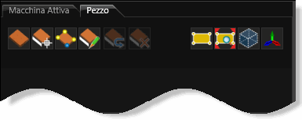
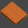
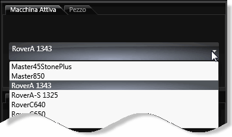
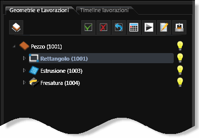
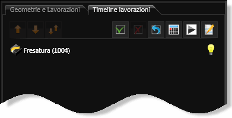
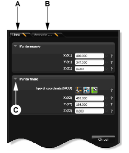

# コマンドエリア

**ファイル名**: `02-10-04_command_area.md`  
**カテゴリ**: インターフェース - コマンドエリア

## 概要

コマンドエリアは、CAD/CAM環境のデータエリアの重要な部分で、様々な管理・作業機能を提供します。主に以下の構成要素で構成されています：

1. **ピースタブ** - 加工するピースの管理用コマンド
2. **アクティブな機械** - 機械選択のドロップダウンメニュー
3. **形状および加工作業エリア** - ツリーリストとタイムライン管理
4. **パラメーターエリア** - 形状と技術パラメーターの管理

## ピースタブのコマンド

### 基本ピース管理ツール

| アイコン | 機能 | 説明 |
|---------|------|------|
|  | **新規の標準ピースを作成する** | 新しい標準ピースを作成するためのコマンド |
|  | **面選択** | ピースの面を選択するため、カーソルをアクティブにします |
|  | **角選択** | カーソルをアクティブ化して、ピースの1つあるいは複数の角を選択します |

### 非標準面管理ツール

| アイコン | 機能 | 説明 |
|---------|------|------|
|  | **カスタマイズされた面を作成** | 形状からはじめて非標準の面を作成します（直線、円弧、ポリラインなど） |
|  | **面を逆転** | 選択した非標準面を逆転させます |
|  | **非標準面を削除** | 選択した非標準面を削除します |

### 表示制御ツール

| アイコン | 機能 | 説明 |
|---------|------|------|
|  | **面のみ表示** | 選択した面のみを表示します ※ボタンを再度クリックして、ピースを表示 |
|  | **面を拡大表示** | 選択した面を描画エリアのサイズに適合させます |

## アクティブな機械

どの機械をアクティブ化するかを選択するドロップダウンメニューを表示します。このメニューにより、作業対象の機械を素早く切り替えることができます。

## 形状および加工作業エリア

### ツリーリスト構造

形状およびピースのノードを持つツリーリストと、様々な形状と関連付けられている加工作業のノードを表示します。作成された形状および加工作業はすべてツリーリストにまとめられ、描画エリアとの相互作用および値の迅速な修正ができます。

**操作方法**：
- 左のマウスキーを使って、（アイコンおよびその名前の前にある）三角形をクリックすると、リストが展開し閉じます
-  シンボルは、ピース、形状または加工作業の表示を有効化または無効にします

### 加工作業のタイムライン

加工作業のノードを持つツリーリストを表示します。このエリアでは、加工作業を命じてシミュレートすることができ、ISOファイルを作成することなどもできます。

**特徴**：
- 加工作業ノードは、ドラッグ＆ドロップ機能を使って動かすことができます
- ツリーリストの各行には、以下の情報の文字列が表示されます：
  - ピースの名前
  - 加工作業の名前
  - 使用されたツール名

**表示例**: `[ピース P1001] - P1006（フライス加工）-CAT1`  
この文字列は、ツールCAT1を使って、フライス加工操作P1006がピースP1001で実行されたことを示します。

## パラメーターエリア

形状および技術パラメーターを管理するカードを含むデータエリアの部分です。各カードのパラメーターはセクションによってグループ化されます。

**構成要素**：
- **A.** 形状ラインパラメーターのカード
- **B.** 詳細なラインパラメーターのカード

**操作方法**：
パラメーターを表示するには、タイトルの前にある縦向きの三角形をクリックして、セクションを展開します。

## 形状および加工作業エリアのコマンド

### ピース管理コマンド

| 機能 | 説明 |
|------|------|
| **新規ピース作成** | 標準的なピースを新規作成 |
| **面選択** | ピースの特定面を選択 |
| **角選択** | ピースの角部分を選択 |
| **非標準面作成** | カスタム形状からの面作成 |
| **面表示制御** | 選択面の表示・非表示切り替え |

### 形状操作コマンド

| 機能 | 説明 |
|------|------|
| **形状作成** | 2D/3D形状の作成と編集 |
| **形状変更** | 既存形状のパラメーター変更 |
| **形状削除** | 不要な形状の削除 |
| **形状コピー** | 形状の複製作成 |
| **形状移動** | 形状の位置変更 |

### 加工作業コマンド

| 機能 | 説明 |
|------|------|
| **加工作業追加** | 新しい加工作業の追加 |
| **順序変更** | 加工作業の実行順序変更 |
| **パラメーター設定** | 加工条件の詳細設定 |
| **シミュレーション** | 加工作業のシミュレーション実行 |
| **プログラム生成** | ISOプログラムの生成 |

## プログラミング指示

### 変数管理

プログラムのパラメーター化における変数の定義と管理機能を提供します。

**特徴**：
- 数値パラメーターの変数化
- 式による計算機能
- パラメーター間の依存関係管理

### 条件分岐

プログラムにおける条件分岐の設定機能です。

**用途**：
- 条件に応じた加工作業の選択
- パラメーターに基づく動作変更
- エラー処理の実装

## 使用方法とワークフロー

### 基本的な作業手順

1. **ピース作成**
   - 新規ピースボタンをクリック
   - 必要な寸法・材質を設定

2. **形状作成**
   - 2D図形ツールで基本形状を作成
   - 3D図形ツールで立体形状を作成

3. **加工作業設定**
   - 適切な加工作業を選択
   - パラメーターを設定
   - ツールを選択

4. **シミュレーション実行**
   - タイムラインで加工順序を確認
   - シミュレーションを実行して動作確認

5. **プログラム生成**
   - ISOファイルを生成
   - 機械に転送して実行

### 効率的な作業のコツ

1. **ツリーリストの活用**
   - 階層構造を理解して効率的にナビゲート
   - 表示・非表示機能で作業対象を明確化

2. **パラメーター管理**
   - セクション展開機能を活用
   - 関連パラメーターをグループ化して管理

3. **ドラッグ＆ドロップ**
   - 加工作業の順序変更を活用
   - 効率的なワークフロー構築

## 関連項目

- [ビューバー（標準バー）](02-10-01_view_bar.md)
- [選択ツールバー](02-10-02_selection_toolbar.md)
- [ステータスバー](02-10-03_status_bar.md)
- [標準ピースを作成する](../02-UTILIZZO/Proced_programmaz.md#標準ピースを作成する)
- [非標準面を作成する](../02-UTILIZZO/Proced_programmaz.md#非標準面を作成する)
- [プログラムをパラメーター化する](../02-UTILIZZO/Proced_programmaz.md#プログラムをパラメーター化する)

---

**注意**: この文書は元HTMLファイル `cad-struttura.htm` および `comadiAreaD.htm` を基に作成されています。 
