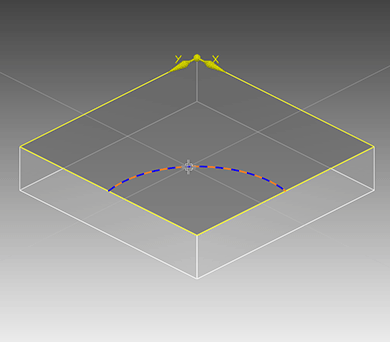

# 描画エリア

**ファイル名**: `02-10-05_drawing_area.md`  
**カテゴリ**: インターフェース - 描画エリア

## 概要

描画エリアは、CAD/CAM環境の中核となるワークスペースで、描画されたオブジェクトに適用された加工作業の描画および表示専用の、作成されたドキュメントの中央部です。形状/加工作業の作成と変更を行う専用のエリアとして機能します。

## 基本機能

### 主要な役割

1. **形状描画** - 2D/3D図形の作成・編集・表示
2. **加工作業の表示** - ツールパスと加工シミュレーションの表示
3. **オブジェクト管理** - 作成されたオブジェクトの選択・操作
4. **視覚的確認** - 設計内容の視覚的な確認と検証

### エリア特性

**中央配置**: 作成されたドキュメントの中央に位置し、メインの作業領域として機能します。

**インタラクティブ**: データエリアのツリーリストとの相互作用により、値の迅速な修正が可能です。

**リアルタイム表示**: 形状や加工作業の変更が即座に反映されます。

## オブジェクトの表示方法

### ワイヤーフレーム可視化

3D図形のプロファイルのみを表示するモードです。

**使用方法**:
- 標準バーの  ボタンをクリック

**特徴**:
- 3D図形のプロファイルラインのみを表示
- 軽量表示で高速レンダリング
- 構造の確認に適している

**色変更**: ステータスバーの  ボタンで、選択したオブジェクトのプロファイルラインの色を変更可能

### 写実的可視化

オブジェクトを色と影で現実的な外観で表示するモードです。

**使用方法**:
- 標準バーの  ボタンをクリック

**特徴**:
- 3D図形を色と影付きで表示
- 現実的な外観による形状の確認
- 作成した形状のタイプを容易に判別

**素材設定**:
- レベルを使用して素材と影を定義
- ステータスバーの  ボタンで素材や色を変更

### メッシュ可視化

三次元オブジェクトの構造や内部骨格を表示するモードです。

**使用方法**:
- 標準バーの  ボタンをクリック

**特徴**:
- プロファイルラインを可視化
- 隠れたラインや円弧も表示
- 三次元オブジェクトの内部骨格を確認

**色変更**: ステータスバーの  ボタンで、選択したオブジェクトのラインの色を変更可能

## 描画操作とインタラクション

### オブジェクト作成

#### 2D図形の作成
- **点**: 描画エリアで直接クリックして配置
- **線分・円弧**: 開始点をクリック、終点を指定
- **ポリライン**: 連続する点をクリックして作成
- **円・楕円**: 中心点をクリックして作成
- **矩形・多角形**: 開始点をクリック、寸法を指定

#### 3D図形の作成
- **基本プリミティブ**: ボックス、シリンダー、球体などの基本形状
- **押し出し**: 2D図形を3D形状に押し出し
- **回転**: 2D図形を軸周りに回転させて3D化
- **ロフト**: 複数の断面から3D形状を作成

### 精密入力支援

#### スナップ機能
描画エリアでは、ステータスバーのスナップツールと連携して高精度な位置決めが可能です：

- **終点スナップ**: 既存形状の終点に自動吸着
- **中間点スナップ**: セグメントの中間点に自動吸着
- **交差点スナップ**: 形状の交差点に自動吸着
- **垂直・接線スナップ**: 特定の角度や接触点に吸着

#### グリッド機能
- **表示**: ステータスバーでグリッド表示をON/OFF
- **スナップ**: グリッド点への自動吸着機能
- **間隔設定**: グリッド間隔の調整可能

### 表示制御

#### ズーム・パン操作
- **拡大**: マウスホイール上回転、または標準バーの拡大ツール
- **縮小**: マウスホイール下回転、または標準バーの縮小ツール
- **パン**: 中ボタンドラッグ、または標準バーのパンツール
- **全体表示**: 標準バーの全体表示ボタン

#### 回転・視点変更
- **3D回転**: 標準バーの回転ツールをアクティブ化
- **直交ビュー**: 標準バーの直交ビューボタン（正面、側面、上面など）
- **等角投影**: 3D形状の等角投影表示

## オブジェクト選択と編集

### 選択方法

#### 基本選択
- **単一選択**: オブジェクトをクリック
- **複数選択**: Ctrlキーを押しながらクリック
- **矩形選択**: ドラッグで矩形選択領域を作成
- **全選択**: 選択ツールバーの全選択ボタン

#### 高度な選択
- **類似選択**: 同じタイプのオブジェクトを一括選択
- **レイヤー選択**: 特定レイヤーのオブジェクトを選択
- **逆選択**: 選択状態を反転

### 編集操作

#### 基本編集
- **移動**: 選択オブジェクトをドラッグ
- **回転**: 回転ハンドルを使用
- **スケール**: スケールハンドルで拡大縮小
- **削除**: Deleteキーまたは削除ボタン

#### 高度な編集
- **コピー**: Ctrl+C、Ctrl+V
- **配列複製**: 規則的な配列で複製
- **ミラー**: 指定軸で反転複製
- **変形**: 自由変形ツールで変形

## データエリアとの連携

### ツリーリストとの同期

描画エリアで選択したオブジェクトは、データエリアのツリーリストでも自動的に選択されます。逆に、ツリーリストでノードを選択すると、対応するオブジェクトが描画エリアでハイライト表示されます。

### パラメーター変更の反映

データエリアでパラメーターを変更すると、描画エリアのオブジェクトがリアルタイムで更新されます。

### 表示制御

ツリーリストの  /  シンボルにより、描画エリアでのオブジェクト表示・非表示を制御可能です。

## 加工作業の表示

### ツールパス表示

加工作業が定義されると、描画エリアにツールパスが表示されます：

- **カット部分**: 実際に材料を削る部分を表示
- **早送り部分**: ツールの高速移動部分を表示
- **アプローチ・リトラクト**: 加工開始・終了時の動作を表示

### シミュレーション

- **動的シミュレーション**: 加工過程をアニメーション表示
- **工具表示**: 実際の工具形状を表示
- **材料削除**: 削られる材料部分を視覚化

### 色分け表示

ステータスバーの設定により、各加工作業を異なる色で表示し、作業の区別を容易にします。

## 作業効率向上のヒント

### 表示モードの使い分け

1. **設計段階**: ワイヤーフレーム表示で軽快な操作
2. **確認段階**: 写実的表示で仕上がりを確認
3. **詳細検討**: メッシュ表示で構造を詳細確認

### ショートカットキーの活用

- **Esc**: 現在のコマンドをキャンセル
- **Ctrl+Z**: 元に戻す
- **Ctrl+Y**: やり直し
- **Delete**: 選択オブジェクトを削除
- **F**: 全体表示

### レイヤー管理

- **機能別分類**: 形状、寸法、加工作業などでレイヤーを分ける
- **色分け**: レイヤーごとに色を設定して視認性向上
- **表示制御**: 不要なレイヤーを非表示にして作業領域をクリア

## 描画品質と性能

### 表示品質の調整

**高品質表示**: 詳細な確認や最終検査時に使用
**高速表示**: 作業中の快適な操作のために使用

### 大容量データの処理

- **選択的表示**: 必要な部分のみを表示
- **レベル・オブ・ディテール**: 表示距離に応じた詳細度調整
- **メモリ最適化**: 不要なオブジェクトの一時非表示

## トラブルシューティング

### 表示の問題

**症状**: オブジェクトが表示されない
**対策**: 
- レイヤーの表示状態を確認
- 全体表示で表示範囲を調整
- ビューを再描画

**症状**: 表示が重い
**対策**:
- 表示モードをワイヤーフレームに変更
- 不要なオブジェクトを非表示
- グラフィック設定を調整

### 操作の問題

**症状**: 選択ができない
**対策**:
- オブジェクトのロック状態を確認
- レイヤーのロック状態を確認
- 選択フィルターの設定を確認

## 関連項目

- [ビューバー（標準バー）](02-10-01_view_bar.md)
- [ステータスバー](02-10-03_status_bar.md)
- [コマンドエリア](02-10-04_command_area.md)
- [オブジェクトの表示方法](../../../_USO-bSuiteComuni/visualiz-oggetti.md)
- [ビューの管理](../../../_USO-bSuiteComuni/Gestione-viste.md)
- [レベルを管理する](../02-UTILIZZO/Gestione_livelli.md)
- [2D図形ツール](../04-Geo2D/)
- [3D図形ツール](../06-Geo3D/)

---

**注意**: この文書は元HTMLファイル `cad-struttura.htm` および `visualiz-oggetti.htm` を基に作成されています。 
