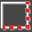

# 描画バー

**ファイル名**: `drawing_toolbar.md`  
**カテゴリ**: インターフェース - 描画バー

## 概要

描画バーは、bSolidのCAD/CAM環境における図形作成の中核となるサイドバーです。2D図形の基本要素から3D立体モデリングまで、設計に必要なすべての描画ツールを体系的に配置しています。効率的なワークフローと精密な図形作成を支援する豊富な機能により、初心者から熟練者まで幅広いユーザーのニーズに対応します。

## 描画バーの構成

描画バーは以下の主要セクションで構成されています：

| セクション | 内容 | 主な用途 |
|-----------|------|----------|
| **A. 基本2D図形ツール** | 点、線、円弧の基本要素 | スケッチ、アウトライン作成 |
| **B. 高度2D図形ツール** | ポリライン、スプライン、幾何図形 | 複雑な2D形状作成 |
| **C. テキスト・注釈ツール** | 文字、記号、ラベル | 図面注記、識別情報 |
| **D. 3D基本立体ツール** | プリミティブ、押し出し、回転 | 基本的な3D形状作成 |
| **E. 3D高度モデリングツール** | ロフト、スイープ、ブール演算 | 複雑な3D形状作成 |
| **F. 特殊加工ツール** | 芸術的面、画像変換 | 装飾的・特殊形状作成 |

## A. 基本2D図形ツール

### 基本要素作成

#### 点（Point）

**機能**: 描画の基準点や構築補助点を作成

**使用場面**:
- **基準点設定**: 測定・寸法記入の基準
- **位置マーキング**: 重要位置のマーク
- **構築補助**: 他の図形作成の補助点
- **アライメント**: オブジェクトの整列基準

**作成方法**:
1. 点ツールをクリック
2. 描画エリアで位置をクリック
3. 座標を数値入力（オプション）
4. 連続配置（Enterで確定）

**パラメーター**:
- **X、Y、Z座標**: 点の3次元位置
- **表示スタイル**: 点の表示形状（×、○、□等）
- **サイズ**: 画面上での表示サイズ
- **色**: 点の表示色

#### 線分（Line）

**機能**: 直線セグメントを作成（単一線分または連続線分）

**作成モード**:
- **単一線分**: 開始点と終了点を指定
- **連続線分**: 複数の線分を連続して作成
- **閉じた形状**: 最終点を開始点に接続
- **水平・垂直制約**: 直交制限での作成

**操作手順**:
1. 線分ツールをクリック
2. 開始点をクリック（またはスナップ）
3. 終了点をクリック
4. 連続作成の場合は次の終了点をクリック
5. 右クリックまたはEscで終了

**高度な線分作成**:
- **角度制約**: 指定角度での線分作成
- **長さ制約**: 指定長での線分作成
- **接線**: 既存曲線への接線作成
- **法線**: 既存曲線への法線作成

#### 平行線（Parallel Line）

**機能**: 既存の線分または図形に平行な直線を作成

**作成手順**:
1. 平行線ツールをクリック
2. 基準となる線分・図形を選択
3. 平行線の距離を指定
4. 平行線の方向（左右）を指定
5. 必要に応じて長さを調整

**設定オプション**:
- **距離**: 基準線からの離隔距離
- **方向**: 平行線の配置方向
- **長さ**: 平行線の長さ設定
- **端点処理**: 平行線の端点設定

#### 円弧（Arc）

**機能**: 円弧（円の一部）を作成

**作成方法の種類**:
- **3点指定**: 開始点、経由点、終了点
- **中心・半径・角度**: 中心点、半径、開始・終了角度
- **2点・半径**: 開始点、終了点、半径
- **接線**: 既存要素への接線円弧

**パラメーター制御**:
- **半径（R）**: 円弧の半径
- **開始角度**: 円弧の開始角度
- **終了角度**: 円弧の終了角度
- **中心点**: 円弧の中心座標
- **方向**: 時計回り・反時計回り

## B. 高度2D図形ツール

### 複合図形作成

#### ポリライン（Polyline）

**機能**: 直線と円弧を組み合わせた連続する複合図形を作成

**ポリラインの特徴**:
- **単一オブジェクト**: 複数セグメントが一つのオブジェクト
- **連続性**: セグメント間の自動接続
- **可変幅**: セグメントごとの幅設定可能
- **開・閉形状**: 開いた形状と閉じた形状

**操作手順**:
1. ポリラインツールをクリック
2. 開始点をクリック
3. 次の点をクリック（直線セグメント）
4. 円弧モードに切り替えて円弧セグメント作成
5. 右クリックで終了、または開始点で閉じる

#### FreeForm（スプライン曲線）

**機能**: 自由曲線（スプライン曲線）を制御点により作成

**スプラインの種類**:
- **NURBS**: 非一様有理Bスプライン
- **ベジエ曲線**: ベジエ制御点による曲線
- **補間スプライン**: 指定点を通る滑らかな曲線
- **近似スプライン**: 指定点近傍を通る曲線

#### 矩形（Rectangle）

**機能**: 矩形、正方形、平行四辺形を作成

**作成方法**:
- **2点指定**: 対角の2点を指定
- **中心・サイズ**: 中心点と寸法を指定
- **3点指定**: 平行四辺形の3点を指定
- **寸法入力**: 幅と高さを数値入力

#### 円（Circle）

**機能**: 完全な円を作成

**作成方法**:
- **中心・半径**: 中心点と半径を指定
- **中心・直径**: 中心点と直径を指定
- **3点指定**: 円周上の3点を指定
- **2点指定**: 直径の両端点を指定

#### 楕円（Ellipse）

**機能**: 楕円形状を作成

**設定パラメーター**:
- **長軸（A）**: 楕円の長い軸の長さ
- **短軸（B）**: 楕円の短い軸の長さ
- **回転角**: 楕円の回転角度

#### 多角形（Polygon）

**機能**: 正多角形を作成

**設定パラメーター**:
- **辺数**: 多角形の辺の数（3以上）
- **中心点**: 多角形の中心位置
- **半径**: 外接円または内接円の半径
- **回転角**: 多角形の回転角度

#### 部分的選択（Partial Selection）

**機能**: 既存図形の一部を選択して新しい加工可能図形を作成

**活用場面**:
- **部分加工**: 形状の一部のみの加工
- **セグメント修正**: 特定部分の修正
- **段階的加工**: 工程別の部分加工

## C. テキスト・注釈ツール

#### リニアテキスト（Linear Text）

**機能**: 直線的に配置されるテキストオブジェクトを作成

**テキスト設定**:
- **フォント**: 使用するフォントファミリー
- **サイズ**: 文字の高さ（単位：mm）
- **スタイル**: 太字、斜体、下線等
- **配置**: 左寄せ、中央、右寄せ

**用途例**:
- **図面タイトル**: 図面名、プロジェクト名
- **寸法注記**: 寸法値、公差表記
- **材料表記**: 材質、規格表記
- **作業指示**: 加工指示、注意事項

#### パス上テキスト（Text on Path）

**機能**: 選択したパス（線、曲線）に沿ってテキストを配置

**パス設定**:
- **基準パス**: テキストが従うパス図形
- **配置位置**: パス上での開始位置
- **方向**: テキストの向き（順方向・逆方向）
- **間隔**: パスとテキストの間隔

## D. 3D基本立体ツール

#### 基本立体（Primitives）

**機能**: 標準的な3D立体図形を作成

**利用可能な基本立体**:
- **直方体（Box）**: 幅・奥行・高さによる直方体
- **円柱（Cylinder）**: 半径・高さによる円柱
- **円錐（Cone）**: 上半径・下半径・高さによる円錐
- **球（Sphere）**: 半径による完全球

#### 押し出し（Extrusion）

**機能**: 2D図形を垂直方向に押し出して3D立体を作成

**押し出し設定**:
- **基準図形**: 押し出しの基となる2D図形
- **押し出し距離**: 押し出す高さ・距離
- **方向**: 押し出し方向（正・負）
- **傾斜角**: 押し出し面の傾斜角度

#### パス押し出し（Sweep）

**機能**: 指定したパス（経路）に沿って2D図形を押し出し

**設定要素**:
- **断面図形**: 押し出される2D断面
- **パス**: 押し出しの経路となる曲線
- **向き制御**: 断面の向き制御方法
- **スケール**: パスに沿ったスケール変化

#### 回転（Revolution）

**機能**: 2D図形を回転軸周りに回転させて3D立体を作成

**回転設定**:
- **基準図形**: 回転させる2D図形
- **回転軸**: 回転の中心軸
- **回転角度**: 回転する角度（0-360度）
- **分割数**: 回転面の分割数

## E. 3D高度モデリングツール

#### ロフト（複数断面からの面）

**機能**: 複数の断面図形間を滑らかに補間して3D面を作成

**活用分野**:
- **船体設計**: 船舶の船体形状
- **航空機設計**: 翼、胴体の設計
- **自動車設計**: ボディパネルの設計
- **工業デザイン**: 製品の外形設計

#### 4セクションからの面

**機能**: 4つの境界セクション（輪郭）から面を作成

#### 2セクションからの面

**機能**: 2つの断面間を補間して面を作成

#### 標準ロフト（2セクション+1定型パス）

**機能**: 2つの断面と1つの定型閉じたパスから面を作成

#### ガイド付きロフト（2セクション+1ガイドパス）

**機能**: 2つの断面と1つのガイドパスから面を作成

## F. 特殊加工ツール

#### 光る面（Glow Surface）

**機能**: テキスト等から芸術的な浅浮き彫り面を作成

**活用用途**:
- **看板製作**: 文字サインの製作
- **装飾パネル**: 装飾的なパネル製作
- **記念品**: 記念プレート等の製作
- **芸術作品**: 芸術的な作品製作

#### 固定化（Solidify）

**機能**: 閉じた2D図形から平坦な3D面を作成

#### 画像からの面（Surface from Bitmap）

**機能**: ラスター画像から高さマップによる3D面を作成

**応用分野**:
- **地形モデル**: 地形図からの地形作成
- **芸術作品**: 写真からの立体作品
- **テクスチャー**: 表面テクスチャーの作成
- **装飾パネル**: 装飾的な表面パターン

#### ブール演算（Boolean Operations）

**機能**: 複数の3D図形に対してブール演算を実行

**演算の種類**:
- **結合（Union）**: 複数立体の結合
- **差分（Difference）**: 立体からの減算
- **交差（Intersection）**: 立体の共通部分
- **排他（XOR）**: 重複部分の除外

## 描画バーの効率的活用法

### ワークフロー最適化

#### 設計段階別ツール選択

**概念設計段階**:
- **基本図形**: 点、線、円、矩形等の基本要素
- **プリミティブ**: 基本立体による概念検討
- **簡易3D**: 押し出し、回転による簡易3D化

**詳細設計段階**:
- **精密2D**: ポリライン、スプライン等の精密図形
- **高度3D**: ロフト、スイープ等の高度3D
- **ブール演算**: 複雑形状の組み合わせ作成

**仕上げ段階**:
- **テキスト**: 図面情報、ラベルの追加
- **特殊加工**: 装飾的要素の追加
- **最終調整**: 詳細部分の微調整

### 効率向上テクニック

#### ショートカット活用
| 機能 | ショートカット | 頻度 |
|------|----------------|------|
| 線分 | **L** | 高 |
| 円 | **C** | 高 |
| 矩形 | **R** | 中 |
| 円弧 | **A** | 中 |
| 押し出し | **Ctrl + E** | 高 |
| 回転 | **Ctrl + R** | 中 |

#### パラメトリック設計
- **変数使用**: 寸法の変数化
- **式の活用**: 計算式による寸法設定
- **関連付け**: 関連する寸法の連動
- **更新管理**: パラメーター変更時の自動更新

## 他ツールバーとの連携

### CADオプションバーとの連携
- **図形編集**: 作成図形の変形・編集
- **配列**: 図形の配列・複製
- **結合**: 複数図形の結合
- **分解**: 複合図形の分解

### 測定バーとの連携
- **寸法確認**: 作成図形の寸法測定
- **角度確認**: 角度の測定・確認
- **面積計算**: 閉じた図形の面積計算
- **品質検証**: 図形品質の検証

### ステータスバーとの連携
- **座標確認**: 正確な座標での作図
- **スナップ活用**: 精密な位置決め
- **レイヤー管理**: 図形の階層管理
- **表示制御**: 作業効率的な表示制御

## トラブルシューティング

### よくある問題と解決法

#### 図形が作成できない
**症状**: 描画ツールが動作しない

**原因と対処法**:
1. **レイヤーロック**: アクティブレイヤーがロックされている
   - ステータスバーでレイヤーロックを解除
2. **構築面エラー**: 構築面の設定が不適切
   - 構築面を正しく設定
3. **スナップ干渉**: スナップ設定が適切でない
   - スナップ設定を調整

#### 3D図形が正しく作成されない
**症状**: 3D変換で期待した形状にならない

**原因と対処法**:
1. **開いた図形**: 2D図形が閉じていない
   - 図形を閉じるか、適切な2D図形を使用
2. **方向エラー**: 押し出し・回転方向が不適切
   - 方向設定を確認・修正
3. **パラメーターエラー**: 設定値が不適切
   - パラメーター値を適切な範囲に設定

## 関連セクション

- [CADオプションバー](./cad_options_toolbar.md) - 図形編集ツールとの連携
- [測定バー](./measurement_toolbar.md) - 作成図形の測定・検証
- [ステータスバー](./status_bar.md) - 描画支援機能との連携
- [2D図形詳細](../04-Geo2D/README.md) - 2D図形作成の詳細ガイド
- [3D図形詳細](../06-Geo3D/README.md) - 3D図形作成の詳細ガイド

## 上位セクションへ戻る

- [インターフェース](./README.md) - インターフェースセクション目次
- [CAD/CAM](../README.md) - CAD/CAMセクション目次
- [bSolid マニュアル目次](../../README.md) - メイン目次

---

**注意**: 描画バーの機能は、使用しているライセンスや3Dモジュールの有無により一部制限される場合があります。3D機能の一部は追加ライセンスが必要です。複雑な3D図形の作成は、十分なシステムメモリとグラフィック性能を必要とします。 
