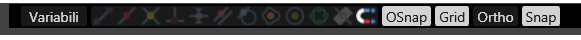

# ステータスバー

**ファイル名**: `status_bar.md`  
**カテゴリ**: インターフェース - ステータスバー

## 概要

ステータスバーは、bSolidアプリケーションの下部に位置する水平なバーで、現在の作業状態、設定情報、座標データ、ツール状態などの重要な情報を表示します。また、スナップ機能、レイヤー管理、描画補助ツールへの直接アクセスも提供し、効率的なCAD/CAM操作の中核となる機能を集約しています。



## ステータスバーの構成

ステータスバーは左から右に以下の主要セクションで構成されています：

| セクション | 内容 | 主な機能 |
|-----------|------|----------|
| **A. 座標表示エリア** | カーソル位置の座標情報 | X、Y、Z座標のリアルタイム表示 |
| **B. スナップツール** | オブジェクト精密接続機能 | 各種スナップ機能の切り替え |
| **C. 描画補助設定** | グリッド・直交・スナップ制御 | 描画支援機能の有効/無効 |
| **D. レイヤーツール** | レイヤー管理機能 | 表示・非表示・ロック・色設定 |
| **E. 加工表示ツール** | 加工関連表示制御 | ツールパス・加工色表示制御 |
| **F. システム情報** | アプリケーション状態 | 処理状況・メモリ使用量等 |

## A. 座標表示エリア

### リアルタイム座標表示

**機能**: マウスカーソルの現在位置をリアルタイムで数値表示

**表示形式**:
```
X: 123.456  Y: 789.012  Z: 345.678
```

**座標系の種類**:
- **絶対座標**: 原点(0,0,0)からの絶対位置
- **相対座標**: 前回のクリック点からの相対位置
- **極座標**: 距離と角度による位置表現

**設定可能項目**:
- **単位**: mm、inch、m等の選択
- **精度**: 小数点以下の表示桁数設定
- **更新頻度**: 座標更新の頻度設定

**活用方法**:
- **精密配置**: 数値による正確な位置決め
- **距離測定**: 2点間の距離の計算
- **角度確認**: オブジェクト間の角度測定
- **品質管理**: 寸法精度の確認

### 選択オブジェクト情報

**表示内容**:
- **オブジェクト名**: 選択されたオブジェクトの名前
- **オブジェクト種類**: ライン、円、ポリライン等の種別
- **数量**: 選択されたオブジェクトの数
- **プロパティ**: 長さ、面積、体積等の基本情報

**表示例**:
```
選択: ライン(3)  長さ: 125.34mm  角度: 45.0°
```

## B. スナップツール

### 基本スナップツール

精密な図形作成のための「磁石」機能群です。

#### 終点スナップ


**機能**: オブジェクトの端点（開始点・終了点）に自動的にカーソルを吸着

**対象オブジェクト**:
- **直線**: 両端の端点
- **円弧**: 開始点と終了点
- **ポリライン**: 各セグメントの端点
- **フリーフォーム**: コントロールポイント

**使用場面**:
- **正確な接続**: オブジェクト同士の正確な接続
- **延長線作成**: 既存線の延長線描画
- **角度設定**: 端点を基準とした角度設定

**操作のコツ**:
- カーソルを端点に近づけると自動的に吸着
- スナップ感度は設定で調整可能
- 複数の端点が近い場合は最も近い点を選択

#### 中間点スナップ


**機能**: ライン、円弧、ポリラインセグメントの中間点に吸着

**注意点**:
- フリーフォームオブジェクトでは機能しません
- 円弧の場合は弧長の中間点（直線距離ではない）
- ポリラインでは各セグメントごとに中間点を検出

**活用場面**:
- **均等分割**: オブジェクトの均等分割
- **対称配置**: 中心を基準とした対称配置
- **基準点設定**: 測定や寸法記入の基準点

#### 交点スナップ


**機能**: 2つ以上のオブジェクトの交点に吸着

**交点検出の種類**:
- **実交点**: オブジェクトが実際に交わる点
- **仮想交点**: 延長線上で交わる仮想的な点
- **多重交点**: 3つ以上のオブジェクトが交わる点

**対象組み合わせ**:
- 直線×直線、直線×円弧、円弧×円弧
- ポリライン×各種オブジェクト
- 3Dオブジェクトの投影交点

### 高度なスナップツール

#### 垂直スナップ


**機能**: 既存オブジェクトに対して垂直な位置にカーソルを配置

**動作説明**:
1. スナップツールをアクティブ化
2. 基準となるオブジェクトの近くにカーソルを移動
3. 垂直関係が成立する位置で自動吸着

**活用場面**:
- **直角作図**: 正確な直角の作成
- **垂線作成**: 既存線に対する垂線
- **寸法線配置**: 垂直寸法線の配置

#### 平行スナップ


**機能**: 基準オブジェクトと平行な方向を維持

**操作手順**:
1. 基準となるオブジェクトを指定
2. 平行スナップを有効化
3. 描画時に自動的に平行方向に制限

**応用例**:
- **平行線作成**: 等間隔の平行線群
- **角度統一**: 図面内の角度統一
- **配置整列**: オブジェクトの整列配置

#### 接線スナップ


**機能**: 円や円弧に対する接線位置に吸着

**接線の種類**:
- **外部接線**: 円の外側からの接線
- **内部接線**: 円を跨ぐ接線
- **共通接線**: 2つの円に共通する接線

**設計用途**:
- **滑らかな接続**: 曲線の滑らかな接続
- **歯車設計**: 歯車の歯形設計
- **パイプ設計**: 配管の経路設計

### 特殊スナップツール

#### 重心スナップ


**機能**: 閉じた図形の重心（図心）に吸着

**重心計算の対象**:
- **多角形**: 多角形の重心
- **閉じたポリライン**: 複雑な形状の重心
- **複合図形**: 複数要素で構成された図形の重心

**活用場面**:
- **バランス設計**: 重心を考慮した設計
- **配置基準**: 重心を基準とした配置
- **構造解析**: 構造計算の基準点設定

#### 中心スナップ


**機能**: 円・円弧・楕円の中心点に吸着

**対象図形**:
- **円**: 円の中心点
- **円弧**: 円弧の中心点（完全円の中心）
- **楕円**: 楕円の中心点

**精度**:
- 自動計算による高精度の中心点検出
- 不完全な円弧でも中心を正確に検出

#### 象限スナップ


**機能**: 円形図形の象限点（0°、90°、180°、270°）に吸着

**象限点の定義**:
- **0°**: 右端点（3時の位置）
- **90°**: 上端点（12時の位置）
- **180°**: 左端点（9時の位置）
- **270°**: 下端点（6時の位置）

**座標系依存**:
- 現在の構築面（XY平面）を基準
- UCS（ユーザー座標系）の設定に依存

#### 構築面交点スナップ


**機能**: アクティブな構築面との交点に吸着

**3D設計での重要性**:
- **面間移動**: 異なる面間での作図
- **3D交点**: 3次元での正確な交点検出
- **投影作図**: 3Dオブジェクトの2D投影作図

### スナップ制御機能

#### 自動スナップ設定


**機能**: 常にアクティブにするスナップツールの設定

**設定ウィンドウの内容**:
- **個別選択**: 各スナップツールの個別設定
- **プリセット**: 作業用途別のプリセット設定
- **優先順位**: 複数スナップの優先順位設定
- **感度調整**: スナップ感度の詳細調整

**効率的な設定例**:
- **一般作図**: 終点、中間点、交点
- **精密作図**: 終点、中間点、交点、垂直、平行
- **円弧作業**: 終点、中心、接線、象限

## C. 描画補助設定

### 基本制御オプション

#### 変数管理
**機能**: アクティブなドキュメントの変数管理セクションの表示切り替え

**変数の種類**:
- **システム変数**: アプリケーション全体の設定
- **ドキュメント変数**: 文書固有の設定
- **ユーザー変数**: ユーザー定義の変数

**活用場面**:
- **パラメトリック設計**: 変数を使った設計
- **設定確認**: 現在の設定値確認
- **一括変更**: 複数設定の一括変更

#### Oスナップ（オブジェクトスナップ）
**機能**: 選択されたスナップツール全体の有効/無効制御

**動作説明**:
- **有効時**: 設定されたスナップツールが動作
- **無効時**: すべてのスナップ機能が停止
- **一時無効**: Shiftキー押下で一時的に無効化

**使い分け**:
- **精密作業**: 有効にして正確な位置決め
- **自由描画**: 無効にして制約のない描画
- **部分的制御**: 特定のスナップのみ使用

#### グリッド表示
**機能**: 描画エリアのグリッド（格子）表示の切り替え

**グリッドの設定項目**:
- **間隔**: 主グリッドと補助グリッドの間隔
- **色**: グリッド線の色設定
- **線種**: 実線、点線等の線種選択
- **表示範囲**: グリッド表示の範囲設定

**グリッドの利点**:
- **視覚的基準**: 距離と配置の視覚的確認
- **整列補助**: オブジェクトの整列支援
- **縮尺感覚**: 図面の縮尺感覚の向上

#### 直交制御（Ortho）
**機能**: カーソル移動を水平・垂直方向に制限

**制御モード**:
- **完全直交**: 完全に水平・垂直のみ
- **角度制限**: 15°、30°、45°等の角度制限
- **相対直交**: 基準線に対する相対的な直交

**活用場面**:
- **直角作図**: 正確な直角の作成
- **水平・垂直線**: 完全な水平・垂直線の描画
- **整列作業**: オブジェクトの整列作業

#### グリッドスナップ
**機能**: グリッド交点への自動吸着

**スナップ設定**:
- **基本間隔**: メイングリッドへのスナップ
- **細分化**: 細かいグリッドへのスナップ
- **任意間隔**: ユーザー定義間隔でのスナップ

**精度向上**:
- **等間隔配置**: 正確な等間隔配置
- **寸法統一**: 寸法の統一と標準化
- **効率化**: 素早い位置決め

## D. レイヤーツール

### 色設定ツール

#### レイヤー色リセット


**機能**: 個別設定された色をリセットし、レイヤー標準色に戻す

**対象オブジェクト**:
- **個別色設定されたオブジェクト**: 個別に色を変更されたオブジェクト
- **レイヤー標準色**: レイヤーで定義された標準色
- **全オブジェクト**: 選択されたすべてのオブジェクト

**使用場面**:
- **色の統一**: 図面の色統一
- **標準化**: レイヤー規則への準拠
- **誤設定修正**: 誤った色設定の一括修正

#### 個別色設定


**機能**: 選択オブジェクトに個別の色を設定

**色選択方法**:
- **標準色**: プリセットされた標準色パレット
- **カスタム色**: RGB値による任意の色設定
- **色名指定**: 色名による指定

**個別色の用途**:
- **強調表示**: 重要なオブジェクトの強調
- **分類表示**: 機能別の色分け
- **一時的表示**: 作業中の一時的な色分け

### レイヤー管理ツール

#### レイヤーリスト


**機能**: 作成されたレイヤーの一覧表示と選択

**リスト表示情報**:
- **レイヤー名**: レイヤーの名前
- **状態**: 表示/非表示、ロック/解除状態
- **色**: レイヤーの標準色
- **オブジェクト数**: レイヤー内のオブジェクト数

**操作機能**:
- **アクティブ化**: 作図対象レイヤーの切り替え
- **選択**: 特定レイヤーのオブジェクト選択
- **複数選択**: 複数レイヤーの同時選択

#### レイヤー表示制御

##### 表示状態


**機能**: レイヤーの表示状態を示すインジケーター

**表示状態の種類**:
- **完全表示**: すべてのオブジェクトが表示
- **半透明表示**: 半透明での表示
- **輪郭表示**: 輪郭線のみの表示

##### 非表示状態


**機能**: レイヤーを非表示にし、画面から除外

**非表示の利点**:
- **画面整理**: 不要な要素の除外
- **作業集中**: 特定要素への集中
- **パフォーマンス**: 表示負荷の軽減

**注意点**:
- 非表示オブジェクトは選択不可
- 印刷時も非表示のまま
- スナップ対象からも除外

#### レイヤーロック制御

##### ロック状態


**機能**: レイヤーをロックし、編集を禁止

**ロック効果**:
- **選択禁止**: オブジェクトの選択不可
- **編集禁止**: 移動、削除、変更不可
- **表示維持**: 表示は維持される

**活用場面**:
- **図面保護**: 完成した図面の保護
- **基準線保護**: 基準となる線の保護
- **誤操作防止**: 重要要素の誤操作防止

##### 解除状態


**機能**: レイヤーのロックを解除し、編集を許可

**解除による機能復旧**:
- **選択可能**: オブジェクトの選択可能
- **編集可能**: 全ての編集操作が可能
- **スナップ対象**: スナップ機能の対象に復帰

#### レイヤー詳細設定


**機能**: レイヤー管理ダイアログの表示

**設定可能項目**:
- **レイヤー名**: 名前の変更・設定
- **色設定**: レイヤー標準色の設定
- **線種設定**: 線の種類・太さの設定
- **材質設定**: 3Dオブジェクトの材質設定

**高度な管理機能**:
- **レイヤー作成**: 新しいレイヤーの作成
- **レイヤー削除**: 不要なレイヤーの削除
- **レイヤー複製**: 既存レイヤーの複製
- **インポート/エクスポート**: レイヤー設定の外部連携

## E. 加工表示ツール

### ツールパス表示制御

#### 高速移動表示


**機能**: ツールの高速移動パスの表示切り替え

**高速移動の特徴**:
- **非加工移動**: 材料に触れない移動経路
- **位置決め**: 次の加工位置への移動
- **退避動作**: 工具の退避・回避動作

**表示の意味**:
- **表示時**: 全ての移動経路を確認
- **非表示時**: 加工パスのみを確認
- **色分け**: 加工パスと移動パスの区別

**活用場面**:
- **パス確認**: 全体の加工経路確認
- **時間評価**: 加工時間の評価
- **効率改善**: 移動経路の最適化

#### 加工ツール表示


**機能**: 加工で使用するツール（工具）の表示切り替え

**ツール表示の内容**:
- **工具形状**: ドリル、エンドミル等の実形状
- **工具径**: 工具の直径表示
- **工具位置**: 現在の工具位置
- **回転方向**: 工具の回転方向

**設定オプション**:
- **詳細表示**: 工具の詳細形状表示
- **簡略表示**: 工具の簡略形状表示
- **シンボル表示**: 工具種別のシンボル表示

**確認項目**:
- **工具選択**: 適切な工具の選択確認
- **工具径**: 加工径と工具径の関係
- **干渉確認**: 工具と材料の干渉確認

#### 加工色分け表示


**機能**: 各加工工程を異なる色で表示

**色分けの効果**:
- **工程識別**: 加工工程の視覚的識別
- **順序確認**: 加工順序の確認
- **品質管理**: 各工程の品質確認

**色分けルール**:
- **工程別**: 荒加工、仕上げ加工等
- **工具別**: 使用工具による色分け
- **深度別**: 加工深度による色分け

**カスタマイズ**:
- **色設定**: 各工程の色設定
- **透明度**: 重なり部分の透明度設定
- **線種**: 工程別の線種設定

## ステータスバーの効率的活用法

### ワークフロー別設定

#### 設計初期段階
**推奨設定**:
- **スナップ**: 終点、中間点、交点
- **グリッド**: 表示ON、大きめの間隔
- **Ortho**: 有効
- **レイヤー**: 基本レイヤーのみ表示

**設定理由**:
- 基本的な形状作成に集中
- 過度な制約を避けてアイデア展開
- シンプルな構成で混乱を避ける

#### 詳細設計段階
**推奨設定**:
- **スナップ**: 全種類有効
- **グリッド**: 表示ON、細かい間隔
- **座標表示**: 高精度表示
- **レイヤー**: 機能別レイヤー活用

**設定理由**:
- 高精度な寸法管理が必要
- 複雑な形状の正確な作成
- 詳細な位置関係の管理

#### 加工データ作成段階
**推奨設定**:
- **加工表示**: すべて有効
- **色分け**: 工程別色分け
- **ツール表示**: 有効
- **レイヤー**: 加工工程別管理

**設定理由**:
- 加工パスの視覚的確認
- 工程順序の明確化
- 工具と材料の干渉確認

### カスタマイズと効率化

#### 個人設定の保存
**設定内容**:
- **スナップ組み合わせ**: よく使う組み合わせの保存
- **レイヤー構成**: 標準的なレイヤー構成の保存
- **色設定**: 個人の色設定の保存

**保存方法**:
- **プロファイル保存**: 設定の名前付き保存
- **自動読み込み**: 起動時の自動読み込み
- **プロジェクト別**: プロジェクト別の設定管理

#### チーム標準の設定
**標準化項目**:
- **レイヤー構成**: チーム共通のレイヤー構成
- **色規則**: 統一された色規則
- **スナップ設定**: 推奨されるスナップ設定

**配布・管理**:
- **設定ファイル**: 標準設定の配布
- **テンプレート**: 標準テンプレートの活用
- **更新管理**: 設定の更新・同期

## トラブルシューティング

### よくある問題と解決法

#### スナップが効かない
**症状**: スナップツールがアクティブなのに吸着しない

**原因と対処法**:
1. **Oスナップ無効**: Oスナップボタンを確認・有効化
2. **スナップ感度**: スナップ感度を調整
3. **オブジェクト種別**: 対象オブジェクトがスナップ対応か確認
4. **ズームレベル**: 適切なズームレベルに調整

#### レイヤーが表示されない
**症状**: レイヤーを作成したが表示されない

**原因と対処法**:
1. **表示設定**: レイヤーの表示設定を確認
2. **フィルター**: レイヤーフィルターの設定確認
3. **ズーム範囲**: 表示ズーム範囲の確認
4. **オブジェクト存在**: レイヤー内のオブジェクト存在確認

#### 座標が正しく表示されない
**症状**: 座標値が期待する値と異なる

**原因と対処法**:
1. **座標系**: 使用中の座標系（UCS）の確認
2. **単位設定**: 単位設定の確認・変更
3. **精度設定**: 表示精度の設定確認
4. **基準点**: 座標系の基準点確認

#### 加工表示が見えない
**症状**: 加工パスが表示されない

**原因と対処法**:
1. **表示設定**: 加工表示ツールの設定確認
2. **レイヤー**: 加工レイヤーの表示設定
3. **ズーム**: 適切なズームレベルへの調整
4. **データ存在**: 加工データの存在確認

## 関連セクション

- [標準バー](./standard_toolbar.md) - 基本操作ツールとの連携
- [インターフェース概要](./interface_overview.md) - インターフェース全体との関連
- [ショートカットキー](./shortcuts.md) - キーボード操作との連携
- [マウス操作](./mouse_operations.md) - マウス操作との組み合わせ

## 上位セクションへ戻る

- [インターフェース](./README.md) - インターフェースセクション目次
- [CAD/CAM](../README.md) - CAD/CAMセクション目次
- [bSolid マニュアル目次](../../README.md) - メイン目次

---

**注意**: ステータスバーの機能は、使用しているライセンスやハードウェア性能により一部制限される場合があります。スナップ機能は適切に設定することで作業効率が大幅に向上しますが、過度に多くのスナップを同時に有効にするとパフォーマンスに影響する場合があります。レイヤー管理は図面の整理と保守性に重要な役割を果たしますので、プロジェクト開始時に適切な構成を計画することを推奨します。 
