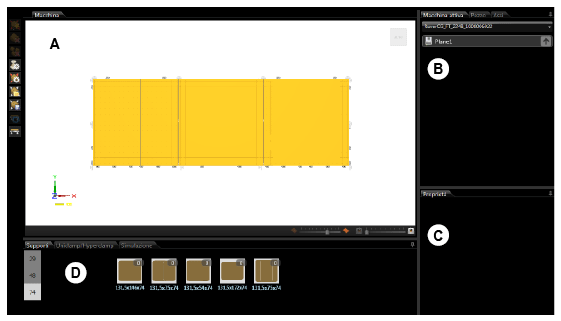

# 機械シミュレーション紹介

説明

bSolidの機械シミュレーション環境では、実際の加工作業を仮想的に実行し、潜在的な問題を特定することができます。このセクションでは、機械シミュレーション環境の基本機能と概要について説明します。

関連項目

* [機械構造](./03-02_Macc-struttura01.md)
* [環境の使用](./03-03_Macc-UsoAmbiente.md)

## 環境へのアクセス

機械シミュレーション環境にアクセスするには、環境バーを表示して  ボタンをクリックします。

## 環境の機能

機械シミュレーション環境では、以下の操作を実行できます：

1. テーブル上のピースの配置
2. 作業テーブルエレメント（ストップ、成形可能な吸引カップ等）を正しい位置に配置して、加工作業中に損傷しないようにする
3. 加工作業のシミュレーションを実行する

## 環境の構成

機械シミュレーション環境は、以下の主要なサブ環境で構成されています：

### 平面表示サブ環境

平面表示サブ環境には以下の要素が含まれています：

- **画像エリア** - 機械と作業ピースのグラフィック表示
- **右側エリア** - 作業テーブル、ピースおよび機械軸の管理カード
  - タブ「アクティブな機械」
  - タブ「ピース」
  - タブ「軸」
- **データエリア** - ツリーリストでの選択によって変わるデータ入力エリア
- **管理エリア** - 作業テーブルおよびシミュレーターオブジェクトの管理
  - オブジェクトカード
  - シミュレーションカード

### 加工作業シミュレーションサブ環境

加工作業シミュレーションサブ環境では、プログラムされた加工作業の実行をシミュレートし、潜在的な問題や衝突を検出することができます。

## 主要機能

機械シミュレーション環境の主要機能には以下が含まれます：

- 作業テーブル上のピース配置のシミュレーション
- クランプシステムとその干渉チェック
- 工具経路のシミュレーションと検証
- 加工時間の計算と最適化
- 衝突検出と回避

これらの機能を使用することで、実際の加工前に潜在的な問題を特定し、解決することができます。 