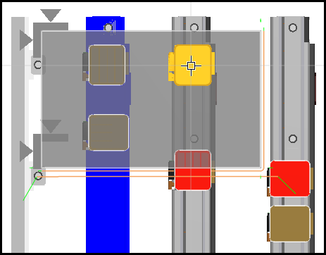
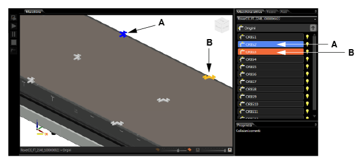
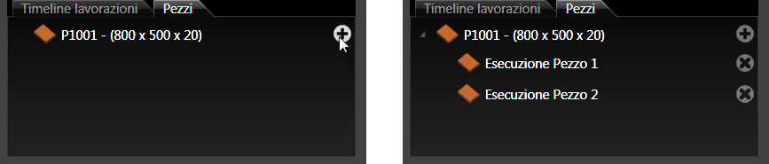
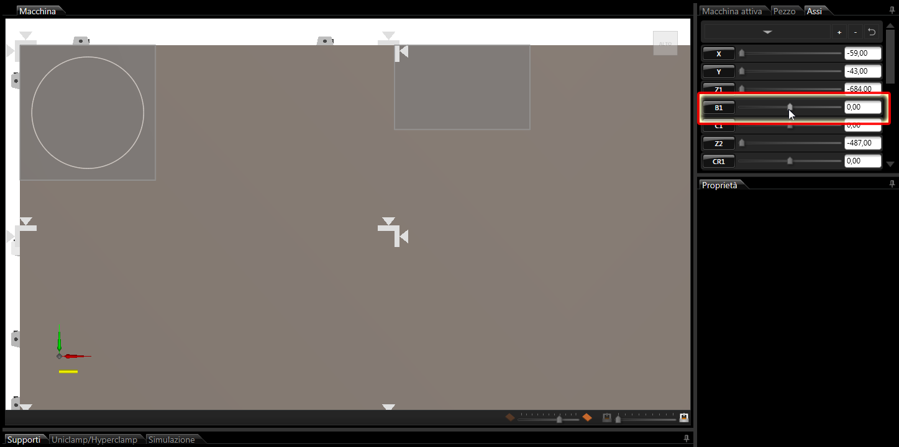
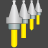

# 機械構造

説明

bSolidの機械シミュレーション環境は、機械のコンポーネントと構造をデジタルに再現します。このセクションでは、機械構造の表示方法とその操作方法について説明します。

関連項目

* [機械シミュレーション紹介](./03-01_Macc-presentaz.md)
* [環境の使用](./03-03_Macc-UsoAmbiente.md)

## 画像エリア

画像エリアには、機械と処理するピース（作業テーブル上に配置されている場合）の視覚的表示が含まれています。

オブジェクトを選択する場合は、十字カーソルを使用するか、ツリーリストアイコンをクリックします。選択されたオブジェクトは青色で表示されます。

### 画像の色

| 色 | 説明 |
|---|---|
| 黄色 | カーソルでその上を通ることでハイライトされるオブジェクト |
| 青色 | カーソルでクリックして選択したオブジェクト |
| 赤色 | 間違った場所にあり、可動マシンパーツと衝突するオブジェクト |

## タブ「アクティブな機械」

このタブには、機械部品と作業テーブルのアイコン付きのツリーリストが表示されます。ツリーリストのオブジェクトをクリックすると、そのパーツのリストが表示され、画像エリアに詳細が表示されます。

ツリーリストのオブジェクトをハイライトするには、クリックせずにマウスでアイコンをドラッグします。アイコンはオレンジ色に変わり、画像エリア内の対応するオブジェクトは黄色で表示されます。

* **A.** 黄色またはオレンジ色: カーソルでドラッグして強調表示されたオブジェクト
* **B.** 青色: カーソルでクリックして選択されたオブジェクト

データエリアに表示されるデータは、有効な機械モデルに関連付けられています。ツリーリストで選択されたオブジェクトに関するデータが表示されます（例：キャリッジ、平面の位置など）。

## タブ「ピース」

このタブには、ツーリング管理コマンド（テーブル上でのピース位置決め、ツーリング保管など）が表示されます。

### タブ「ピース」サブセクション

作業テーブル上に配置されるピース専用のエリア。マルチピースが有効になった場合、プラスアイコンがフリーリストエリアに表示され、ピースのコピーを作成できるようになります。

### タブ「機械切削加工のタイムライン」

加工作業のタイムラインを表示します。

### タブ「プロパティ」

* マルチピース機能が有効になった場合、データフィールドはピースと同じになります
* 単一のピースを位置決めする場合、以下のデータフィールドが表示されます：
  * **原点に移動** - 作業テーブルの原点を定義し、ピースを押すための基準として使用します
  * **ツーリングをコピー** - ピースを移動し、ツーリング設定もコピーします
  * **実行** - 定義した原点にピースを移動します

## タブ「軸」

このタブには、様々な部品を移動して正確な場所に位置決めするために使用する機械の軸のリストが表示されます。

軸を移動するには、カーソルを水平方向のスライドバーに当てて、ドラッグし、左のマウスキーを押し続けます。

## オブジェクトカード

オブジェクトカードには、作業テーブルのツーリングに使用される、マガジンに登録されたオブジェクト（クランプおよび成形可能な吸引カップ）が表示されます。

### タブ「サポート（支え）」

すべての使用可能なタイプのサポートのリスト（例：成形可能な吸引カップなど）が表示されます。

### タブ「ユニクランプ/ハイパークランプ」

すべての使用可能なタイプのクランプのリスト（例：ユニクランプなど）が表示されます。

### オブジェクト管理ボタン

| ボタン | 説明 |
|---|---|
|  | 選択されたすべてのキャリッジを備え付けます |
|  | 単一の選択されたタイプに属するオブジェクトの数を定義するためのダイアログボックスを開きます |

## カード「シミュレーション」

シミュレーションカードは、機械で仮想チェックを行い、機械加工結果を検証するためのツールです。ピースに実際に起こることを画面に表示します。

シミュレーションを開始し、作業テーブルオブジェクトの動きをチェックするためのコマンド：

| パラメータ | 説明 |
|---|---|
| 速度 | 仮想シミュレーションを加速または減速します **注意**: 1x以上の速度では正確な衝突チェック結果を保証できません |
| 繰り返し | 加工作業の繰り返しを有効/無効にします |
| 衝突確認 | テーブル上のオブジェクトとツールの衝突チェックを有効/無効にします |
| 廃棄物を取り除く | 廃棄物の除去方法を選択できます |
| 素材を取り除く | 除去する材料の可視化を有効/無効にします |
| 品質 | 最終結果の精度を向上させ、加工部の視覚化を改善します |
| ピースを隠します | ピースの表示を有効/無効にします | 