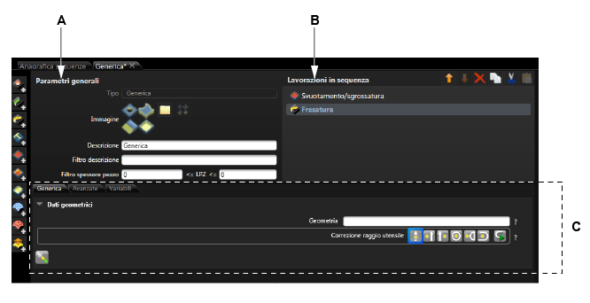

# データカタログ

説明

bSolidルール環境で使用されるデータカタログについて説明します。ルールエンジンを効果的に活用するために必要なデータ構成とカタログの管理方法を学ぶことができます。

関連項目

* [ルールの探索](./04-01_esplorare.md)
* [ルールの使用](./04-03_Uso-reg.md)

## シーケンスデータ

**アクセス方法**:  > 

シーケンスデータは加工作業の実行順序を定義するためのルールを管理します。

### カード構造

**A.** 一般的パラメーター  
**B.** シーケンス中の加工作業  
**C.** データカード：メインタブ、高度なタブ、変数タブ

### 一般的パラメーター

* **画像** - シーケンスに関連付けられる画像
* **説明** - シーケンスのコメントや説明
* **説明フィルター** - 検索用の簡単な説明
* **ピース厚さフィルター** - シーケンスを適用するピース厚さの範囲（最小および最大）

### シーケンス中の加工作業

シーケンスに入力された加工作業のリストで、コマンドを使用してリストを管理します。

### データタブ

#### メインタブ
* **形状データ** - 加工作業の同名のセクションを参照

#### タブ「より高度な」
* **プロパティ** - 加工作業の同名のセクションを参照

#### タブ「変数」
作成された変数のリスト。新規変数を追加するには  ボタンをクリックします。

**新しい変数ダイアログボックス**:
* **名前** - 変数の名称
* **説明** - 短い説明を入力
* **測定単位** - 測定単位を選択

## エッジバンディング構成データ

**アクセス方法**:  > 

> **注**: エッジバンディング装置を搭載した木材加工用マシンのみで使用できます。グレーのフィールド（無効）はBiesse技術者のみが変更できます。

### 機械加工設定

エッジバンドされるピースのフライス加工を含む、すべてのエッジバンディング作業のデフォルトデータを構成するテーブルが表示されます。リストから加工作業を選択すると、隣接するデータエリアに設定可能なデータフィールドのリストが表示されます。

#### 設定可能な加工作業

| 加工作業 | 説明 |
|---------|------|
| フライス加工 | 「切削」セクションを参照 |
| チップクリーニングブロワー | 「チップクリーニングブロワ」セクションを参照 |
| 液体供給 | 「液体供給」セクションを参照 |
| エッジバンドストリップの適用（開放） | 「エッジバンドストリップの適用」セクションを参照 |
| エッジバンドストリップの適用（閉鎖） | 「エッジバンドストリップの適用」セクションを参照 |
| エッジバンドストリップの適用（ドロップ） | 「エッジバンドストリップの適用」セクションを参照 |
| ブレードを用いてトリミングするエッジバンドストリップ | 「ブレードを用いてトリミングするエッジバンドストリップ」セクションを参照 |
| ミリングカッターによるエッジバンドストリップのトリミング | 「ミリングカッターによるエッジバンドストリップのトリミング」セクションを参照 |
| GROTEFELDコピアー蓄積を用いてのエッジトリミング/面取り | 「GROTEFELDコピアー蓄積を用いてのエッジトリミング/面取り」セクションを参照 |
| コピア蓄積AGGRE122に関するエッジトリミング | 「コピア蓄積AGGRE122に関するエッジトリミング」セクションを参照 |
| 骨材コピアAGGRE122での丸みつけ | 「骨材コピアAGGRE122での丸みつけ」セクションを参照 |
| エッジバンドストリップでのダブルエッジトリミング | セクション「エッジ保護テープ厚さ範囲」を参照 |

## 自動加工作業データ

**アクセス方法**:  > 

自動加工作業データでは、特定の形状や条件に基づいて自動的に適用される加工作業のルールを管理します。形状の認識と加工作業のマッピングをカスタマイズできます。

### 設定項目

* **形状の識別** - 適用条件となる形状の特徴を定義
* **適用パラメーター** - 加工作業適用時のパラメーター設定
* **ツールの選択** - 使用するツールとその設定
* **優先順位** - 複数のルールが競合する場合の優先順位

## マクロルールデータ

**アクセス方法**:  > 

マクロルールデータは、カスタム加工作業マクロを管理するためのインターフェースを提供します。繰り返し使用する複雑な加工作業シーケンスをマクロとして定義し、必要に応じて適用できます。

### マクロの構成要素

* **パラメーター** - マクロに渡すパラメーターの定義
* **変数** - マクロ内で使用する変数
* **加工作業シーケンス** - マクロを構成する加工作業の順序
* **適用条件** - マクロが適用される条件の定義 