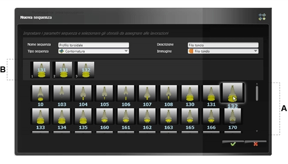
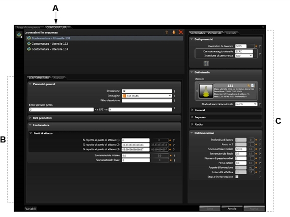

# ルールの使用

説明

bSolidルール環境で作成したルールを効果的に使用する方法について説明します。シーケンスルール、エッジバンディングルール、自動加工作業ルール、マクロルールの設定と適用方法を学ぶことができます。

関連項目

* [ルールの探索](./04-01_esplorare.md)
* [データカタログ](./04-02_dati-catalog.md)

## シーケンスルールの設定

加工作業シーケンスは、プログラミングを容易にするために、選択された形状または面に次に適用される、特定のシーケンスに配置された加工作業のセットです。

例えば、ラフ成形、成形されたフライスでのフライス加工、ピースをプロファイルするための仕上げを生成する必要がある場合、異なるツールを使用するこれらすべての作業を含むグループを作成するのに、シーケンスを使用できます。Cad/Cam環境に挿入され、描かれたプロファイルに適用可能です。

### シーケンスの作成

新規の加工作業シーケンスを作成するには、以下のように進めてください。

1.  ボタンをクリックします。

2. データフィールドに入力します：
   * **シーケンス名** - シーケンスの名前
   * **シーケンスタイプ** - ドロップダウンメニューからタイプを選択（一般的な加工操作順序など）
   * **説明** - シーケンスのコメントまたは説明
   * **画像** - 順序と関連付ける画像を選択

3. 各加工作業で使用するツールを選択します。選択された各ツール用に、加工作業が自動的に作成されます。
   
   ツールを挿入するには、エリアAのそれぞれの単一のアイコンをクリックします。ツールが自動的にエリアBに挿入されます。
   
   

4. 保存ボタンをクリックし実行した作業を保存してウインドウを閉じるか、キャンセルボタンをクリックし保存しないでウインドウを閉じます。
   
   カードAが環境の主部に表示され、新規に作成されたシーケンスの名称を示します。
   
   

5. データフィールドに入力します。詳細は「シーケンスデータ」を参照してください。
   
   加工作業をクリックすると、プレビューボックスが選択された加工作業のデータを含むカードを表示します。データフィールドの説明については、選択された加工作業のタイプを扱っているパラグラフを参照してください。

### シーケンスの検索

テーブルに表示するシーケンスを検索するには：

1.  ボタンをクリックして「シーケンス検索」ダイアログボックスを表示します。

2. 実行したい検索のタイプに基づいて関連するフィールドに入力します：
   * **名前** - 順序名に基づいてフィルタリング
   * **タイプ** - 順序タイプに基づいてフィルタリング 
   * **説明** - コメントに基づいてフィルタリング

3. OKボタンをクリックして設定を保存してから、ダイアログボックスを閉じて検索を開始します。

テーブルに所望するシーケンスだけが表示されます。

### フィルター装置によるシーケンスのフィルタリング

テーブルに必要なツールだけを表示するには、フィルターエリアのボタンの1つをクリックします（「フィルターツール」参照）。

## エッジバンディングルールの設定

エッジバンディングルールは、エッジバンディング処理を自動化するために使用されます。特定の条件下で適用されるエッジバンディング処理のデフォルト値を設定できます。

### エッジバンディングルールの作成

1. 新規のエッジバンディングルールを作成するには、新規ボタンをクリックします。

2. ルールの基本情報を入力します：
   * **名前** - ルールの名前
   * **説明** - ルールの説明
   * **適用条件** - ルールが適用される条件（エッジの形状やピースの厚さなど）

3. エッジバンディング処理のパラメーターを設定します：
   * **エッジバンドの種類** - 使用するエッジバンドの材質や厚さ
   * **加工方法** - エッジバンドの適用方法
   * **仕上げ設定** - エッジバンド適用後の仕上げ処理

## 自動加工作業ルールの設定

自動加工作業ルールは、特定の形状やパターンを認識し、適切な加工作業を自動的に適用するために使用されます。

### 自動加工作業ルールの作成

1. 新規の自動加工作業ルールを作成するには、新規ボタンをクリックします。

2. ルールの基本情報を入力します：
   * **名前** - ルールの名前
   * **説明** - ルールの説明
   * **形状認識パラメーター** - 認識する形状の特徴

3. 加工作業のパラメーターを設定します：
   * **使用するツール** - 加工に使用するツールの選択
   * **加工パラメーター** - 速度、深さなどの加工パラメーター
   * **適用順序** - 複数の加工作業がある場合の適用順序

## マクロルールの設定

マクロルールは、複数の加工作業をまとめて一つの操作として定義し、再利用可能にします。

### マクロの作成

1. 新規のマクロルールを作成するには、新規ボタンをクリックします。

2. マクロの基本情報を入力します：
   * **名前** - マクロの名前
   * **説明** - マクロの説明
   * **パラメーター** - マクロに渡すパラメーターの定義

3. マクロに含める加工作業を順番に追加します。
   各加工作業のパラメーターを設定し、必要に応じてパラメーター間の関連付けを行います。

4. マクロの実行条件や適用方法を設定します。 