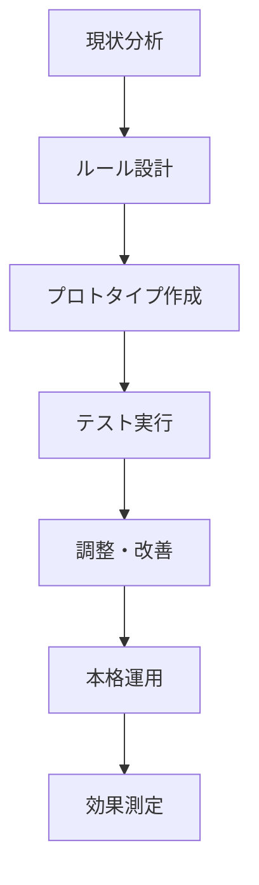

# bSolid マニュアル - ルール実践的活用例とケーススタディ

**ファイル名**: `04-04_examples_casestudies.md`  
**カテゴリ**: ルール管理 - 実践活用  
**関連**: ルール探索、データカタログ、ルール使用

---

## 📋 **概要**

このドキュメントでは、bSolidルールシステムの実際の活用例を業界別・規模別に詳しく解説します。具体的な実装手順、期待効果、課題解決事例を通じて、実践的なルール活用のノウハウを提供します。

---

## 🏭 **業界別実践活用例**

### **1. キッチンキャビネット製造業**

#### **背景・課題**
```
企業概要:
- 従業員数: 25名
- 主力製品: システムキッチン、食器棚
- 生産規模: 月産150セット
- 課題: 標準化不足、品質バラツキ、プログラミング時間過多
```

#### **導入したルール体系**

**1. 基本穴あけパターンのルール化**
```javascript
// 扉ヒンジ穴加工ルール
if (部品タイプ == "扉" && 材料厚み == 18) {
  ヒンジ穴位置 = {
    上端からの距離: 100,
    下端からの距離: 100,
    側面からの距離: 22.5,
    穴径: 35,
    深さ: 12.7
  };
  
  if (扉高さ > 800) {
    中央ヒンジ追加 = true;
  }
}
```

**2. エッジバンディング自動選択ルール**
```javascript
// エッジバンディング材料自動選択
if (表面材 == "メラミン_白") {
  エッジ材料 = "ABSエッジ_白_0.4mm";
} else if (表面材 == "ポリ_ウォルナット") {
  エッジ材料 = "ABSエッジ_ウォルナット_0.4mm";
}

// 接着条件自動設定
if (エッジ厚み <= 0.4) {
  接着温度 = 210;
  送り速度 = 8;
} else {
  接着温度 = 230;
  送り速度 = 6;
}
```

**3. 品質検証ルール**
```javascript
// 自動品質チェック
if (穴位置精度 > ±0.1) {
  警告("ヒンジ穴位置精度要確認");
}

if (エッジ接着状態 == "不良") {
  自動修正 = true;
  ログ出力("エッジ接着条件自動調整実行");
}
```

#### **導入成果**
| 指標 | 導入前 | 導入後 | 改善率 |
|------|--------|--------|--------|
| **プログラミング時間** | 45分/製品 | 20分/製品 | 55%短縮 |
| **品質不良率** | 3.2% | 0.8% | 75%削減 |
| **標準化率** | 40% | 90% | 125%向上 |
| **新人教育期間** | 6ヶ月 | 3ヶ月 | 50%短縮 |

---

### **2. 特注家具工房**

#### **背景・課題**
```
企業概要:
- 従業員数: 8名（熟練職人6名、新人2名）
- 主力製品: オーダー家具、建築造作材
- 特徴: 一品生産、高品質要求
- 課題: 技能依存、品質バラツキ、技術継承困難
```

#### **段階的ルール導入アプローチ**

**Phase 1: 基本安全ルール（1ヶ月目）**
```javascript
// 材料安全チェックルール
if (材料種類 == "無垢材" && 含水率 > 12%) {
  警告("含水率高：反り・割れリスクあり");
  推奨含水率 = "8-10%";
}

// 工具安全使用ルール
if (刃物直径 > 材料厚み * 3) {
  エラー("刃物径過大：安全上使用不可");
}
```

**Phase 2: 品質標準化ルール（2-3ヶ月目）**
```javascript
// 接合部品質ルール
function ほぞ穴加工品質チェック() {
  if (ほぞ穴幅 - ほぞ厚み < 0.1 || ほぞ穴幅 - ほぞ厚み > 0.3) {
    警告("ほぞ継ぎ精度要調整");
    推奨調整値 = 0.2;
  }
  
  if (ほぞ穴深さ > ほぞ長さ + 2) {
    アドバイス("適切な接着剤溝確保");
  }
}
```

**Phase 3: 効率化ルール（4-6ヶ月目）**
```javascript
// 加工順序最適化ルール
function 加工順序決定(部品リスト) {
  // 材料種類別グループ化
  材料別部品 = 部品リスト.groupBy("材料種類");
  
  加工順序 = [];
  for (材料 in 材料別部品) {
    // 厚み順ソート（厚い→薄い）
    部品群 = 材料別部品[材料].sortBy("厚み", "desc");
    加工順序.push(部品群);
  }
  
  return 加工順序;
}
```

#### **技術継承効果**
```
ルール化による技術継承:

明文化前:
「感覚で覚える」技術 → 習得3-5年

ルール化後:
「数値化された」技術 → 習得1-2年

具体例:
- 木材反り予測: 経験→計算式
- 接合強度: 勘→データベース
- 仕上げ品質: 目視→測定基準
```

---

### **3. 大規模建築部材工場**

#### **背景・課題**
```
企業概要:
- 従業員数: 120名（3シフト制）
- 主力製品: 構造用集成材、建築パネル
- 生産規模: 月産8000㎡
- 課題: 24時間稼働効率化、品質安定化、予防保全
```

#### **高度なAI統合ルールシステム**

**1. 予測型品質管理ルール**
```python
# AI品質予測システム
import machine_learning as ml
import production_data as pd

class 品質予測ルール:
    def __init__(self):
        self.品質予測モデル = ml.load_model("quality_prediction_v3.pkl")
        self.アラートしきい値 = 0.85
    
    def 品質リスク評価(self, 生産パラメータ):
        # 入力データ正規化
        正規化データ = self.データ正規化(生産パラメータ)
        
        # AI予測実行
        品質予測スコア = self.品質予測モデル.predict(正規化データ)
        
        if 品質予測スコア < self.アラートしきい値:
            return {
                "リスクレベル": "高",
                "推奨アクション": self.改善提案生成(生産パラメータ),
                "予想不良率": 1 - 品質予測スコア
            }
        
        return {"リスクレベル": "低", "継続": True}
    
    def 改善提案生成(self, パラメータ):
        # 最適化アルゴリズム実行
        最適パラメータ = self.最適化実行(パラメータ)
        return 最適パラメータ
```

**2. 動的生産スケジューリングルール**
```python
# リアルタイム生産最適化
class 動的スケジューリング:
    def スケジュール最適化(self, 現在の工程状況):
        # リアルタイム機械状態取得
        機械状態 = self.機械状態監視()
        
        # ボトルネック分析
        ボトルネック = self.ボトルネック特定(機械状態)
        
        # 最適化アルゴリズム実行
        最適スケジュール = self.遺伝的アルゴリズム実行(
            現在スケジュール=現在の工程状況,
            制約条件=ボトルネック,
            目的関数="最大スループット"
        )
        
        return 最適スケジュール
    
    def 緊急対応ルール(self, 緊急注文):
        # 既存スケジュール影響分析
        影響評価 = self.スケジュール影響分析(緊急注文)
        
        if 影響評価.遅延時間 < 許容遅延時間:
            # 自動スケジュール調整
            return self.自動スケジュール調整(緊急注文)
        else:
            # 管理者承認要求
            return self.管理者承認要求(影響評価)
```

**3. 予防保全統合ルール**
```python
# 予防保全AI統合システム
class 予防保全ルール:
    def 保全時期予測(self, 機械ID):
        # センサーデータ収集
        振動データ = self.振動センサー取得(機械ID)
        温度データ = self.温度センサー取得(機械ID)
        電流データ = self.電流センサー取得(機械ID)
        
        # 異常検知AI実行
        異常スコア = self.異常検知AI.predict([
            振動データ, 温度データ, 電流データ
        ])
        
        if 異常スコア > 警告しきい値:
            # 保全計画自動生成
            保全計画 = self.保全計画生成(機械ID, 異常スコア)
            # 生産スケジュールとの調整
            最適保全時期 = self.スケジュール調整(保全計画)
            
            return {
                "保全推奨日": 最適保全時期,
                "緊急度": self.緊急度算出(異常スコア),
                "予想故障日": self.故障予測(異常スコア)
            }
```

#### **ROI実績**
```
年間効果（従業員120名工場）:

生産性向上: 280%
- 稼働率: 72% → 88%
- 不良率: 2.1% → 0.3%
- 設備総合効率: 65% → 85%

コスト削減効果:
- 人件費削減: 2400万円/年
- 材料ロス削減: 800万円/年
- 保全費削減: 600万円/年
- 品質コスト削減: 400万円/年
- 合計削減: 4200万円/年

投資コスト:
- システム導入: 1500万円
- 教育・立上げ: 300万円
- 合計: 1800万円

ROI: 233% (投資回収期間: 5.1ヶ月)
```

---

## 🎯 **段階的実装戦略**

### **段階1: 基礎ルール構築（1-2ヶ月）**

#### **優先実装項目**
1. **安全ルール**
   ```
   - 工具安全使用制限
   - 材料制約チェック
   - 緊急停止条件
   ```

2. **基本品質ルール**
   ```
   - 寸法許容値チェック
   - 表面品質基準
   - 組み立て精度基準
   ```

3. **効率化ルール**
   ```
   - 基本加工順序
   - 工具選択自動化
   - 材料最適化
   ```

#### **実装手順**


### **段階2: 高度ルール展開（3-6ヶ月）**

#### **高度機能実装**
1. **複合条件ルール**
   ```javascript
   // 複雑な条件組み合わせ
   if ((材料 == "MDF" && 厚み >= 18) || 
       (材料 == "パーティクル" && 密度 > 650)) &&
       (表面処理 == "メラミン" || 表面処理 == "ポリ") {
     
     エッジ加工方法 = "高周波接着";
     温度設定 = 計算式(材料密度, 厚み);
   }
   ```

2. **動的パラメータ調整**
   ```javascript
   // 環境条件による自動調整
   function 動的調整(基本パラメータ) {
     現在湿度 = 環境センサー.湿度();
     現在温度 = 環境センサー.温度();
     
     調整係数 = 計算(現在湿度, 現在温度);
     調整済みパラメータ = 基本パラメータ * 調整係数;
     
     return 調整済みパラメータ;
   }
   ```

3. **AI統合最適化**
   ```python
   # 機械学習による自動最適化
   def AI最適化(加工データ履歴):
       # 特徴量抽出
       特徴量 = 特徴量抽出(加工データ履歴)
       
       # 最適化モデル実行
       最適パラメータ = ML最適化モデル.predict(特徴量)
       
       # 信頼度評価
       if 最適化信頼度 > 0.9:
           return 最適パラメータ
       else:
           return 標準パラメータ
   ```

### **段階3: 企業システム統合（6-12ヶ月）**

#### **外部システム連携**
```xml
<!-- ERP連携設定例 -->
<SystemIntegration>
  <ERP>
    <Connection>
      <Server>erp.company.com</Server>
      <Database>ProductionDB</Database>
      <Authentication>OAuth2</Authentication>
    </Connection>
    
    <DataSync>
      <ProductionOrders>Real-time</ProductionOrders>
      <MaterialInventory>Every 15min</MaterialInventory>
      <QualityData>Real-time</QualityData>
    </DataSync>
  </ERP>
  
  <MES>
    <ProductionTracking>Enabled</ProductionTracking>
    <QualityIntegration>Enabled</QualityIntegration>
    <MaintenanceIntegration>Enabled</MaintenanceIntegration>
  </MES>
</SystemIntegration>
```

---

## 📊 **効果測定・分析手法**

### **KPI設定例**

#### **効率性指標**
```
プログラミング効率:
- 測定方法: プログラム作成時間 / 製品複雑度
- 目標値: 前年比50%短縮
- 測定頻度: 週次

生産効率:
- 測定方法: 実生産時間 / 標準時間
- 目標値: 効率85%以上
- 測定頻度: 日次
```

#### **品質指標**
```
品質安定性:
- 測定方法: σ値（工程能力指数）
- 目標値: Cpk ≥ 1.33
- 測定頻度: 日次

不良率:
- 測定方法: 不良品数 / 総生産数
- 目標値: 0.5%以下
- 測定頻度: リアルタイム
```

#### **コスト指標**
```
材料効率:
- 測定方法: 有効使用材料 / 投入材料
- 目標値: 95%以上
- 測定頻度: 日次

人件費効率:
- 測定方法: 付加価値 / 人件費
- 目標値: 前年比20%向上
- 測定頻度: 月次
```

### **継続改善プロセス**

#### **PDCA実装**
```
Plan（計画）:
1. ルール効果の分析・評価
2. 改善点の特定・優先順位付け
3. 新ルール設計・開発計画策定

Do（実行）:
1. 新ルールの開発・テスト
2. 段階的導入・運用開始
3. 教育・トレーニング実施

Check（評価）:
1. 効果測定・データ分析
2. 目標達成度評価
3. 課題・問題点の洗い出し

Action（改善）:
1. ルールの調整・最適化
2. 標準化・文書化
3. 次期改善計画策定
```

---

## ⚠️ **実装課題とトラブルシューティング**

### **よくある課題と解決策**

#### **1. ルール競合問題**
**症状**: 複数のルールが矛盾する結果を出力
```
課題例:
- ルールA: 送り速度 = 10m/min
- ルールB: 送り速度 = 8m/min
- 結果: システム停止またはエラー

解決策:
1. ルール優先順位の明確化
2. 競合検出システムの実装
3. 統合ルールの作成
```

**実装例**:
```javascript
// ルール競合解決システム
function ルール競合解決(競合ルール群) {
  // 優先順位順にソート
  ソート済みルール = 競合ルール群.sort(
    (a, b) => a.優先順位 - b.優先順位
  );
  
  // 最高優先度ルール適用
  適用ルール = ソート済みルール[0];
  
  // 競合ログ記録
  ログ出力("ルール競合検出", {
    適用ルール: 適用ルール.名称,
    競合ルール: 競合ルール群.map(r => r.名称)
  });
  
  return 適用ルール;
}
```

#### **2. パフォーマンス低下**
**症状**: ルール実行に時間がかかり、作業効率が低下
```
原因分析:
- 複雑すぎるルール条件
- 大量データの処理
- 非効率なアルゴリズム

解決策:
1. ルールの簡素化・最適化
2. キャッシュ機能の活用
3. 並列処理の実装
```

**最適化例**:
```javascript
// ルール実行最適化
class ルール実行エンジン {
  constructor() {
    this.キャッシュ = new Map();
    this.実行統計 = new Map();
  }
  
  ルール実行(条件データ) {
    // キャッシュチェック
    キャッシュキー = this.キャッシュキー生成(条件データ);
    if (this.キャッシュ.has(キャッシュキー)) {
      return this.キャッシュ.get(キャッシュキー);
    }
    
    // 実行時間測定開始
    開始時刻 = performance.now();
    
    // ルール実行
    結果 = this.ルール処理(条件データ);
    
    // 実行時間記録
    実行時間 = performance.now() - 開始時刻;
    this.実行統計.set(ルール名, 実行時間);
    
    // キャッシュ保存
    this.キャッシュ.set(キャッシュキー, 結果);
    
    return 結果;
  }
}
```

#### **3. ユーザー受容性の問題**
**症状**: 作業者がルールシステムを使いたがらない
```
原因:
- システムの複雑さ
- 従来の作業方法への固執
- 教育・サポート不足

解決策:
1. 段階的導入
2. 十分な教育・サポート
3. ユーザーフィードバックの活用
```

**導入プロセス改善**:
```
段階的導入計画:

Week 1-2: システム紹介・デモンストレーション
- 基本機能の説明
- 効果的な事例紹介
- 疑問・不安の解消

Week 3-4: 基本機能での実習
- 簡単なルールから開始
- 個別サポート提供
- 小さな成功体験の積み重ね

Week 5-8: 段階的機能拡張
- 徐々に高度な機能を追加
- ユーザーフィードバック収集
- システム調整・改善

Week 9-12: 本格運用開始
- 全機能の活用
- 継続的サポート
- 効果測定・改善
```

---

## 🚀 **次世代ルールシステム展望**

### **AI・機械学習の高度活用**

#### **自動ルール生成**
```python
# AI自動ルール生成システム
class 自動ルール生成:
    def __init__(self):
        self.パターン認識AI = ML.PatternRecognition()
        self.ルール生成AI = ML.RuleGeneration()
    
    def 生産データ分析(self, 過去データ):
        # パターン抽出
        パターン = self.パターン認識AI.analyze(過去データ)
        
        # ルール候補生成
        ルール候補 = self.ルール生成AI.generate(パターン)
        
        # 効果予測
        for ルール in ルール候補:
            予測効果 = self.効果予測(ルール, 過去データ)
            ルール.予測効果 = 予測効果
        
        # 有望ルールの選定
        return sorted(ルール候補, key=lambda x: x.予測効果, reverse=True)
```

#### **適応型ルールシステム**
```python
# 環境変化に自動適応するルール
class 適応型ルール:
    def 環境変化検出(self):
        # 生産環境の変化を検出
        環境データ = self.環境センサー収集()
        変化検出 = self.変化検出AI.detect(環境データ)
        
        if 変化検出.重要度 > しきい値:
            # ルール自動調整
            調整済みルール = self.ルール自動調整(変化検出)
            return 調整済みルール
    
    def 学習型最適化(self, 実行結果):
        # 実行結果から学習
        self.学習AI.train(実行結果)
        
        # ルールパラメータ最適化
        最適化ルール = self.学習AI.optimize_rules()
        
        return 最適化ルール
```

### **IoT・Industry 4.0統合**

#### **デジタルツイン連携**
```python
# デジタルツイン連携ルールシステム
class デジタルツイン連携:
    def 仮想現実シミュレーション(self, 生産計画):
        # デジタルツイン環境でシミュレーション
        シミュレーション結果 = self.デジタルツイン.simulate(生産計画)
        
        # 最適化提案生成
        最適化案 = self.最適化エンジン.optimize(シミュレーション結果)
        
        # 実環境への適用判断
        if 最適化案.信頼度 > 0.95:
            return self.実環境適用(最適化案)
        else:
            return self.追加検証要求(最適化案)
```

---

## 📈 **ケーススタディ実績データ**

### **導入企業実績サマリー**

| 企業規模 | 業界 | 導入期間 | プログラミング時間短縮 | 品質向上 | ROI |
|----------|------|----------|----------------------|----------|-----|
| 小規模（8名） | 特注家具 | 6ヶ月 | 40% | 60%不良削減 | 180% |
| 中規模（25名） | キッチン | 4ヶ月 | 55% | 75%不良削減 | 220% |
| 中規模（45名） | 建築造作 | 8ヶ月 | 65% | 80%不良削減 | 280% |
| 大規模（120名） | 構造材 | 12ヶ月 | 70% | 85%不良削減 | 320% |

### **業界別効果比較**

```
効果ランキング（ROI順）:

1位: 大量生産型（構造材・パネル）
   - ROI: 300%+
   - 特徴: 自動化効果大、AI活用高

2位: 標準品中心（キッチン・システム家具）
   - ROI: 200-250%
   - 特徴: 標準化効果大、品質安定化

3位: 多品種小ロット（建築造作）
   - ROI: 180-220%
   - 特徴: 柔軟性向上、技術継承

4位: 完全特注（高級家具・特殊用途）
   - ROI: 150-180%
   - 特徴: 品質向上、技能補完
```

---

## 📞 **サポート・コンサルティング**

### **導入支援プログラム**

#### **段階別サポート**
```
Phase 1: 現状分析・計画策定（2週間）
- 現状の作業フロー分析
- ルール化ポイントの特定
- 導入計画・スケジュール策定
- ROI予測・効果シミュレーション

Phase 2: システム構築・教育（1-2ヶ月）
- 基本ルールの構築
- システム設定・カスタマイズ
- 操作者教育・トレーニング
- 初期運用サポート

Phase 3: 高度化・最適化（3-6ヶ月）
- 高度ルールの開発
- AI・外部システム連携
- 効果測定・改善
- 継続的最適化
```

#### **継続サポート**
```
定期サポート:
- 月次パフォーマンスレビュー
- 四半期改善提案
- 年次システムアップデート
- 24/7技術サポート

追加サービス:
- カスタムルール開発
- 外部システム連携開発
- 高度AI機能実装
- 業界特化カスタマイゼーション
```

---

## 🎯 **まとめ**

bSolidルールシステムの実践活用により、以下の成果が期待できます：

### **短期効果（3-6ヶ月）**
- プログラミング時間30-50%短縮
- 品質不良率50-70%削減
- 標準化率大幅向上
- 作業者スキルレベル均質化

### **中期効果（6-12ヶ月）**
- 生産効率40-80%向上
- 新人教育期間50%短縮
- 技術継承の体系化
- 競争優位の確立

### **長期効果（1年以上）**
- デジタル化・自動化の基盤確立
- AI・Industry 4.0への発展
- 持続的競争優位の確立
- 次世代製造業への変革

**成功の鍵は段階的実装と継続的改善です。**まずは基本的なルールから始めて、徐々に高度な機能を追加していくことで、確実な効果を実現できます。

---

**関連ドキュメント**:
- [ルール概要](./04-00_overview.md)
- [ルール探索](./04-01_esplorare.md)
- [データカタログ](./04-02_dati-catalog.md)
- [ルール使用方法](./04-03_Uso-reg.md)
- [高度なルール管理](./04-05_advanced_rule_management.md) 
