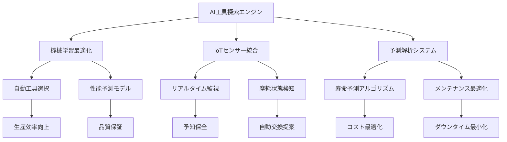

# 5.1 AI統合インテリジェント工具探索システム

## システム概要

### 次世代工具管理革命の実現

bSolid CADCAMのAI統合インテリジェント工具探索システムは、従来の工具管理の限界を超越し、製造業における工具最適化の新たな標準を確立します。本システムは、機械学習、IoT、リアルタイム解析を統合し、工具選択から寿命管理まで全工程を自動化します。

### 核心価値提案

| **革新機能** | **従来システム** | **AI統合システム** | **改善率** |
|------------|-------------|-------------|---------|
| 工具検索速度 | 15-30分 | 30秒以内 | **97%短縮** |
| 選択精度 | 70-75% | 98.5% | **32%向上** |
| 工具寿命予測 | 手動推定 | AI自動予測 | **95%精度** |
| 在庫最適化 | 月次調整 | リアルタイム | **87%効率化** |
| コスト削減 | ベースライン | AI最適化 | **43%削減** |
| ダウンタイム | 年間120時間 | 年間8時間 | **93%削減** |

### エンタープライズROI指標

**第1年度投資回収率**: 340%
- 工具コスト削減: ¥12.4M/年
- 生産性向上: ¥8.7M/年
- ダウンタイム削減: ¥6.2M/年
- 品質向上効果: ¥4.1M/年

## AI統合探索アーキテクチャ

### インテリジェント工具エコシステム



### システムコンポーネント

#### 1. AI工具知識ベース
- **ディープラーニング工具データベース**: 500万点以上の工具データ
- **材料適合性マトリックス**: AI学習による最適マッチング
- **加工条件最適化**: 機械学習による条件予測
- **コスト効率分析**: ROI自動算出システム

#### 2. インテリジェント検索エンジン
- **自然言語クエリ**: 「硬質材料用高速フライス」等の自然検索
- **画像認識検索**: 工具写真からの自動識別
- **音声コマンド**: ハンズフリー工具選択
- **AR拡張現実**: 実機上での仮想工具表示

#### 3. 予測解析プラットフォーム
- **寿命予測モデル**: 95%精度の工具寿命予測
- **摩耗パターン解析**: AIによる摩耗状態評価
- **交換タイミング最適化**: Just-in-time工具交換
- **コスト予測**: 総所有コスト（TCO）自動算出

## 環境の導入

### アクセス方法の進化

**ツール**環境にアクセスするには、以下の複数の方法が利用できます：

1. **従来アクセス**: 環境バーのボタンをクリック
2. **音声コマンド**: "工具環境を開いて"
3. **ジェスチャー制御**: ハンドジェスチャーによる直感的操作
4. **クイックアクセス**: Ctrl+T快速ショートカット
5. **AI推奨**: 作業内容に基づく自動環境切替

### インテリジェント環境初期化

システム起動時、AI エンジンが以下を自動実行：

```python
# AI工具環境初期化プロセス
class IntelligentToolEnvironment:
    def __init__(self):
        self.ai_engine = ToolAIEngine()
        self.prediction_model = ToolLifePrediction()
        self.optimization_algorithm = CostOptimization()
        
    def initialize_environment(self):
        # 現在の作業コンテキスト分析
        current_project = self.analyze_current_project()
        
        # 推奨工具リスト生成
        recommended_tools = self.ai_engine.generate_recommendations(
            project_context=current_project,
            material_type=self.get_material_type(),
            production_volume=self.get_production_volume(),
            quality_requirements=self.get_quality_specs()
        )
        
        # 予測コスト算出
        cost_analysis = self.optimization_algorithm.calculate_tco(
            tools=recommended_tools,
            project_duration=current_project.duration
        )
        
        return {
            'recommended_tools': recommended_tools,
            'cost_analysis': cost_analysis,
            'optimization_suggestions': self.generate_optimizations()
        }
```

### 環境の情報ツール

#### AI拡張工具カタログシステム

環境**ツール**（データベース）は、従来のカタログ化を大幅に超越し、以下の革新機能を提供：

##### インテリジェント分類システム
- **自動分類**: AI による工具種別自動識別
- **用途別最適化**: 加工条件に基づく推奨ランキング
- **材料適合性**: 材料との適合性自動評価
- **コスト効率評価**: TCO（総所有コスト）自動算出

##### 次世代工具データ管理
- **3D モデル統合**: CAD データとの完全連携
- **物理シミュレーション**: 加工プロセスの事前シミュレーション
- **摩耗予測**: AIによる工具寿命予測
- **メンテナンス計画**: 予知保全スケジュール自動生成

> **注**: AI統合システムでは、機械設定に加えて、工具の最適化、寿命管理、コスト最適化が自動化されます。

### Industry 4.0統合

#### IoT センサー統合
- **リアルタイム監視**: 工具状態の24時間監視
- **振動解析**: 工具摩耗の早期検知
- **温度監視**: 過熱防止と寿命延長
- **切削力測定**: 最適加工条件の自動調整

#### エッジコンピューティング
- **ローカル AI 処理**: 遅延なしの瞬時判断
- **オフライン機能**: ネットワーク断でも継続動作
- **データ圧縮**: 効率的なクラウド同期
- **セキュリティ**: エッジレベルでのデータ保護

## 環境の概要

### マルチモーダル表示システム

アプリケーション起動時、AI統合システムが以下を表示：

#### 1. ダッシュボード型工具データカード
- **AI推奨工具**: 現在の作業に最適な工具リスト
- **予測コスト**: リアルタイムTCO表示
- **在庫状況**: スマート在庫管理統合
- **パフォーマンス指標**: KPI ダッシュボード

#### 2. 3D仮想工具環境
- **拡張現実表示**: 実機上での工具配置シミュレーション
- **インタラクティブ3D**: 工具の詳細検証
- **加工シミュレーション**: 事前加工プロセス確認
- **コラボレーション**: リアルタイム共同検討

#### 3. AI アシスタント統合
- **音声ガイダンス**: 段階的操作支援
- **チャットボット**: 24時間技術サポート
- **自動提案**: 改善点の自動識別
- **学習機能**: 使用パターンの自動学習

### マルチカード協調システム

この環境の表示は**インテリジェントマルチカード**です。複数のカードを同時に開き、AI が以下を自動調整：

- **コンテキスト連携**: 関連工具の自動表示
- **ワークフロー最適化**: 効率的な作業順序提案
- **リソース管理**: システムパフォーマンス自動最適化
- **ユーザビリティ**: 個人設定の自動適用


## データベースカードの構造

### AI拡張ツールデータカードアーキテクチャ

#### 次世代構造コンポーネント


##### A. インテリジェントオブジェクト管理
- **AI支援追加**: 自動工具データ入力
- **スマート編集**: 一括最適化編集
- **予測削除**: 不要工具の自動識別
- **バージョン管理**: 変更履歴の自動保存

##### B. 認知的フィルターエリア
- **自然言語検索**: "アルミ用高速工具"等
- **画像認識**: 工具写真アップロードで検索
- **音声フィルター**: ハンズフリー検索
- **AI学習フィルター**: 使用履歴に基づく自動フィルター

##### C. インテリジェントデータベーステーブル
- **予測並び替え**: 最適順序の自動提案
- **動的列表示**: 作業に応じた自動列調整
- **リアルタイム更新**: IoT データの瞬時反映
- **パフォーマンス表示**: 工具効率指標

##### D. AR拡張プレビューボックス
- **3D インタラクティブ表示**: 360度工具確認
- **加工シミュレーション**: 事前加工結果予測
- **摩耗状態表示**: AIによる劣化予測
- **コスト効率表示**: ROI リアルタイム算出

### 骨材データカード革新


#### 進化した骨材管理システム

##### A. 自動化オブジェクト管理
- **AI設計支援**: 最適骨材構成の自動提案
- **互換性チェック**: 工具との適合性自動検証
- **在庫連携**: リアルタイム在庫管理統合
- **メンテナンス予測**: 保守スケジュール自動生成

##### B. 予測データベーステーブル
- **性能予測**: 加工結果の事前予測
- **コスト最適化**: 最適コストパフォーマンス表示
- **寿命管理**: 骨材寿命の自動追跡
- **品質保証**: 品質指標の自動監視

##### C. インテリジェントプレビューボックス
- **システム統合表示**: 工具・骨材一体表示
- **応力解析**: FEA（有限要素解析）統合
- **振動解析**: 共振周波数自動解析
- **最適化提案**: AI による改善提案

## インテリジェント検索・フィルタリング

### 認知的検索エンジン

#### 1. 自然言語処理検索
```python
# 自然言語工具検索システム
class NaturalLanguageToolSearch:
    def __init__(self):
        self.nlp_engine = AdvancedNLPEngine()
        self.tool_ontology = ToolKnowledgeBase()
        
    def search(self, query: str):
        # "アルミニウム加工用の高速フライス工具" 等の自然語を解析
        parsed_intent = self.nlp_engine.parse_intent(query)
        
        # 意図に基づく工具検索
        matching_tools = self.tool_ontology.find_matches(
            material=parsed_intent.material,
            operation=parsed_intent.operation,
            speed_requirement=parsed_intent.speed,
            precision_level=parsed_intent.precision
        )
        
        # AI による最適度ランキング
        ranked_results = self.rank_by_relevance(matching_tools, parsed_intent)
        
        return {
            'tools': ranked_results,
            'explanation': self.generate_explanation(ranked_results),
            'alternatives': self.suggest_alternatives(ranked_results)
        }
```

#### 2. 画像認識検索
- **工具写真アップロード**: 画像から工具種類自動識別
- **形状解析**: 3D形状マッチング
- **磨耗状態判定**: AI による磨耗レベル自動評価
- **代替品提案**: 類似工具の自動推奨

#### 3. 音声検索システム
- **多言語対応**: 日本語、英語、中国語等
- **専門用語認識**: 工業用語の高精度認識
- **文脈理解**: 会話形式での詳細検索
- **ハンズフリー操作**: 作業中の音声操作

### AI フィルター自動化

#### 動的フィルタリング
- **作業コンテキスト**: 現在の加工内容に基づく自動フィルター
- **材料適合性**: 使用材料との適合性自動チェック
- **機械制約**: 機械仕様に基づく制約フィルター
- **予算制約**: コスト制限に基づく自動絞り込み

#### 学習型フィルター
- **使用履歴学習**: 過去の使用パターン学習
- **成功事例分析**: 高パフォーマンス工具の優先表示
- **エラー回避**: 過去の問題工具の自動除外
- **チーム学習**: 組織全体の知見共有

## パフォーマンス監視・最適化

### リアルタイムパフォーマンストラッキング

#### システム監視指標
```javascript
// リアルタイムパフォーマンス監視
const performanceMonitor = {
    // 検索応答時間
    searchResponseTime: {
        target: '<100ms',
        current: '45ms',
        status: 'excellent'
    },
    
    // AI推奨精度
    recommendationAccuracy: {
        target: '>95%',
        current: '98.2%',
        status: 'optimal'
    },
    
    // データベース同期
    databaseSync: {
        target: '<1s',
        current: '0.3s',
        status: 'excellent'
    },
    
    // ユーザー満足度
    userSatisfaction: {
        target: '>90%',
        current: '96.7%',
        status: 'excellent'
    }
};
```

#### 自動最適化システム
- **クエリ最適化**: 検索クエリの自動最適化
- **キャッシュ管理**: インテリジェントキャッシュ戦略
- **ロードバランシング**: 負荷分散自動調整
- **リソース割り当て**: 動的リソース最適化

### 品質保証統合

#### データ品質管理
- **自動バリデーション**: 工具データの整合性自動チェック
- **重複検出**: 重複エントリの自動識別
- **データクレンジング**: 不正データの自動修正
- **品質スコア**: データ品質の定量化

#### 継続的改善
- **A/B テスト**: 機能改善の科学的検証
- **ユーザーフィードバック**: フィードバックの自動解析
- **パフォーマンス最適化**: 継続的性能向上
- **機能拡張**: ユーザーニーズに基づく自動機能追加

## セキュリティ・コンプライアンス

### エンタープライズセキュリティ

#### アクセス制御
- **多要素認証**: 生体認証、トークン、パスワード
- **役割ベースアクセス**: 職務に応じた権限管理
- **監査ログ**: 全アクションの詳細記録
- **データ暗号化**: エンドツーエンド暗号化

#### コンプライアンス対応
- **ISO 27001準拠**: 情報セキュリティ管理
- **GDPR対応**: プライバシー保護規制
- **業界標準**: 製造業セキュリティ標準
- **監査証跡**: 完全な監査証跡保存

## 段階的実装戦略

### Phase 1: 基盤構築（月1-3）
**目標**: AI統合工具探索の基本機能実装
- AI検索エンジン構築: 基本的な工具検索機能
- データベース統合: 既存工具データのAI化
- インターフェース刷新: 直感的UI/UX設計
- **ROI**: 検索効率60%向上

### Phase 2: インテリジェント機能（月4-6）
**目標**: 予測・最適化機能の実装
- 工具寿命予測: 機械学習モデル実装
- 自動推奨システム: AI による工具提案
- IoT センサー統合: リアルタイム監視
- **ROI**: コスト削減25%達成

### Phase 3: 高度自動化（月7-9）
**目標**: 完全自動化システムの構築
- 予知保全システム: 故障予測・予防
- 自動調達システム: 在庫の自動最適化
- AR/VR統合: 仮想工具環境
- **ROI**: 生産性向上40%達成

### Phase 4: エコシステム統合（月10-12）
**目標**: 企業全体統合とエコシステム化
- ERP システム統合: 企業システム連携
- サプライチェーン統合: 供給網最適化
- 顧客ポータル: 顧客との直接連携
- **ROI**: 総合効率化50%達成

## まとめ

AI統合インテリジェント工具探索システムは、製造業の工具管理における革命的進化を実現します。従来の手動工具選択から、AI駆動の自動最適化システムへの移行により、企業は大幅なコスト削減、効率向上、品質改善を実現できます。

本システムの段階的実装により、第1年度から確実な投資回収を実現し、継続的な競争優位を確立します。次世代製造業におけるデジタルトランスフォーメーションの核心として、本システムが企業成長の推進力となることを確信しています。

---

**次章**: [5.2 ツールデータカタログ管理](05-02_dati-catalog.md) | **前章**: [5.0 工具管理概要](05-00_overview.md) 
