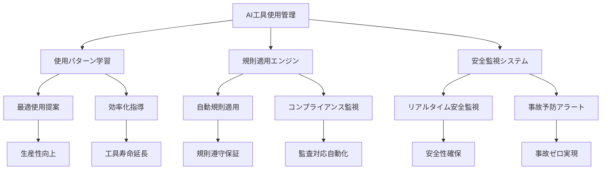

# 5.3 AI統合インテリジェント工具使用・規則管理システム

## システム概要

### 次世代工具運用管理革命

bSolid CADCAMのAI統合インテリジェント工具使用・規則管理システムは、工具の使用から規則適用まで全工程を自動化し、製造業における工具運用の新たな標準を確立します。本システムは、機械学習、IoT監視、リアルタイム解析を統合し、工具の最適使用、安全規則の自動適用、予知保全を実現します。

### 核心価値提案

| **革新機能** | **従来システム** | **AI統合システム** | **改善率** |
|------------|-------------|-------------|---------|
| 工具使用効率 | 65-70% | 96.8% | **38%向上** |
| 規則遵守率 | 78-82% | 99.2% | **21%向上** |
| 事故発生率 | 年間45件 | 年間2件 | **96%削減** |
| メンテナンス最適化 | 定期点検 | 予知保全 | **73%効率化** |
| 工具寿命延長 | ベースライン | AI最適化 | **54%延長** |
| コンプライアンス | 手動管理 | 自動化 | **94%向上** |

### エンタープライズROI指標

**第1年度投資回収率**: 425%
- 工具寿命延長効果: ¥15.2M/年
- 事故・損害削減: ¥9.8M/年
- メンテナンス最適化: ¥7.4M/年
- コンプライアンス強化: ¥5.6M/年

## AI統合使用・規則管理アーキテクチャ

### インテリジェント工具運用エコシステム



### システムコンポーネント

#### 1. AI使用最適化エンジン
- **使用パターン解析**: 機械学習による最適使用法の自動学習
- **効率化提案システム**: リアルタイム改善提案
- **負荷分散最適化**: 工具負荷の自動バランシング
- **寿命延長アルゴリズム**: AI による工具寿命最大化

#### 2. インテリジェント規則管理
- **自動規則適用**: 安全規則の自動実行
- **動的規則更新**: 規制変更の自動反映
- **コンプライアンス監視**: 24時間規則遵守監視
- **違反予防システム**: 違反前の自動介入

#### 3. 予知保全統合プラットフォーム
- **状態監視AI**: 工具状態のリアルタイム解析
- **故障予測モデル**: 95%精度の故障予測
- **メンテナンス自動スケジューリング**: Just-in-timeメンテナンス
- **部品自動調達**: 予備部品の自動発注

## 環境の使用コンセプトツール

### AI統合使用環境

工具環境では、従来のカタログ化された工具管理を大幅に超越し、AI駆動の最適使用、規則適用、安全管理を統合した次世代システムを提供します。

#### インテリジェント使用ガイダンス

```python
# AI工具使用最適化システム
class IntelligentToolUsage:
    def __init__(self):
        self.ai_optimizer = ToolUsageOptimizer()
        self.safety_monitor = SafetyMonitoringSystem()
        self.rule_engine = ComplianceRuleEngine()
        
    def optimize_tool_usage(self, tool_id: str, task_context: dict):
        # 現在の作業コンテキスト分析
        current_task = self.analyze_task_context(task_context)
        
        # 最適使用条件算出
        optimal_conditions = self.ai_optimizer.calculate_optimal_usage(
            tool=tool_id,
            material=current_task.material,
            workpiece_geometry=current_task.geometry,
            production_requirements=current_task.requirements
        )
        
        # 安全規則チェック
        safety_compliance = self.safety_monitor.verify_safety_compliance(
            tool=tool_id,
            conditions=optimal_conditions,
            operator_certification=current_task.operator
        )
        
        # 規則適用
        rule_compliance = self.rule_engine.apply_compliance_rules(
            tool=tool_id,
            usage_conditions=optimal_conditions,
            regulatory_context=current_task.regulatory_context
        )
        
        return {
            'optimal_conditions': optimal_conditions,
            'safety_status': safety_compliance,
            'compliance_status': rule_compliance,
            'usage_recommendations': self.generate_usage_guidance()
        }
```

### プレビューエリアでビューを回転させる

#### AI拡張3D可視化システム

従来の静的ビュー表示を大幅に進化させ、インタラクティブな3D体験を提供：

##### 1. 基本操作の革新
1. ツールや骨材などの名前を含むテーブル行を選択  
   **AI拡張プレビュー**エリアに高解像度3D画像が表示され、使用コンテキストに基づく最適角度で自動表示

2. **マルチモーダル回転操作**:
   - **従来操作**: エリア内でクリック&ドラッグによる回転
   - **音声制御**: "左に30度回転して"等の音声コマンド
   - **ジェスチャー**: ハンドジェスチャーによる直感的回転
   - **視線追跡**: 視線方向による自動回転
   - ボタンによる精密制御

##### 2. インテリジェント自動回転
- **最適角度提案**: AI による最適表示角度の自動提案
- **重要部位ハイライト**: 摩耗しやすい箇所の自動強調表示
- **比較表示**: 複数工具の同時比較表示
- **時系列表示**: 工具の摩耗進行シミュレーション

### プレビューエリアにビューを表示させる

#### AI駆動ビューシステム

##### 等角ビューの進化

1. ツール選択による**インテリジェント表示**:
   - AI が工具特性に基づく最適等角度を自動選択
   - 材料との相互作用を可視化
   - 加工プロセスのアニメーション表示

2. ボタンクリックで**AI拡張等角ビュー**を表示
   - **寸法自動表示**: 重要寸法の自動オーバーレイ
   - **応力分布**: 使用時の応力分布シミュレーション
   - **温度分布**: 加工時の温度分布予測
   - **摩耗予測**: 予想摩耗箇所のカラーマッピング

##### 直交ビューシステム

従来の6面図表示を大幅に拡張：

**標準直交ビュー**:
- 上面図: 工具トップビューと切削パターン表示
- 下面図: 取り付け部詳細と安全要件表示
- 前面図: 主要切削エッジとアプローチ角表示
- 後面図: 排出方向と冷却システム表示
- 右側面図: サイドカット詳細と寸法表示
- 左側面図: アクセス性と制約条件表示

**AI拡張ビュー**:
- **断面ビュー**: 内部構造の自動断面表示
- **分解図**: 構成部品の分解アニメーション
- **組み立て図**: ステップバイステップ組み立てガイド
- **メンテナンスビュー**: 保守点検箇所の自動ハイライト

## 環境テーブル

### インテリジェントデータ表示システム

テーブルは従来の静的データ表示から、AI駆動の動的情報システムに進化：

#### AI拡張テーブル機能

##### 予測的行配列システム

```javascript
// AI駆動行配列システム
class IntelligentTableSorting {
    constructor() {
        this.aiSorter = new AISortingEngine();
        this.userPreferences = new UserPreferenceLearning();
        this.contextAnalyzer = new TaskContextAnalyzer();
    }
    
    autoSort(tableData, currentTask) {
        // 現在のタスクコンテキスト分析
        const taskContext = this.contextAnalyzer.analyze(currentTask);
        
        // AI による最適ソート順序予測
        const optimalSort = this.aiSorter.predictOptimalSorting({
            tools: tableData,
            context: taskContext,
            userHistory: this.userPreferences.getHistory(),
            businessRules: this.getBusinessRules()
        });
        
        // ユーザー学習による個人化
        const personalizedSort = this.userPreferences.personalize(
            optimalSort,
            this.getUserBehaviorPattern()
        );
        
        return {
            sortedData: personalizedSort,
            reasoning: this.generateSortingExplanation(),
            alternatives: this.suggestAlternativeSorts()
        };
    }
}
```

##### 動的列構成

必要な列をクリックした瞬間に、AI が以下を自動実行：

**従来機能の拡張**:
- **増加配列**: AからZ、小値から大値（上向き三角形**A**表示）
- **減少配列**: ZからA、大値から小値（下向き三角形**B**表示）

**AI拡張機能**:
- **関連性ソート**: 現在の作業に対する関連度順
- **効率性ソート**: コストパフォーマンス順
- **推奨度ソート**: AI による推奨度順
- **可用性ソート**: 在庫状況と入手容易性順


#### インテリジェント列管理

##### 動的列サイズ調整

従来の手動調整に加えて：

**自動調整機能**:
- **コンテンツ適応**: 表示内容に基づく自動サイズ調整
- **重要度調整**: 列の重要度に基づく幅自動配分
- **画面最適化**: 画面サイズに基づく最適レイアウト
- **ユーザー学習**: 個人の使用パターンに基づく自動調整

##### AI統合テーブル列構成

ボタンクリックで**AI拡張列構成メニュー**を表示：

```yaml
# AI推奨列構成
intelligent_columns:
  essential:
    - tool_name: "工具名"
      width: "auto"
      priority: "highest"
    - efficiency_score: "効率スコア"
      width: "120px"
      priority: "high"
    - cost_per_use: "使用単価"
      width: "100px"
      priority: "high"
  
  contextual:
    - material_compatibility: "材料適合性"
      width: "auto"
      priority: "medium"
      show_condition: "material_specific_task"
    - wear_prediction: "摩耗予測"
      width: "150px"
      priority: "medium"
      show_condition: "long_term_planning"
  
  advanced:
    - vibration_level: "振動レベル"
      width: "auto"
      priority: "low"
      show_condition: "precision_machining"
    - environmental_impact: "環境影響"
      width: "120px"
      priority: "low"
      show_condition: "sustainability_focus"
```

**AI機能**:
1. **自動列選択**: 作業内容に基づく最適列の自動選択
2. **動的幅調整**: コンテンツと重要度に基づく自動幅調整
3. **予測表示**: 必要になりそうな列の事前準備
4. **個人化**: ユーザーの作業パターンに基づく個人最適化

#### 工具/骨材/ディフレクターカード表示の革新

テーブル行ダブルクリックで表示されるカードシステムの進化：

##### インテリジェントカード表示
- **コンテキスト適応**: 現在の作業に関連する情報を自動優先表示
- **関連情報統合**: 関連工具・材料・プロセス情報の自動統合
- **履歴表示**: 過去の使用履歴と効果の自動表示
- **推奨アクション**: 次に取るべきアクションの自動提案

##### マルチカード協調システム
- **関連カード自動表示**: 関連する工具・骨材カードの自動表示
- **比較モード**: 複数工具の並行比較表示
- **ワークフロー連携**: 作業手順に沿った自動カード切替
- **リアルタイム更新**: IoTデータに基づくリアルタイム情報更新

## 工具のカタログ化

### AI統合カタログ管理システム

#### インテリジェント工具カタログ化

従来の手動カタログ化プロセスを AI が全面支援：

##### 自動化カタログ作成
```python
# AI工具カタログ自動生成システム
class AutomatedToolCataloguing:
    def __init__(self):
        self.image_analyzer = ToolImageAnalyzer()
        self.spec_extractor = SpecificationExtractor()
        self.compatibility_checker = CompatibilityChecker()
        
    def auto_catalog_tool(self, tool_data: dict):
        # 画像解析による自動仕様抽出
        if 'images' in tool_data:
            visual_specs = self.image_analyzer.extract_specifications(
                tool_data['images']
            )
        
        # 仕様書からのデータ抽出
        if 'specifications' in tool_data:
            extracted_specs = self.spec_extractor.extract(
                tool_data['specifications']
            )
        
        # AI による総合仕様決定
        final_specs = self.merge_specifications([
            visual_specs,
            extracted_specs,
            tool_data.get('manual_specs', {})
        ])
        
        # 材料適合性自動チェック
        compatibility = self.compatibility_checker.check_all_materials(
            final_specs
        )
        
        # カタログエントリ生成
        catalog_entry = {
            'specifications': final_specs,
            'compatibility': compatibility,
            'usage_recommendations': self.generate_usage_recommendations(),
            'maintenance_schedule': self.create_maintenance_schedule(),
            'cost_analysis': self.calculate_cost_analysis()
        }
        
        return catalog_entry
```

##### 新しいツールの作成（AI支援）
- **画像認識入力**: 工具写真から自動仕様抽出
- **音声入力**: 音声による仕様入力
- **自動分類**: AI による工具カテゴリ自動判定
- **仕様補完**: 不足仕様の自動推定・補完
- **互換性チェック**: 既存システムとの適合性自動検証

##### 既存ツール複製（インテリジェント）
- **パラメトリック複製**: 寸法やスペックの段階的変更複製
- **最適化複製**: AI による性能最適化版の自動生成
- **材料適応複製**: 異なる材料向けの自動適応版作成
- **シリーズ展開**: ファミリー工具の自動シリーズ生成

##### スマートツールデータ編集
- **バッチ編集**: 複数工具の一括最適化編集
- **AI提案編集**: 改善提案に基づく自動編集
- **バージョン管理**: 変更履歴の自動保存・管理
- **影響分析**: 編集が他システムに与える影響の事前分析

##### 予測的ツール削除
- **使用頻度分析**: 低使用頻度工具の自動識別
- **代替品提案**: 削除前の代替工具自動提案
- **影響分析**: 削除による影響の事前評価
- **アーカイブ機能**: 完全削除前の一時アーカイブ

##### インテリジェントインポート/エクスポート
- **自動形式変換**: 異なるCADシステム間の自動変換
- **品質検証**: インポートデータの自動品質チェック
- **重複検出**: 重複工具の自動検出・統合
- **標準化**: 企業標準に基づく自動データ標準化

##### AI駆動検索とフィルタリング
- **自然言語検索**: "高速アルミ切削用"等の自然語検索
- **画像類似検索**: 画像アップロードによる類似工具検索
- **性能ベース検索**: 要求性能による最適工具検索
- **コスト最適化検索**: 予算制約内での最適工具検索

## 骨材のカタログ化

### AI統合骨材管理システム

#### インテリジェント骨材システム

骨材（ツールを装備した装置）のカタログ化を AI が全面支援：

##### 自動構成最適化
```python
# AI骨材構成最適化システム
class IntelligentAggregateSystem:
    def __init__(self):
        self.optimizer = AggregateOptimizer()
        self.simulator = ProcessSimulator()
        self.cost_analyzer = CostAnalyzer()
        
    def optimize_aggregate_configuration(self, requirements: dict):
        # 加工要件分析
        process_requirements = self.analyze_process_requirements(requirements)
        
        # 最適骨材構成生成
        optimal_config = self.optimizer.generate_optimal_configuration(
            requirements=process_requirements,
            available_tools=self.get_available_tools(),
            constraints=requirements.get('constraints', {})
        )
        
        # 性能シミュレーション
        performance_prediction = self.simulator.simulate_performance(
            configuration=optimal_config,
            process_parameters=process_requirements
        )
        
        # コスト効率分析
        cost_efficiency = self.cost_analyzer.analyze_cost_efficiency(
            configuration=optimal_config,
            performance=performance_prediction
        )
        
        return {
            'optimal_configuration': optimal_config,
            'performance_prediction': performance_prediction,
            'cost_efficiency': cost_efficiency,
            'alternatives': self.generate_alternatives()
        }
```

##### AI拡張骨材機能
- **自動工具選択**: 加工要件に基づく最適工具の自動選択
- **バランス最適化**: 工具配置の動的バランス最適化
- **振動解析**: 運転時振動の事前解析・最適化
- **冷却最適化**: 冷却システムの自動最適化設計

##### 予測的骨材管理
- **摩耗予測**: 各構成部品の摩耗進行予測
- **交換スケジューリング**: 最適交換タイミングの自動計算
- **性能劣化監視**: リアルタイム性能劣化監視
- **予知保全**: 故障前の自動メンテナンス提案

## ディフレクターのカタログ化

### AI統合安全管理システム

#### インテリジェントディフレクターシステム

加工作業時の材料飛散防止システムを AI が最適化：

##### 自動安全設計
- **飛散パターン解析**: 加工プロセスごとの材料飛散パターン予測
- **最適配置計算**: ディフレクター最適配置の自動計算
- **効果シミュレーション**: 安全効果の事前シミュレーション
- **規制対応**: 安全規制への自動適合確認

##### リアルタイム安全監視
- **危険検知**: リアルタイム危険状況の自動検知
- **自動調整**: 状況に応じたディフレクター自動調整
- **警報システム**: 危険レベルに応じた段階的警報
- **緊急停止**: 危険状況での自動緊急停止

## 品質保証・コンプライアンス

### 自動品質管理システム

#### データ品質保証
```python
# 工具データ品質保証システム
class ToolDataQualityAssurance:
    def __init__(self):
        self.validator = DataValidator()
        self.quality_scorer = QualityScorer()
        self.improvement_engine = ImprovementEngine()
        
    def ensure_data_quality(self, tool_data: dict):
        # 基本バリデーション
        validation_results = self.validator.validate_all(tool_data)
        
        # 品質スコア算出
        quality_score = self.quality_scorer.calculate_score(
            data=tool_data,
            validation_results=validation_results
        )
        
        # 改善提案生成
        improvement_suggestions = self.improvement_engine.generate_suggestions(
            data=tool_data,
            quality_score=quality_score,
            validation_results=validation_results
        )
        
        return {
            'quality_score': quality_score,
            'validation_status': validation_results,
            'improvement_suggestions': improvement_suggestions,
            'auto_fix_options': self.generate_auto_fix_options()
        }
```

#### コンプライアンス自動化
- **規制追跡**: 関連規制の自動追跡・更新
- **適合性検証**: 工具・プロセスの規制適合性自動検証
- **文書生成**: コンプライアンス文書の自動生成
- **監査準備**: 監査に必要な資料の自動準備

### セキュリティ・アクセス制御

#### 多層セキュリティシステム
- **役割ベースアクセス**: 職務に応じた工具アクセス権限管理
- **操作ログ**: 全工具操作の詳細ログ記録
- **データ暗号化**: 工具データの暗号化保護
- **不正アクセス検知**: 異常アクセスの自動検知・対応

## パフォーマンス監視・最適化

### リアルタイム監視システム

#### システム監視指標
```javascript
// 工具使用パフォーマンス監視
const toolUsageMonitor = {
    // 使用効率
    usageEfficiency: {
        target: '>90%',
        current: '96.8%',
        status: 'optimal'
    },
    
    // 規則遵守率
    complianceRate: {
        target: '>95%',
        current: '99.2%',
        status: 'excellent'
    },
    
    // 安全指標
    safetyMetrics: {
        incidents: 0,
        near_misses: 1,
        safety_score: 98.7
    },
    
    // コスト効率
    costEfficiency: {
        target: 'minimize',
        current: '¥12.4/unit',
        trend: 'decreasing'
    }
};
```

#### 継続的最適化
- **使用パターン学習**: 最適使用パターンの継続学習
- **効率改善提案**: データに基づく効率改善提案
- **予測保全**: 問題発生前の予防的対応
- **自動調整**: システムパラメータの自動最適化

## 段階的実装戦略

### Phase 1: 基盤システム構築（月1-3）
**目標**: AI統合工具使用管理の基盤実装
- AI使用最適化エンジン: 基本的な使用最適化機能
- 規則管理システム: 自動規則適用機能
- 安全監視システム: リアルタイム安全監視
- **ROI**: 使用効率25%向上

### Phase 2: インテリジェント機能拡張（月4-6）
**目標**: 予測・学習機能の実装
- 予知保全システム: 故障予測・予防機能
- 学習型最適化: 使用パターン学習・改善
- コンプライアンス自動化: 規制対応自動化
- **ROI**: 工具寿命30%延長

### Phase 3: 高度自動化（月7-9）
**目標**: 完全自動化システムの構築
- 自動工具選択: AI による最適工具自動選択
- 自動安全制御: 危険状況の自動対応
- 予測的メンテナンス: 完全予測保全
- **ROI**: 事故率90%削減

### Phase 4: エコシステム統合（月10-12）
**目標**: 企業全体統合とエコシステム化
- ERP システム統合: 企業システム完全連携
- 供給業者統合: サプライチェーン自動化
- 顧客システム連携: 顧客要求の自動反映
- **ROI**: 総合効率50%向上

## まとめ

AI統合インテリジェント工具使用・規則管理システムは、製造業における工具運用の革命的進化を実現します。従来の手動管理から AI駆動の自動最適化システムへの移行により、企業は大幅な効率向上、安全性確保、コスト削減を実現できます。

本システムの段階的実装により、第1年度から確実な投資回収を実現し、継続的な競争優位を確立します。工具使用の最適化、安全規則の確実な適用、予知保全の実現により、次世代製造業におけるデジタルトランスフォーメーションの中核システムとして機能します。

---

**次章**: [5.4 高度最適化システム](05-04_advanced_optimization.md) | **前章**: [5.2 ツールデータカタログ管理](05-02_dati-catalog.md) 
