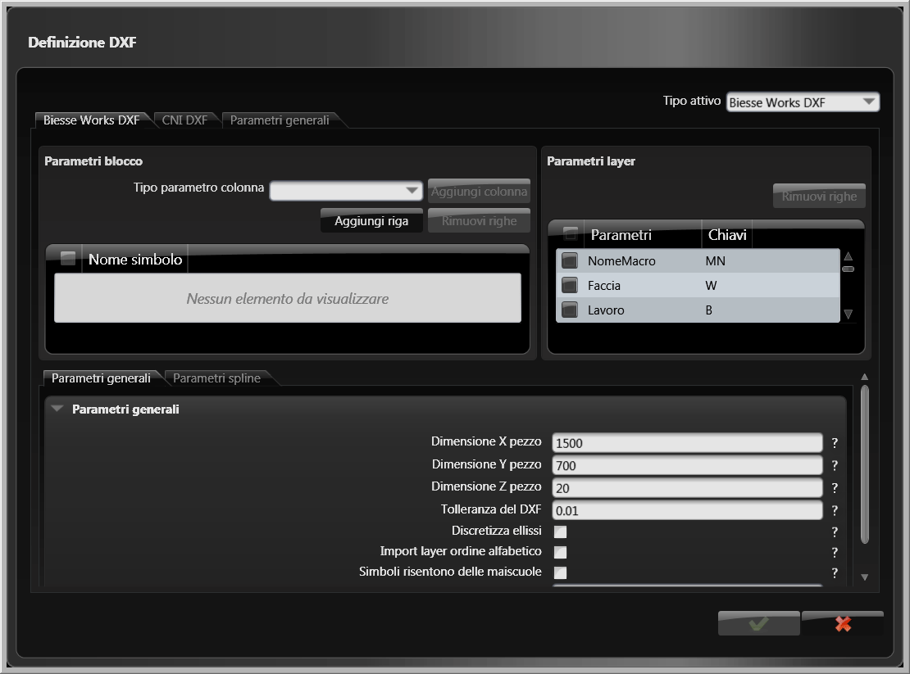

# DXF定義ダイアログボックス

## 概要

bSolidにDXFファイルをインポートするためのルールを定義するダイアログボックスです。このダイアログでは、DXFファイルから正しくデータを読み取るための各種パラメーターを設定できます。

## ダイアログボックスの表示方法

1. 環境バーのボタン  をクリックします
2. **一般設定** カードをクリックします
3. **DXF定義** ボタンをクリックします

## ダイアログボックスの説明

DXF定義ダイアログボックスには以下のタブが含まれています：

### タブ一覧

- [BiesseワークDXF](#biesseワークdxf)
- [CNI DXF](#cni-dxf)
- [一般的パラメーター](#一般的パラメーター)

---

## BiesseワークDXF

### ブロックパラメーター

#### 行パラメーターのタイプ

下のテーブルにパラメーターを入力するのに使用し、インポートされるDXFファイルでブロック（形状のグループ）を読み取るルールを定義します。

#### 列を追加します

ドロップダウンメニュー「行パラメーターのタイプ」で選択されたパラメーターの名称がついたテーブルで列を追加します。

#### 行の追加

テーブルに新しい行を追加します。

#### 行を削除

テーブルで選択された行を削除します。

### レイヤーパラメーター

インポートのときにプログラムが正確に読み取られるように、このセクションは、一般的なCADプログラムで作成されたDXFファイルで使用されるデフォルト・キーのついたテーブルを表示しています。

デフォルトによって、テーブルの各パラメーターがキーに対応します。これらのキーはパーソナライズ（変更）できます。

| パラメーター | キー | 説明 |
|-------------|------|------|
| マクロ名称 | MN | マクロを表示するキー |
| 面 | W | ピースの標準サイドを表示しているキー |
| 一般的なフェイス | WG | 一般的フェイスを表示しているキー、すべてのフェイスを定義するために使われる |
| ワーク | B | 加工作業のタイプを表示しているキー |
| ツール補正 | TC | ツールの修正を表示しているキー |
| 作業速度 | F | フィードの速度（ミリメートル/分 または インチ/分）を表示するキー |
| 回転速度 | S | ツールの回転スピード（1分あたりの回転数）を表示するキー |
| 奥行 | D | 加工作業の深さと位置（ミリメートルまたはインチ）を表示するキー |
| 厚さ | TH | ツールの厚さ（ミリメートルまたはインチ）を表示するキー |
| 直径 | DI | ツールの直径（ミリメートルまたはインチ）を表示するキー |
| 下降速度 | DES | 下降速度（ミリメートル/分 または インチ/分）を表示するキー |
| 方向 | DIR | 機械加工の方向を示すキー |
| 貫通 | PT | 貫通の加工作業を表示するキー： • 0 = no = default • 1 = yes |
| ツール分類 | TCL | ツール分類を表示しているキー（データベースごとのコード） |
| ツールコード | TCD | ツールコードを表示しているキー（英数字） |
| ツールタイプ | TTY | ツールのタイプを表示しているキー（数値） |
| AR | AR | AR角度を表示しているキー（度数で表され、小数点以下は非表示） |
| フェイス高さ | HF | 一般的なフェイスの高さ（ミリメートルまたはインチ）を表示するキー |
| 起点リスト | LO | 原点のリストを表示するキー（英数字の値） |
| 対称プログラム | PS | 対称プログラムを表示しているキー |
| アグリゲートツーリング | AA | そのアグリゲートツーリングのファイル名が関連付けられるアグリゲートツーリングを表示するのに使用 |
| 機械ツーリング | AM | その機械コンフィギュレーションのファイル名が関連付けられる機械ツーリングを表示するのに使用 |
| マガジンツーリング | AS | そのマガジンツーリングのファイル名が関連付けられるマガジンツーリングを表示するのに使用 |
| 進入：ユーザ半径 % | IP | ツールの進入半径修正用のパーセント数値を表示するキー |
| 進入：角度 | IA | ツールの進入角度を表示するキー |
| 進入：タイプ | IT | ツールの進入のタイプを表示するキー |
| ユーザーパネル | CP | カスタマイズされたピースのパラメーターを表示するキー |
| ツールローテーション | TR | ツールの回転方向を示すキー |
| 退出：ユーザ半径 % | OP | ツールの退出半径修正用のパーセント数値を表示するキー |
| 退出：角度 | OA | ツールの退出角度を表示するキー |
| 退出：タイプ | OT | ツールの退出のタイプを表示するキー |

### 一般的パラメーター

#### ピースのX寸法
ピースのx寸法のデフォルト値を定義するのに使用します。この値は、インポートされたDXFレイヤーで指定されなかった場合に、自動的に測定されます。

#### ピースのY寸法
ピースのy寸法のデフォルト値を定義するのに使用します。この値は、インポートされたDXFレイヤーで指定されなかった場合に、自動的に測定されます。

#### ピースのZ寸法
ピースの厚さのデフォルト値を定義するのに使用されます。この値は、インポートされたDXFレイヤーで指定されなかった場合に、自動的に測定されます。

#### DXF許容差
DXFファイルを変換するための小数の値の精度を定義するために使用されます。

#### 楕円離散化
DXFファイルにある楕円形状の分解を有効（ボックスチェック）または無効にし、それらを多数の曲線セグメントに分割します。

楕円の円弧がプロファイルの一部である場合に、この機能は便利かもしれません。もしボックスが無効なら、楕円は単体のパートとしてインポートされることができます。

#### アルファベット順にレイヤーをインポート
DXFファイルのレイヤーをインポートするためのオーダーを有効（ボックスにチェックを入れる）または無効にします。

- ボックスが有効であるときは、DXFレイヤーが英数字のオーダーでインポートされることを意味します
- ボックスが無効であるときは、インポートされたレイヤーはどんなルールにも従わないということを意味しています；作成されたときのオーダーを維持します

#### 大文字を認識するシンボル
"大文字と小文字を区別する" の機能を有効（ボックスにチェックを入れる）または無効にします、つまり、小文字を大文字とを区別できる機能です。

たとえば、システムによって認識するためには、テーブルのキーはレイヤーで定義されるオリジナルなものに対応しなければなりません。大文字または小文字は正しく記述すること：たとえば"panel"というワードは、"Panel"や"PANEL"とは認識されず、"panel"とのみ認識されます。

ボックスが無効とされた場合には、キーは大文字と小文字を区別しません。

#### ストリングセパレータ
英数の値を区切るためのデフォルト文字（レイヤーの構文用に使用されます）。

---

## CNI DXF

### ブロックパラメーター

#### 行の追加
テーブルに新しい行を追加します。

#### 行を削除
テーブルで選択された行を削除します。

### レイヤーパラメーター

インポートのときにプログラムが正確に読み取られるように、このセクションは、一般的なCADプログラムで作成されたDXFファイルで使用されるデフォルト・キーのついたテーブルを表示しています。

デフォルトによって、テーブルの各パラメーターがキーに対応します。これらのキーはパーソナライズ（変更）できます。

| パラメーター | キー | 説明 |
|-------------|------|------|
| パネル | PANNELLO | ピースを表示するキー |
| カット | LAMA | カット加工を表示するキー |
| 電子スピンドル | PANTO | 切削加工を表示するキー |
| ボアリングサイド1 | LATOA | サイド1の水平方向のボアリングを表示するキー |
| ボアリングサイド2 | LATOB | サイド2の水平方向のボアリングを表示するキー |
| ボアリングサイド3 | LATOC | サイド3の水平方向のボアリングを表示するキー |
| ボアリングサイド4 | LATOD | サイド4の水平方向のボアリングを表示するキー |
| ボアリングサイド5 | LATOE | サイド5の水平方向のボアリングを表示するキー |
| 垂直方向の穴あけ | VERTICA | サイド0の垂直方向のボアリングを表示するキー |
| アンギュラーボーリング加工 | FORIA | 傾いたボアリングを表示するキー |
| ポイント | K | 小数セパレータを表示するキー |
| 休止（Z）を無効化 | DIS_Z | DXFレイヤーに示された機械加工/形状のX座標を考慮するか否かを表示するためのキー 入力される値は： • 0 = Z座標は、ピースのメイン表面に対する加工面への表面の移動位置とみなされます • 1 = Z座標は考慮されません |

### 一般的パラメーター

#### ピースのX寸法
ピースのx寸法のデフォルト値を定義するのに使用します。この値は、インポートされたDXFレイヤーで指定されなかった場合に、自動的に測定されます。

#### ピースのY寸法
ピースのy寸法のデフォルト値を定義するのに使用します。この値は、インポートされたDXFレイヤーで指定されなかった場合に、自動的に測定されます。

#### ピースのZ寸法
ピースの厚さのデフォルト値を定義するのに使用されます。この値は、インポートされたDXFレイヤーで指定されなかった場合に、自動的に測定されます。

#### DXF許容差
DXFファイルを変換するための小数の値の精度を定義するために使用されます。

#### 楕円離散化
DXFファイルにある楕円形状の分解を有効（ボックスチェック）または無効にし、それらを多数の曲線セグメントに分割します。

楕円の円弧がプロファイルの一部である場合に、この機能は便利かもしれません。もしボックスが無効なら、楕円は単体のパートとしてインポートされることができます。

#### 大文字を認識するシンボル
"大文字と小文字を区別する" の機能を有効（ボックスにチェックを入れる）または無効にします、つまり、小文字を大文字とを区別できる機能です。

たとえば、システムによって認識するためには、テーブルのキーはレイヤーで定義されるオリジナルなものに対応しなければなりません。大文字または小文字は正しく記述すること：たとえば"panel"というワードは、"Panel"や"PANEL"とは認識されず、"panel"とのみ認識されます。

ボックスが無効とされた場合には、キーは大文字と小文字を区別しません。

---

## 一般的パラメーター

### 常にミリメートルとしてインポート

デフォルト・ユニットとしてミリメートルでの測定ユニットを有効（ボックスにチェックを入れる）または無効にします。

インポートされたDXFファイルが特定の測定ユニットを示さないときは、フィールドで表示されるデータアイテムは、システムによって使用されます。

---

## 関連セクション

- [一般設定](./06-01_Impost-general.md) - 全体的な設定管理
- [バックアップと復元](../01-PerIniziare/01-02_imp_back_restore.md) - データの保護
- [CAD/CAM環境](../02-CADCAM/README.md) - DXFファイルの活用 
