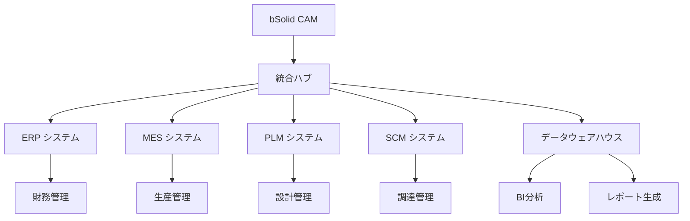

# bSolid マニュアル - クラウド・エンタープライズ統合

**ファイル名**: `06-09_cloud_enterprise_integration.md`  
**カテゴリ**: 設定管理 - クラウド統合  
**関連**: AI自動化設定、システム統合、セキュリティ管理

---

## 📋 **概要**

bSolidのクラウド・エンタープライズ統合機能は、マルチクラウド環境での運用、大規模組織での展開、既存エンタープライズシステムとのシームレスな統合を実現します。スケーラビリティ、セキュリティ、管理性を重視した設計となっています。

---

## ☁️ **マルチクラウド統合**

### **1. クラウドプラットフォーム対応**

#### **主要クラウドプロバイダー統合**
```python
class MultiCloudManager:
    def __init__(self):
        self.aws_connector = AWSConnector()
        self.azure_connector = AzureConnector()
        self.gcp_connector = GCPConnector()
        self.private_cloud = PrivateCloudConnector()
        self.hybrid_orchestrator = HybridOrchestrator()
    
    def deploy_across_clouds(self, deployment_config):
        # クラウド間での最適配置計算
        optimal_distribution = self.calculate_optimal_distribution(
            deployment_config
        )
        
        # 各クラウドでの並行展開
        deployment_results = []
        for cloud, config in optimal_distribution.items():
            result = self.deploy_to_cloud(cloud, config)
            deployment_results.append(result)
        
        # クラウド間統合設定
        self.hybrid_orchestrator.configure_inter_cloud_connectivity(
            deployment_results
        )
        
        return deployment_results
```

#### **クラウド選択戦略**
```yaml
cloud_selection_criteria:
  aws:
    strengths:
      - "豊富なサービス群"
      - "グローバル展開力"
      - "高い可用性"
    use_cases:
      - "大規模データ処理"
      - "AI/ML機能統合"
      - "グローバル展開"
  
  azure:
    strengths:
      - "Microsoftエコシステム統合"
      - "ハイブリッドクラウド"
      - "エンタープライズ機能"
    use_cases:
      - "既存Windows環境統合"
      - "Office365連携"
      - "エンタープライズ統合"
  
  gcp:
    strengths:
      - "AI/ML先進機能"
      - "データ分析基盤"
      - "コスト効率"
    use_cases:
      - "ビッグデータ分析"
      - "機械学習活用"
      - "開発・テスト環境"
```

### **2. ハイブリッドクラウド管理**

#### **統合管理システム**
```python
class HybridCloudController:
    def __init__(self):
        self.workload_analyzer = WorkloadAnalyzer()
        self.cost_optimizer = CostOptimizer()
        self.security_manager = SecurityManager()
        self.data_governance = DataGovernanceEngine()
    
    def intelligent_workload_placement(self, workloads):
        for workload in workloads:
            # ワークロード特性分析
            characteristics = self.workload_analyzer.analyze(workload)
            
            # 最適配置先決定
            optimal_location = self.determine_optimal_location(
                characteristics
            )
            
            # セキュリティ要件確認
            security_compliance = self.security_manager.validate_placement(
                workload, optimal_location
            )
            
            if security_compliance:
                self.deploy_workload(workload, optimal_location)
            else:
                self.find_alternative_location(workload, characteristics)
```

#### **データ同期・統合**
- **リアルタイム同期**: 重要データの即座な同期
- **バッチ同期**: 大容量データの効率的な同期
- **差分同期**: 変更分のみの効率的な同期
- **衝突解決**: データ競合の自動解決

---

## 🏢 **エンタープライズシステム統合**

### **1. 基幹システム連携**

#### **ERP統合アーキテクチャ**
```python
class ERPIntegrationHub:
    def __init__(self):
        self.sap_connector = SAPConnector()
        self.oracle_connector = OracleERPConnector()
        self.ms_dynamics_connector = MSDynamicsConnector()
        self.data_mapper = DataMappingEngine()
        self.workflow_engine = WorkflowEngine()
    
    def unified_erp_integration(self, erp_system, integration_config):
        # ERPシステム特定
        connector = self.get_connector(erp_system)
        
        # データマッピング設定
        mapping_rules = self.data_mapper.create_mapping(
            integration_config
        )
        
        # ワークフロー統合
        workflow = self.workflow_engine.create_integration_workflow(
            connector, mapping_rules
        )
        
        # リアルタイム同期開始
        return workflow.start_realtime_sync()
```

#### **統合データフロー**


### **2. セキュリティ統合**

#### **エンタープライズセキュリティ**
```python
class EnterpriseSecurityManager:
    def __init__(self):
        self.identity_provider = IdentityProvider()
        self.access_controller = AccessController()
        self.audit_logger = AuditLogger()
        self.threat_detector = ThreatDetector()
        self.compliance_monitor = ComplianceMonitor()
    
    def comprehensive_security_setup(self, organization_config):
        # シングルサインオン設定
        sso_config = self.identity_provider.setup_sso(
            organization_config.identity_source
        )
        
        # ロールベースアクセス制御
        rbac_config = self.access_controller.setup_rbac(
            organization_config.role_hierarchy
        )
        
        # 監査ログ設定
        audit_config = self.audit_logger.setup_comprehensive_logging(
            organization_config.compliance_requirements
        )
        
        # 脅威検知設定
        threat_config = self.threat_detector.setup_advanced_detection(
            organization_config.security_policies
        )
        
        return {
            "sso": sso_config,
            "access_control": rbac_config,
            "audit": audit_config,
            "threat_detection": threat_config
        }
```

#### **コンプライアンス管理**
```yaml
compliance_frameworks:
  iso27001:
    name: "ISO 27001 情報セキュリティ"
    requirements:
      - "リスク評価・管理"
      - "アクセス制御"
      - "暗号化"
      - "インシデント管理"
    implementation:
      automated_controls: 85%
      manual_controls: 15%
  
  sox:
    name: "SOX法対応"
    requirements:
      - "内部統制"
      - "財務報告統制"
      - "監査証跡"
      - "承認プロセス"
    implementation:
      automated_controls: 90%
      manual_controls: 10%
  
  gdpr:
    name: "GDPR準拠"
    requirements:
      - "データ保護"
      - "プライバシー管理"
      - "同意管理"
      - "削除権対応"
    implementation:
      automated_controls: 80%
      manual_controls: 20%
```

---

## 📊 **大規模展開・管理**

### **1. スケーラブルアーキテクチャ**

#### **マイクロサービス構成**
```python
class MicroservicesOrchestrator:
    def __init__(self):
        self.service_registry = ServiceRegistry()
        self.load_balancer = LoadBalancer()
        self.circuit_breaker = CircuitBreaker()
        self.api_gateway = APIGateway()
        self.monitoring_system = MonitoringSystem()
    
    def deploy_scalable_architecture(self, scale_requirements):
        # サービス分割
        services = self.decompose_into_services(scale_requirements)
        
        # 各サービスの展開
        deployed_services = []
        for service in services:
            deployed_service = self.deploy_service(service)
            self.service_registry.register(deployed_service)
            deployed_services.append(deployed_service)
        
        # API Gateway設定
        self.api_gateway.configure_routing(deployed_services)
        
        # 負荷分散設定
        self.load_balancer.configure_balancing(deployed_services)
        
        # 監視設定
        self.monitoring_system.setup_monitoring(deployed_services)
        
        return deployed_services
```

#### **自動スケーリング**
```yaml
autoscaling_policies:
  cpu_based:
    metric: "cpu_utilization"
    target: 70
    scale_up_threshold: 80
    scale_down_threshold: 50
    min_instances: 2
    max_instances: 20
  
  memory_based:
    metric: "memory_utilization"
    target: 75
    scale_up_threshold: 85
    scale_down_threshold: 60
    min_instances: 2
    max_instances: 15
  
  custom_metrics:
    processing_queue_length:
      target: 100
      scale_up_threshold: 200
      scale_down_threshold: 50
    active_user_count:
      target: 1000
      scale_up_threshold: 1500
      scale_down_threshold: 500
```

### **2. マルチテナント管理**

#### **テナント分離システム**
```python
class MultiTenantManager:
    def __init__(self):
        self.tenant_provisioner = TenantProvisioner()
        self.resource_isolator = ResourceIsolator()
        self.billing_calculator = BillingCalculator()
        self.performance_monitor = PerformanceMonitor()
    
    def provision_new_tenant(self, tenant_config):
        # テナント固有リソース作成
        tenant_resources = self.tenant_provisioner.create_tenant_resources(
            tenant_config
        )
        
        # リソース分離設定
        isolation_config = self.resource_isolator.setup_isolation(
            tenant_resources, tenant_config.isolation_level
        )
        
        # 課金設定
        billing_config = self.billing_calculator.setup_billing(
            tenant_config.billing_model
        )
        
        # 性能監視設定
        monitoring_config = self.performance_monitor.setup_tenant_monitoring(
            tenant_resources
        )
        
        return {
            "tenant_id": tenant_resources.tenant_id,
            "resources": tenant_resources,
            "isolation": isolation_config,
            "billing": billing_config,
            "monitoring": monitoring_config
        }
```

#### **テナント分離レベル**
- **論理分離**: データベース・スキーマレベルでの分離
- **物理分離**: インスタンス・サーバーレベルでの分離
- **ハイブリッド分離**: 要件に応じた柔軟な分離
- **動的分離**: 負荷・セキュリティ要件に応じた動的調整

---

## 🔐 **高度なセキュリティ機能**

### **1. ゼロトラストアーキテクチャ**

#### **包括的セキュリティモデル**
```python
class ZeroTrustSecurity:
    def __init__(self):
        self.identity_verifier = IdentityVerifier()
        self.device_authenticator = DeviceAuthenticator()
        self.network_segmenter = NetworkSegmenter()
        self.data_classifier = DataClassifier()
        self.access_evaluator = AccessEvaluator()
    
    def continuous_verification(self, access_request):
        # 多要素認証
        identity_score = self.identity_verifier.verify_identity(
            access_request.user
        )
        
        # デバイス信頼性評価
        device_score = self.device_authenticator.evaluate_device(
            access_request.device
        )
        
        # ネットワーク評価
        network_score = self.network_segmenter.evaluate_network_context(
            access_request.network_context
        )
        
        # データ分類に基づくアクセス評価
        data_sensitivity = self.data_classifier.classify_requested_data(
            access_request.resources
        )
        
        # 総合アクセス評価
        access_decision = self.access_evaluator.evaluate(
            identity_score, device_score, network_score, data_sensitivity
        )
        
        return access_decision
```

### **2. 高度な暗号化・保護**

#### **エンドツーエンド暗号化**
```python
class AdvancedEncryption:
    def __init__(self):
        self.key_manager = KeyManager()
        self.encryption_engine = EncryptionEngine()
        self.secure_storage = SecureStorage()
        self.quantum_resistant = QuantumResistantCrypto()
    
    def setup_end_to_end_encryption(self, data_flow_config):
        # 暗号化キー生成・管理
        encryption_keys = self.key_manager.generate_keys(
            data_flow_config.security_level
        )
        
        # 量子耐性暗号化設定
        if data_flow_config.quantum_resistant_required:
            quantum_keys = self.quantum_resistant.generate_quantum_safe_keys()
            encryption_keys.update(quantum_keys)
        
        # データフロー暗号化設定
        encryption_pipeline = self.encryption_engine.create_pipeline(
            data_flow_config, encryption_keys
        )
        
        # セキュアストレージ設定
        secure_storage_config = self.secure_storage.configure(
            encryption_keys, data_flow_config
        )
        
        return {
            "encryption_pipeline": encryption_pipeline,
            "key_management": encryption_keys,
            "secure_storage": secure_storage_config
        }
```

---

## 📈 **性能・可用性管理**

### **1. 高可用性システム**

#### **冗長化・フェイルオーバー**
```python
class HighAvailabilityManager:
    def __init__(self):
        self.cluster_manager = ClusterManager()
        self.failover_controller = FailoverController()
        self.health_monitor = HealthMonitor()
        self.disaster_recovery = DisasterRecoveryManager()
    
    def setup_ha_cluster(self, ha_requirements):
        # クラスター構成
        cluster_config = self.cluster_manager.create_cluster(
            ha_requirements.cluster_size,
            ha_requirements.geographic_distribution
        )
        
        # フェイルオーバー設定
        failover_config = self.failover_controller.configure_failover(
            cluster_config, ha_requirements.rto, ha_requirements.rpo
        )
        
        # 健全性監視
        health_config = self.health_monitor.setup_comprehensive_monitoring(
            cluster_config
        )
        
        # 災害復旧設定
        dr_config = self.disaster_recovery.setup_dr_procedures(
            cluster_config, ha_requirements.dr_strategy
        )
        
        return {
            "cluster": cluster_config,
            "failover": failover_config,
            "monitoring": health_config,
            "disaster_recovery": dr_config
        }
```

#### **可用性目標**
```yaml
availability_targets:
  tier1_critical:
    uptime: "99.99%"  # 年間52分のダウンタイム
    rto: "5分"        # 復旧時間目標
    rpo: "15分"       # 復旧時点目標
    
  tier2_important:
    uptime: "99.9%"   # 年間8.7時間のダウンタイム
    rto: "30分"
    rpo: "1時間"
    
  tier3_standard:
    uptime: "99.5%"   # 年間43.8時間のダウンタイム
    rto: "2時間"
    rpo: "4時間"
```

### **2. パフォーマンス最適化**

#### **動的リソース管理**
```python
class DynamicResourceManager:
    def __init__(self):
        self.resource_predictor = ResourcePredictor()
        self.allocation_optimizer = AllocationOptimizer()
        self.performance_tuner = PerformanceTuner()
        self.cost_optimizer = CostOptimizer()
    
    def optimize_resource_allocation(self, current_metrics, forecast_period):
        # リソース需要予測
        demand_forecast = self.resource_predictor.predict_demand(
            current_metrics, forecast_period
        )
        
        # 最適リソース配分計算
        optimal_allocation = self.allocation_optimizer.calculate_optimal(
            demand_forecast, current_metrics
        )
        
        # 性能チューニング
        tuning_recommendations = self.performance_tuner.analyze_and_recommend(
            optimal_allocation
        )
        
        # コスト最適化
        cost_optimized_allocation = self.cost_optimizer.optimize_costs(
            optimal_allocation, tuning_recommendations
        )
        
        return cost_optimized_allocation
```

---

## 💰 **コスト管理・最適化**

### **1. 詳細コスト分析**

#### **マルチディメンション分析**
```python
class CostAnalytics:
    def __init__(self):
        self.cost_collector = CostDataCollector()
        self.allocation_engine = CostAllocationEngine()
        self.trend_analyzer = CostTrendAnalyzer()
        self.optimization_advisor = CostOptimizationAdvisor()
    
    def comprehensive_cost_analysis(self, analysis_period):
        # コストデータ収集
        raw_cost_data = self.cost_collector.collect_all_costs(analysis_period)
        
        # 多次元コスト配分
        allocated_costs = self.allocation_engine.allocate_costs(
            raw_cost_data,
            dimensions=['department', 'project', 'resource_type', 'geography']
        )
        
        # トレンド分析
        cost_trends = self.trend_analyzer.analyze_trends(
            allocated_costs, analysis_period
        )
        
        # 最適化提案
        optimization_opportunities = self.optimization_advisor.identify_opportunities(
            allocated_costs, cost_trends
        )
        
        return {
            "cost_breakdown": allocated_costs,
            "trends": cost_trends,
            "optimization_opportunities": optimization_opportunities,
            "projected_savings": self.calculate_projected_savings(optimization_opportunities)
        }
```

### **2. 自動コスト最適化**

#### **インテリジェント最適化**
- **使用パターン分析**: 実際の使用状況に基づく最適化
- **リソース右サイジング**: 適切なサイズへの自動調整
- **スケジューリング最適化**: 時間帯に応じたリソース管理
- **予約最適化**: 長期利用割引の活用

---

## 📋 **導入・展開戦略**

### **段階的展開計画**

#### **フェーズ1: 基盤構築（3-6ヶ月）**
1. クラウド基盤の構築
2. 基本的なセキュリティ設定
3. 基幹システム接続
4. 初期ユーザーグループでの試験運用

#### **フェーズ2: 機能拡張（6-12ヶ月）**
1. AI機能の本格導入
2. 高度な分析機能実装
3. 大規模ユーザー展開
4. 性能・可用性の向上

#### **フェーズ3: 最適化・発展（12-18ヶ月）**
1. 完全自動化の実現
2. 高度な統合機能実装
3. 次世代技術の導入準備
4. 継続的改善体制の確立

---

**最終更新**: 2024年12月  
**バージョン**: 2.0  
**言語**: 日本語 
