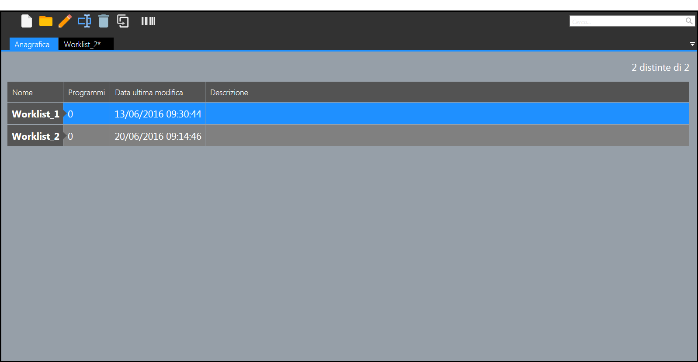

# リストの使用方法

このセクションでは、bSolidソフトウェアでのリスト機能の実際の使用方法について詳しく説明します。

## リスト環境の起動

リスト環境を起動するには、メインメニューから「リスト」を選択します。リスト環境が表示され、プロジェクトの部品と材料を管理することができます。

## リスト環境のインターフェイス

リスト環境のインターフェイスは、以下の主要なエリアに分かれています：

1. **リストツールバー** - リスト機能に関連するコマンドが含まれています
2. **プロジェクトツリー** - プロジェクト内の部品構造を階層的に表示
3. **リスト表示エリア** - 選択された部品リストを表示
4. **プロパティパネル** - 選択された項目の詳細情報を表示

## 新しいリストの作成

新しいリストを作成するには、以下の手順に従います：

1. リストツールバーから「新規作成」ボタンをクリックします
2. リストの名前と基本情報を入力します
3. 「OK」をクリックして確定します

新しいリストが作成され、リスト表示エリアに表示されます。

## 部品の追加

リストに部品を追加するには、以下の方法があります：

### 手動による追加

1. リストツールバーから「部品追加」ボタンをクリックします
2. 部品の詳細情報（名前、寸法、数量など）を入力します
3. 「追加」をクリックして部品をリストに追加します

### CADモデルからの追加

1. CAD環境で作成したモデルを選択します
2. 右クリックメニューから「リストに追加」を選択します
3. 追加するリストを選択します
4. 「OK」をクリックして確定します

## リストの編集

既存のリストを編集するには、以下の手順を実行できます：

### 部品情報の編集

1. 編集する部品をリスト表示エリアで選択します
2. プロパティパネルで必要な変更を行います
3. 「適用」をクリックして変更を確定します

### 部品の削除

1. 削除する部品をリスト表示エリアで選択します
2. リストツールバーの「削除」ボタンをクリックします
3. 確認ダイアログで「はい」をクリックして削除を確定します

## リストのエクスポート

作成したリストは、さまざまな形式でエクスポートすることができます：

1. リストツールバーから「エクスポート」ボタンをクリックします
2. エクスポート形式（CSV、Excel、PDF など）を選択します
3. ファイル名と保存場所を指定します
4. 「保存」をクリックしてエクスポートを実行します

## リストの印刷

リストを印刷するには、以下の手順に従います：

1. リストツールバーから「印刷」ボタンをクリックします
2. 印刷設定を調整します
3. 「印刷」をクリックして印刷を実行します

これらの基本的な操作を理解することで、bSolidのリスト機能を効果的に使用することができます。次のセクションでは、より高度なリスト機能と特定のリストタイプについて説明します。 