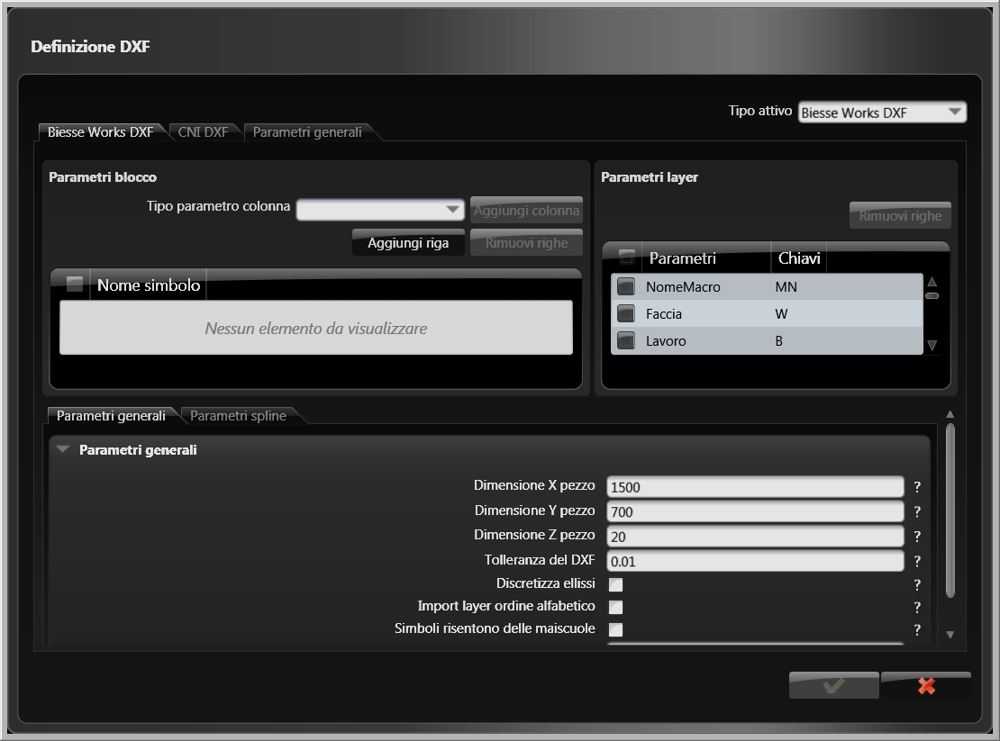

# バーコードの使用

このセクションでは、bSolidソフトウェアのリスト機能と連携するバーコード機能について説明します。バーコード機能を使用することで、部品の追跡と識別を効率化することができます。

## バーコード機能の概要

bSolidのバーコード機能には、以下のような利点があります：

- 部品とプロジェクトの迅速かつ正確な識別
- 生産プロセスの追跡と管理の改善
- 人為的エラーの削減
- 在庫管理の効率化
- 品質管理の強化

## バーコードタイプ

bSolidでは、以下のバーコードタイプをサポートしています：

1. **1Dバーコード**
   - Code 39
   - Code 128
   - EAN-13
   - UPC-A

2. **2Dバーコード**
   - QRコード
   - DataMatrix
   - PDF417

各バーコードタイプには、特定の用途や情報密度に応じた利点があります。

## バーコード設定へのアクセス

バーコード設定にアクセスするには：

1. メインメニューから「設定」を選択します
2. 「バーコード」タブを選択します

## バーコード設定

バーコード設定では、以下のパラメータを構成できます：

1. **バーコードタイプ** - 使用するバーコードのタイプを選択します
2. **情報内容** - バーコードに含める情報を指定します
   - 部品ID
   - プロジェクト名
   - 寸法情報
   - 材料タイプ
   - カスタム情報
3. **バーコードサイズ** - バーコードの物理的な寸法を設定します
4. **解像度** - バーコードの解像度（DPI）を設定します
5. **エラー訂正レベル** - 2Dバーコードのエラー訂正レベルを設定します（低、中、高）

## バーコードの生成

リスト内の項目にバーコードを生成するには：

1. リスト環境でバーコードを生成したい項目を選択します
2. リストツールバーから「バーコード生成」ボタンをクリックするか、右クリックメニューから「バーコード生成」を選択します
3. バーコード生成ダイアログが表示されます
4. 必要に応じて設定を調整し、「生成」をクリックします

## バーコードラベルの印刷

生成したバーコードラベルを印刷するには：

1. リスト環境で、バーコードが生成された項目を選択します
2. リストツールバーから「バーコード印刷」ボタンをクリックするか、右クリックメニューから「バーコード印刷」を選択します
3. 印刷設定ダイアログが表示されます
4. ラベルのレイアウトと印刷オプションを調整します
5. 「印刷」をクリックして印刷を実行します

## バーコードのスキャンと使用

バーコードをスキャンして部品情報にアクセスするには：

1. バーコードリーダーをシステムに接続します
2. メインメニューから「バーコードスキャン」機能を選択します
3. バーコードをスキャンします
4. システムは自動的に対応する部品情報を表示します

バーコードスキャン機能は、以下のようなさまざまな目的で使用できます：

- 機械加工のための部品の識別
- 在庫管理と追跡
- 品質管理とチェック
- 生産状況の監視

## バーコードテンプレート

bSolidでは、バーコードラベルのカスタムテンプレートを作成することもできます：

1. バーコード設定ダイアログで「テンプレート」タブを選択します
2. 「新規テンプレート」ボタンをクリックします
3. テンプレートエディタが表示されます
4. ラベルのレイアウト、追加情報、ロゴなどをカスタマイズします
5. 「保存」をクリックしてテンプレートを保存します

保存したテンプレートは、バーコード生成時に選択して使用することができます。

バーコード機能を効果的に使用することで、製造プロセス全体の効率と精度を大幅に向上させることができます。 