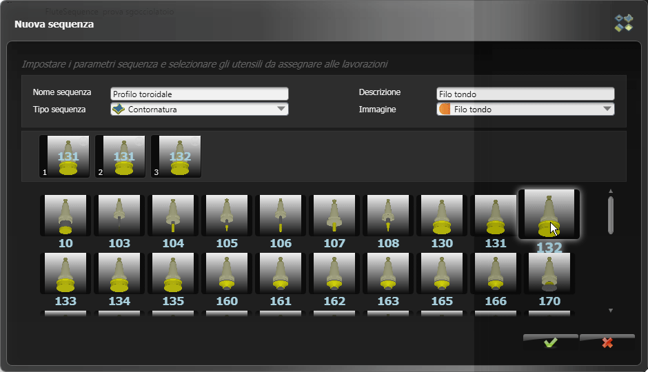

# 装備の紹介

この章では、bSolidソフトウェアの装備（ツーリング）環境について紹介します。装備環境は、作業ユニットやツールマガジンを設定し管理するための機能を提供します。

## 装備環境へのアクセス

装備環境にアクセスするには、環境バーを表示させてボタンをクリックします。

## 環境の情報

装備環境によって、作業ユニットおよびツールマガジンを設定することができるようになります。作業ユニットとは、加工作業に必要なツールを収納するマシンパーツです。個別ユニットの説明については、マシンの取扱説明書を参照してください。

## 環境の概要

装備環境は、以下の主要な要素で構成されています：

1. **標準バー** - 一般的な操作のためのコマンドが含まれています
2. **画像エリア** - 機械を視覚的に表示するエリア
3. **機械部品を示すツリーリスト** - 機械の構成部品が階層的に表示されます
4. **ツールエリア** - 利用可能なツールとその配置を表示・管理するエリア

装備環境を使用することで、加工プロセスに必要なツールや装置を効率的に配置および管理することができます。次の章では、装備環境の構造と使用方法についてより詳しく説明します。 