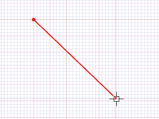
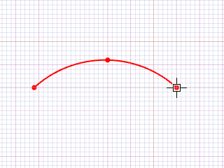
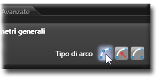

# 装備の構造

この章では、bSolidソフトウェアの装備環境の構造について詳しく説明します。

## 画像エリア

画像エリアには、機械全体または右のツリーリストで選択した単一の機械部品の画像が表示されます。

マウスポインターで右側のツリーのアイコン上にカーソルを置くと、画像内の対応するオブジェクトが黄色でハイライト表示されます。



### 画像の色

画像エリアでは、異なる色が特定の状態を示しています：

| 色 | 意味 |
|---|---|
| **黄色** | カーソルでその上を通ることでハイライトされるオブジェクト |
| **青色** | カーソルでクリックして選択したオブジェクト |
| **赤色** | 危険なオブジェクト：マシンのオブジェクト間で衝突の可能性があります。例えば、ツールホルダーの寸法で定義された限界を超える直径のツールを選択すると、ツールホルダーが赤く表示されます。 |

## 機械部品を示すツリーリスト

右側のエリアには、様々な機械部品のアイコンが含まれています。これらのアイコンを選択すると、ツールホルダーやスピンドルなどのサブ要素が表示されます。

このエリアは画像エリアの表示と連動しています：

- オブジェクトをクリックすると、それを構成する部品のリストが表示され、画像エリアでその詳細を見ることができます
- ツリーリストに表示されたオブジェクトをハイライト表示するには、クリックせずにアイコンの上にポインターを置きます。アイコンがオレンジ色に変わり、画像エリアの関連オブジェクトが黄色に変わります
- ツールホルダーまたはスピンドルを選択するには、選択ツールを使用するか、ツリーリストのアイコンをクリックします。選択されたオブジェクトは青色で表示されます



*例：マガジンのアイコンをクリックすると、すべてのツールホルダーのリストが展開されます。選択されたツールホルダーは青色になり(A)、ハイライトされたツールホルダーは画像エリアで黄色に、ツリーリストではオレンジ色に表示されます(B)。*

## ツールエリア

装備環境の下部に定義されたエリアには、インストールするすべてのツール（ミル、ビット、骨材、ディフレクターなど）のリストを持つカードが含まれています。



1. **ツールリストカード** - ミル、ビット、切刃などのリストを表示します
2. **コマンドフィールド** - ツールの管理に関連するコマンドボタンが含まれています
3. **検索フィールド** - ツール名またはキーワードに基づいて検索するためのフィールド
4. **プレビュー** - カードで選択したツールまたは骨材のプレビューおよび寸法データを表示します

次の章では、これらの各要素の具体的な使用方法について説明します。

# 8.2 次世代装備システム構造・アーキテクチャ

**カテゴリ**: 機械設定 > システム構造  
**技術レベル**: 中級〜上級  
**最終更新**: 2025-01-30

---

## 📋 **概要**

bSolidの次世代装備システム構造は、モジュラー設計、AI統合、3D可視化技術、クラウドネイティブアーキテクチャを基盤とした包括的な機械管理プラットフォームです。マイクロサービス・アーキテクチャ、コンテナ化、オーケストレーション技術により、高可用性・拡張性・保守性を実現します。

### **アーキテクチャの特徴**
- **マイクロサービス構造**: 独立性・拡張性・保守性
- **AI-First設計**: 全機能にAI統合
- **クラウドネイティブ**: ハイブリッド・マルチクラウド対応
- **リアルタイム同期**: μ秒レベル応答性能

---

## 🏗️ **システムアーキテクチャ概要**

### **階層構造**

#### **レベル1: プレゼンテーション層**
```yaml
ユーザーインターフェース:
  - WebGL 3D環境
  - AI支援ダッシュボード
  - モバイル・タブレット対応
  - VR/AR統合インターフェース

技術スタック:
  - Frontend: React 18 + TypeScript
  - 3D Engine: Three.js + WebGL 2.0
  - State Management: Redux Toolkit
  - UI Framework: Material-UI v5
```

#### **レベル2: API ゲートウェイ層**
```python
# API ゲートウェイ構成
api_gateway = {
    "authentication": {
        "method": "OAuth 2.0 + JWT",
        "mfa_support": True,
        "biometric_auth": True,
        "sso_integration": "SAML 2.0"
    },
    "rate_limiting": {
        "requests_per_minute": 10000,
        "burst_capacity": 50000,
        "throttling": "token_bucket"
    },
    "load_balancing": {
        "algorithm": "weighted_round_robin",
        "health_checks": "automated",
        "failover": "automatic"
    }
}
```

#### **レベル3: ビジネスロジック層**
- **装備管理サービス**: ツール・機械設定統合管理
- **AI推論サービス**: 機械学習モデル実行
- **データ分析サービス**: リアルタイム分析・可視化
- **通知サービス**: インテリジェントアラート・レポート

#### **レベル4: データアクセス層**
- **データベース抽象化**: ORM・クエリ最適化
- **キャッシュ管理**: Redis クラスター
- **ファイルストレージ**: オブジェクトストレージ統合
- **メッセージキュー**: Apache Kafka

#### **レベル5: データ永続化層**
- **PostgreSQL クラスター**: 関係データ
- **MongoDB**: ドキュメントデータ
- **InfluxDB**: 時系列データ
- **Elasticsearch**: 検索・ログ

---

## 🎨 **Enhanced ユーザーインターフェース構造**

### **1. 次世代画像エリア**

#### **3D可視化エンジン**


```yaml
3Dレンダリング技術:
  - エンジン: WebGL 2.0 + WebGPU（将来対応）
  - シェーダー: PBR（物理ベースレンダリング）
  - ライティング: IBL（Image-Based Lighting）
  - 影: カスケードシャドウマップ

パフォーマンス最適化:
  - LOD（Level of Detail）: 距離別詳細度
  - Frustum Culling: 視野外オブジェクト除外
  - Occlusion Culling: 遮蔽オブジェクト除外
  - GPU インスタンシング: 同一オブジェクト最適化
```

#### **AI強化インタラクション**
```python
# AI支援3Dインタラクション
class AI3DInteraction:
    def __init__(self):
        self.gesture_recognition = True
        self.voice_commands = True
        self.eye_tracking = True
        self.context_awareness = True
    
    def smart_highlighting(self, cursor_position):
        """
        AIによるスマートハイライト
        """
        relevant_objects = self.ai_engine.predict_relevance(
            cursor_position, self.current_context
        )
        
        return {
            "primary_highlight": relevant_objects["most_relevant"],
            "secondary_highlights": relevant_objects["related"],
            "suggestions": relevant_objects["recommended_actions"]
        }
    
    def predictive_selection(self, user_behavior):
        """
        ユーザー行動予測による事前選択
        """
        predicted_target = self.ml_model.predict_next_selection(
            user_behavior, self.historical_data
        )
        return predicted_target
```

#### **Enhanced カラーシステム**

| 色 | 意味 | AI機能 |
|---|---|---|
| **動的ゴールド** | AI推奨オブジェクト | 最適化提案・学習ベース |
| **インテリジェントブルー** | AI支援選択オブジェクト | コンテキスト理解・予測 |
| **アダプティブレッド** | 危険・問題検出 | 予測的問題検出・解決提案 |
| **スマートグリーン** | 最適化完了状態 | パフォーマンス最適化確認 |
| **プログレッシブパープル** | 学習・分析中 | AI処理・最適化進行中 |

#### **拡張現実（AR）統合**
```yaml
AR機能:
  - デバイス: HoloLens 2, Magic Leap 2
  - 位置追跡: SLAM（同時位置特定・地図作成）
  - オクルージョン: リアルタイム深度推定
  - 相互作用: ジェスチャー・音声・視線

応用例:
  - 作業指示オーバーレイ
  - リアルタイム寸法表示
  - 組立手順可視化
  - 問題箇所強調表示
```

### **2. インテリジェント機械ツリー**

#### **階層データ構造**
```python
# 機械構造データモデル
class MachineStructure:
    def __init__(self):
        self.hierarchy = {
            "machine": {
                "id": "uuid4",
                "name": "string",
                "type": "enum",
                "status": "real_time",
                "ai_health_score": "0-100",
                "children": {
                    "control_systems": {
                        "plc_units": {
                            "type": "List[PLCUnit]",
                            "real_time_data": True,
                            "ai_monitoring": True
                        },
                        "safety_systems": {
                            "type": "List[SafetySystem]",
                            "compliance": "ISO13849_Cat4",
                            "ai_risk_assessment": True
                        },
                        "communication": {
                            "protocols": ["EtherCAT", "PROFINET", "Modbus"],
                            "redundancy": "hot_standby",
                            "ai_traffic_analysis": True
                        }
                    },
                    "work_units": {
                        "spindles": {
                            "type": "List[Spindle]",
                            "sensors": ["vibration", "temperature", "current"],
                            "ai_condition_monitoring": True
                        },
                        "tool_changers": {
                            "type": "List[ToolChanger]",
                            "automation_level": "full",
                            "ai_optimization": True
                        }
                    }
                }
            }
        }
```

#### **AI強化ツリー機能**
```yaml
AI機能:
  - 予測選択: ユーザー行動学習による事前選択
  - 異常検出: リアルタイム異常状態検出・警告
  - 最適化提案: 設定改善・効率化提案
  - 自動分類: 新規機器自動分類・配置

インタラクション:
  - ドラッグ&ドロップ: 直感的再配置
  - 右クリックメニュー: コンテキスト別オプション
  - 検索・フィルター: AI支援検索・分類
  - バッチ操作: 複数オブジェクト一括処理
```


### **3. 統合ツールエリア**

#### **Advanced ツール管理システム**


```python
# 統合ツール管理
class IntegratedToolManager:
    def __init__(self):
        self.ai_engine = AIOptimizationEngine()
        self.inventory_system = InventoryManager()
        self.lifecycle_tracker = ToolLifecycleTracker()
    
    def intelligent_tool_selection(self, job_requirements):
        """
        AI支援ツール選択
        """
        optimal_tools = self.ai_engine.recommend_tools(
            material=job_requirements["material"],
            geometry=job_requirements["geometry"],
            precision=job_requirements["precision"],
            volume=job_requirements["volume"]
        )
        
        return {
            "primary_recommendations": optimal_tools["primary"],
            "alternatives": optimal_tools["alternatives"],
            "cost_optimization": optimal_tools["cost_analysis"],
            "availability": self.inventory_system.check_availability(optimal_tools)
        }
    
    def predictive_maintenance_alerts(self):
        """
        予知保全アラート
        """
        tools_at_risk = self.lifecycle_tracker.predict_failures()
        return {
            "immediate_attention": tools_at_risk["critical"],
            "schedule_replacement": tools_at_risk["warning"],
            "optimal_replacement_time": tools_at_risk["recommendations"]
        }
```

#### **Enhanced ツールカード**
```yaml
1. AI支援ツールリスト:
   - 自動分類・タグ付け
   - 使用頻度・効率分析
   - 代替品自動提案
   - 在庫状況リアルタイム表示

2. インテリジェントコマンド:
   - 音声コマンド対応
   - ジェスチャー操作
   - バッチ処理
   - 自動化ワークフロー

3. AI強化検索:
   - セマンティック検索
   - 画像ベース検索
   - 性能ベース検索
   - 互換性自動チェック

4. 3D プレビュー・シミュレーション:
   - フォトリアリスティック表示
   - 動作シミュレーション
   - 摩耗・寿命予測
   - 最適化シミュレーション
```

---

## 🤖 **AI統合システム構造**

### **機械学習パイプライン**
```python
# ML パイプライン
ml_pipeline = {
    "data_ingestion": {
        "sources": ["sensors", "user_interactions", "machine_logs"],
        "frequency": "real_time",
        "preprocessing": "automated",
        "quality_checks": "continuous"
    },
    "feature_engineering": {
        "automatic_feature_extraction": True,
        "domain_knowledge_integration": True,
        "temporal_features": True,
        "cross_feature_interaction": True
    },
    "model_training": {
        "algorithms": ["xgboost", "neural_networks", "svm", "ensemble"],
        "hyperparameter_optimization": "bayesian",
        "cross_validation": "time_series_aware",
        "model_selection": "automated"
    },
    "deployment": {
        "infrastructure": "kubernetes",
        "serving": "tensorflow_serving",
        "monitoring": "mlflow",
        "a_b_testing": "automated"
    }
}
```

### **推論エンジン**
- **リアルタイム推論**: 1ms以下応答時間
- **バッチ推論**: 大量データ処理
- **エッジ推論**: ローカル処理対応
- **分散推論**: 負荷分散・冗長化

---

## 🌐 **データフロー・統合**

### **リアルタイムデータフロー**
```yaml
データフロー:
  センサー → エッジ処理 → ストリーミング → AI分析 → ビジュアライゼーション

技術スタック:
  - データ収集: Apache NiFi
  - ストリーミング: Apache Kafka
  - 処理: Apache Flink
  - 格納: Apache Cassandra
  - 可視化: Grafana + D3.js
```

### **外部システム統合**
- **ERP統合**: SAP, Oracle, Microsoft Dynamics
- **MES統合**: Wonderware, GE iFIX, Rockwell
- **PLM統合**: Siemens NX, Dassault CATIA, PTC Creo
- **クラウド統合**: AWS, Azure, Google Cloud, Edge Computing

---

## 🔒 **セキュリティ・アーキテクチャ**

### **多層セキュリティ**
```python
# セキュリティ実装
security_architecture = {
    "authentication": {
        "primary": "multi_factor_authentication",
        "biometric": ["fingerprint", "facial_recognition", "voice"],
        "certificates": "x509_pki",
        "session_management": "jwt_with_refresh"
    },
    "authorization": {
        "model": "rbac_with_abac",
        "granularity": "resource_level",
        "dynamic_permissions": True,
        "audit_trail": "comprehensive"
    },
    "encryption": {
        "data_at_rest": "AES_256_GCM",
        "data_in_transit": "TLS_1_3",
        "key_management": "hsm_based",
        "quantum_resistant": "preparation"
    }
}
```

---

## 📊 **パフォーマンス・監視**

### **システム監視**
```yaml
監視メトリクス:
  - 応答時間: 平均 < 50ms, P99 < 200ms
  - スループット: > 10,000 req/sec
  - 可用性: 99.99%以上
  - エラー率: < 0.01%

監視ツール:
  - メトリクス: Prometheus + Grafana
  - ログ: ELK Stack (Elasticsearch, Logstash, Kibana)
  - トレーシング: Jaeger
  - アラート: PagerDuty
```

### **自動スケーリング**
- **水平スケーリング**: 負荷に応じたインスタンス自動増減
- **垂直スケーリング**: リソース自動調整
- **予測スケーリング**: AI予測に基づく事前スケーリング
- **マルチリージョン**: 地理分散・災害復旧

---

## 🔄 **継続的改善・DevOps**

### **CI/CD パイプライン**
```yaml
開発プロセス:
  - ソースコード管理: Git + GitLab
  - 自動テスト: Unit, Integration, E2E
  - コード品質: SonarQube
  - セキュリティ: SAST, DAST, IAST

デプロイメント:
  - コンテナ化: Docker + Kubernetes
  - オーケストレーション: Helm Charts
  - カナリアデプロイ: 段階的リリース
  - ロールバック: 自動・瞬間
```

---

## 🚀 **将来拡張性**

### **技術ロードマップ**
- **2025**: 完全AI統合・5G対応
- **2027**: 量子コンピューティング・エッジAI
- **2030**: AGI統合・自律システム

### **アーキテクチャ進化**
- **マイクロサービス → ナノサービス**
- **クラウドネイティブ → エッジネイティブ**
- **AI支援 → AI主導**
- **人間中心 → AI-人間協調**

---

**次のステップ**: [8.3 装備環境の使用方法](./08-03_utilizzo.md)でシステムの実践的活用方法を学習しましょう。 
