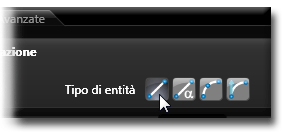
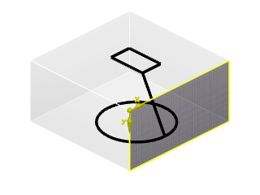

# 装備の使用方法

この章では、bSolidソフトウェアの装備環境の使用方法について詳しく説明します。

## マウスの操作

装備環境では、マウスの中央キー（スクロールホイール）を使用して、以下の操作を行うことができます：

### オブジェクト表示の拡大または縮小

1. マウスの中央キー（スクロールホイール）を押します
2. スクロールホイールを回すと、オブジェクトが拡大または縮小します

### オブジェクト表示の移動

1. マウスの中央キー（スクロールホイール）を押し、手の形のカーソルを表示させます
2. 中央キー（スクロールホイール）を押したまま、マウスを移動させて表示をシフトし、オブジェクトを必要な方向にドラッグします

### 表示の回転

1. キーボードの**Ctrl**キーと、マウスの中央キー（スクロールホイール）を押します
2. 両方を押したまま、カーソルを移動させます

## ツールをスピンドルに挿入する

装備環境での主な作業は、ツールをスピンドルに挿入することです。インストールしたツールは、アイコンの周りの緑色の円によって関連ツールエリアで識別できます。

ツールをスピンドルに挿入すると、ツール名が右のツリーリストのスピンドル名の近くに表示されます。

アクティブなスピンドルを非選択にするには、キーボードの**ESC**キーを使用します。

### 単一のスピンドルを設定する

単一のスピンドルにツールを挿入するには、以下のいずれかの方法を使用します：

- **ドラッグ＆ドロップ法**：関連エリアのツールを選択し、設定するスピンドルの画像までそのツールをドラッグします
  
- **選択とダブルクリック法**：
  1. 十字カーソルを使用して、設定するスピンドルを（画像エリアで）選択します
  2. 関連エリアのツールを選択し、ダブルクリックでそのツールを挿入します

- **ツリーリスト法**：
  1. 右のツリーリストで、必要なユニットまたは電子スピンドルのアイコンを選択してスピンドルのリストを開きます
  2. 設定するスピンドルをクリックすると、選択したスピンドルが青色に変わります
  3. 関連エリアのツールのアイコンをダブルクリックします

### 複数スピンドルのツーリング

複数のスピンドルに同じツールを挿入するには、以下のいずれかの方法を使用します：

- **選択とキーボード法**：
  1. 十字カーソルを使って、キーボードの**CTRL**キーを押しながら、設定するスピンドルの画像をクリックします
  2. 選択したスピンドルは青色に変わります
  3. カーソルを関連エリアに動かし、アクティブなスピンドルに挿入するツールのアイコンをダブルクリックします

- **ツリーリスト法**：
  1. 右のツリーリストで、必要なユニットまたは電子スピンドルのアイコンを選択してスピンドルのリストを開きます
  2. キーボードの**CTRL**キーを押しながら、各スピンドルをクリックします
  3. 選択したスピンドルはすべて青色に変わります
  4. 関連エリアのツールのアイコンをダブルクリックします

## ツールの削除

スピンドルからツールを削除するには：

1. 削除したいツールが挿入されているスピンドルを選択します
2. 右クリックメニューから「ツールを削除」を選択するか、キーボードの**Delete**キーを押します

## 設定の保存

装備の設定を保存するには、標準バーの「保存」ボタンをクリックします。これにより、現在の装備構成が保存され、他のプロジェクトでも使用できるようになります。 
